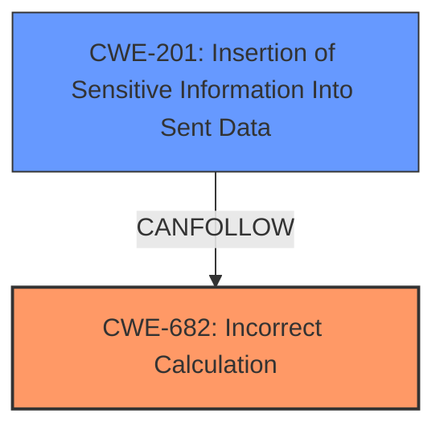

# Raw Analyzer Response for CVE-2021-41329

# Summary
| CWE ID | CWE Name | Confidence | CWE Abstraction Level | CWE Vulnerability Mapping Label | CWE-Vulnerability Mapping Notes |
|---|---|---|---|---|---|
| CWE-682 | Incorrect Calculation | 0.9 | Pillar | Primary | Allowed: The **internal cache key collision** is the root cause, which leads to **incorrect calculation** of the cache key. |
| CWE-201 | Insertion of Sensitive Information Into Sent Data | 0.6 | Base | Secondary | Allowed: The vulnerability results in **information exposure**, as the query results are not constrained by the view filter. |

## Evidence and Confidence

*   **Confidence Score:** 0.75
*   **Evidence Strength:** HIGH

## Relationship Analysis
The primary relationship influencing the decision is that the **internal cache key collision** (CWE-682) leads to **information exposure** (CWE-201) due to **incorrect calculation**.

## Vulnerability Chain
The vulnerability chain starts with an **internal cache key collision** (CWE-682) leading to a user seeing query results not constrained by their view filter, resulting in **insertion of sensitive information into sent data** (CWE-201).

## Summary of Analysis
The initial analysis focused on the **internal cache key collision** as the root cause, which leads to **information exposure**.
The provided evidence clearly points to the **internal cache key collision** as the root cause of the vulnerability. The vulnerability occurs because Seq generates cache keys for queries in such a way that queries differing only in the content of their `in` clauses can generate identical cache keys. This leads to a user potentially receiving cached results from a query executed by another user, thus exposing data that the user should not have access to.

The graph relationships show that the **incorrect calculation** can lead to **insertion of sensitive information into sent data**. This helped solidify the understanding of the vulnerability as a chain of events, starting with the **internal cache key collision** and ending with **information exposure**.

The selected CWEs are at the optimal level of specificity. CWE-682 accurately represents the root cause of the vulnerability, while CWE-201 represents the resulting **information exposure**.
CWE-682 is a Pillar, which is high-level. However, there isn't a more specific CWE to describe the root cause of the vulnerability, which is that the cache key is being calculated incorrectly.

Relevant CWE Information:

# Enhanced Context (25 CWEs)

## CWE-668: Exposure of Resource to Wrong Sphere
**Abstraction Level**: Class
**Similarity Score**: 0.77
**Source**: dense

**Description**:
The product exposes a resource to the wrong control sphere, providing unintended actors with inappropriate access to the resource.

**Mapping Guidance**:
- Usage: Discouraged
- Rationale: CWE-668 is high-level and is often misused as a catch-all when lower-level CWE IDs might be applicable. It is sometimes used for low-information vulnerability reports [REF-1287]. It is a level-1 Class (i.e., a child of a Pillar). It is not useful for trend analysis.

*CWE-668 was considered but not selected* because the vulnerability is more specific than simply exposing a resource to the wrong sphere. The **internal cache key collision** is a more precise root cause.

## CWE-639: Authorization Bypass Through User-Controlled Key
**Abstraction Level**: Base
**Similarity Score**: 0.77
**Source**: dense

**Description**:
The system's authorization functionality does not prevent one user from gaining access to another user's data or record by modifying the key value identifying the data.

**Mapping Guidance**:
- Usage: Allowed
- Rationale: This CWE entry is at the Base level of abstraction, which is a preferred level of abstraction for mapping to the root causes of vulnerabilities.

*CWE-639 was considered but not selected* because the authorization bypass is not due to a user-controlled key. The issue is an **internal cache key collision**, not a manipulation of keys by the user.

## CWE-274: Improper Handling of Insufficient Privileges
**Abstraction Level**: Base
**Similarity Score**: 0.76
**Source**: dense

**Description**:
The product does not handle or incorrectly handles when it has insufficient privileges to perform an operation, leading to resultant weaknesses.

**Mapping Guidance**:
- Usage: Discouraged
- Rationale: This CWE entry could be deprecated in a future version of CWE.

*CWE-274 was considered but not selected* because the vulnerability is not directly related to handling insufficient privileges.

## CWE-538: Insertion of Sensitive Information into Externally-Accessible File or Directory
**Abstraction Level**: Base
**Similarity Score**: 0.76
**Source**: dense

**Description**:
The product places sensitive information into files or directories that are accessible to actors who are allowed to have access to the files, but not to the sensitive information.

**Mapping Guidance**:
- Usage: Allowed
- Rationale: This CWE entry is at the Base level of abstraction, which is a preferred level of abstraction for mapping to the root causes of vulnerabilities.

*CWE-538 was considered but not selected* because the sensitive information is not inserted into a file or directory, but rather exposed through incorrect query results.

## CWE-280: Improper Handling of Insufficient Permissions or Privileges
**Abstraction Level**: Base
**Similarity Score**: 0.76
**Source**: dense

**Description**:
The product does not handle or incorrectly handles when it has insufficient privileges to access resources or functionality as specified by their permissions. This may cause it to follow unexpected code paths that may leave the product in an invalid state.

**Mapping Guidance**:
- Usage: Allowed
- Rationale: This CWE entry is at the Base level of abstraction, which is a preferred level of abstraction for mapping to the root causes of vulnerabilities.

*CWE-280 was considered but not selected* because the vulnerability is not directly related to handling insufficient permissions or privileges.

## CWE-212: Improper Removal of Sensitive Information Before Storage or Transfer
**Abstraction Level**: Base
**Similarity Score**: 0.76
**Source**: dense

**Description**:
The product stores, transfers, or shares a resource that contains sensitive information, but it does not properly remove that information before the product makes the resource available to unauthorized actors.

**Mapping Guidance**:
- Usage: Allowed
- Rationale: This CWE entry is at the Base level of abstraction, which is a preferred level of abstraction for mapping to the root causes of vulnerabilities.

*CWE-212 was considered but not selected* because the vulnerability is not due to the improper removal of sensitive information before storage or transfer.

## CWE-807: Reliance on Untrusted Inputs in a Security Decision
**Abstraction Level**: Base
**Similarity Score**: 0.75
**Source**: dense

**Description**:
The product uses a protection mechanism that relies on the existence or values of an input, but the input can be modified by an untrusted actor in a way that bypasses the protection mechanism.

**Mapping Guidance**:
- Usage: Allowed
- Rationale: This CWE entry is at the Base level of abstraction, which is a preferred level of abstraction for mapping to the root causes of vulnerabilities.

*CWE-807 was considered but not selected* because the vulnerability doesn't involve reliance on untrusted inputs in a security decision.

## CWE-226: Sensitive Information in Resource Not Removed Before Reuse
**Abstraction Level**: Base
**Similarity Score**: 0.75
**Source**: dense

**Description**:
The product releases a resource such as memory or a file so that it can be made available for reuse, but it does not clear or "zeroize" the information contained in the resource before the product performs a critical state transition or makes the resource available for reuse by other entities.

**Mapping Guidance**:
- Usage: Allowed
- Rationale: This CWE entry is at the Base level of abstraction, which is a preferred level of abstraction for mapping to the root causes of vulnerabilities.

*CWE-226 was considered but not selected* because the vulnerability is not due to sensitive information not being removed before reuse of a resource.

## CWE-552: Files or Directories Accessible to External Parties
**Abstraction Level**: Base
**Similarity Score**: 0.75
**Source**: dense

**Description**:
The product makes files or directories accessible to unauthorized actors, even though they should not be.

**Mapping Guidance**:
- Usage: Allowed
- Rationale: This CWE entry is at the Base level of abstraction, which is a preferred level of abstraction for mapping to the root causes of vulnerabilities.

*CWE-552 was considered but not selected* because the vulnerability doesn't involve making files or