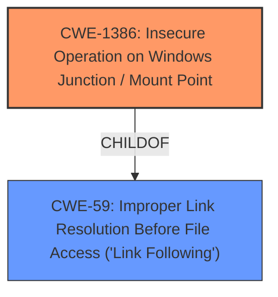

# Analysis for CVE-2021-41347

# Summary
| CWE ID | CWE Name | Confidence | CWE Abstraction Level | CWE Vulnerability Mapping Label | CWE-Vulnerability Mapping Notes |
|---|---|---|---|---|---|
| CWE-1386 | Insecure Operation on Windows Junction / Mount Point | 0.9 | Base | Allowed | Primary CWE |
| CWE-59 | Improper Link Resolution Before File Access ('Link Following') | 0.7 | Base | Allowed | Secondary Candidate |

## Evidence and Confidence

*   **Confidence Score:** 0.9
*   **Evidence Strength:** HIGH

## Relationship Analysis
The primary CWE is CWE-1386, which is a child of CWE-59. CWE-59 is considered as a secondary candidate. The relationship between CWE-1386 and CWE-59 indicates a hierarchical structure, where CWE-1386 is a more specific instance of the more general CWE-59.

## Vulnerability Chain
The vulnerability chain begins with the **improper handling of Windows Junction / Mount Points (CWE-1386)**, leading to the **arbitrary deletion of directory contents**. This ultimately results in **Elevation of Privilege**.

## Summary of Analysis
The initial analysis pointed to CWE-1386 as the primary candidate due to the vulnerability description and the CVE reference summary explicitly mentioning the abuse of directory junctions. The retriever results also listed CWE-1386 as a high-ranking candidate.

The vulnerability exists within the AppX Deployment Service. By creating a directory junction, an attacker can abuse the service to delete the contents of a chosen directory. This can lead to elevation of privileges and arbitrary code execution.

CWE-1386 (Insecure Operation on Windows Junction / Mount Point) is a Base level CWE that describes a scenario where the product opens a file or directory but doesn't properly prevent the name from being associated with a junction or mount point to a destination outside the intended control sphere. This aligns perfectly with the vulnerability description, as the attacker leverages directory junctions to delete the contents of an arbitrary directory.

CWE-59 (Improper Link Resolution Before File Access ('Link Following')) is considered as a secondary candidate because CWE-1386 is a child of CWE-59 and a more specific case of link following related to Windows Junctions / Mount Points.

The selection of CWE-1386 is based on direct evidence from the vulnerability description and the CVE reference summary. The retriever results further support this decision.

# Relevant CWE Information:

# Enhanced Context (25 CWEs)

## CWE-59: Improper Link Resolution Before File Access ('Link Following')
**Abstraction Level**: Base
**Similarity Score**: 0.81
**Source**: dense

**Description**:
The product attempts to access a file based on the filename, but it does not properly prevent that filename from identifying a link or shortcut that resolves to an unintended resource.

**Mapping Guidance**:
- Usage: Allowed
- Rationale: This CWE entry is at the Base level of abstraction, which is a preferred level of abstraction for mapping to the root causes of vulnerabilities.

## CWE-1386: Insecure Operation on Windows Junction / Mount Point
**Abstraction Level**: Base
**Similarity Score**: 5050.66
**Source**: sparse

**Description**:
The product opens a file or directory, but it does not properly prevent the name from being associated with a junction or mount point to a destination that is outside of the intended control sphere.

**Mapping Guidance**:
- Usage: Allowed
- Rationale: This CWE entry is at the Base level of abstraction, which is a preferred level of abstraction for mapping to the root causes of vulnerabilities.

### Identified CWEs:

*   **CWE-1386: Insecure Operation on Windows Junction / Mount Point**

    *   **Technical Explanation:** The vulnerability aligns with CWE-1386 because the attacker creates a directory junction, which the AppX Deployment Service **does not properly** handle, allowing the attacker to redirect the service's operations to an unintended directory and delete its contents. This is a direct match for the CWE's description: "The product opens a file or directory, but it **does not properly prevent** the name from being associated with a junction or mount point to a destination that is outside of the intended control sphere."
    *   **Security Implications and Potential Impact:** The ability to delete arbitrary directory contents can lead to a denial of service, data loss, or, as stated in the vulnerability description, elevation of privilege and arbitrary code execution.
    *   **Hierarchical Relationships:** CWE-1386 is a child of CWE-59 (Improper Link Resolution Before File Access ('Link Following')).
    *   **Primary/Secondary:** This is the primary CWE due to the explicit mention of directory junctions in the vulnerability description.
    *   **MITRE Mapping Guidance:** The usage is "Allowed," and the rationale states that it is at the Base level of abstraction, which is preferred.
    *   **Supporting Evidence:**"Root cause of vulnerability": "The vulnerability exists within the AppX Deployment Service. By creating a directory junction, an attacker can abuse the service to delete the contents of a chosen directory."
    *   **Confidence:** 0.9

*   **CWE-59: Improper Link Resolution Before File Access ('Link Following')**

    *   **Technical Explanation:** The vulnerability can also be seen as a case of CWE-59 because directory junctions are a type of symbolic link. The AppX Deployment Service **fails to properly resolve** the link, leading to the deletion of unintended resources.
    *   **Security Implications and Potential Impact:** Similar to CWE-1386, this can lead to denial of service, data loss, or elevation of privilege.
    *   **Hierarchical Relationships:** CWE-59 is the parent of CWE-1386.
    *   **Primary/Secondary:** This is a secondary CWE because CWE-1386 provides a more specific description of the vulnerability.
    *   **MITRE Mapping Guidance:** The usage is "Allowed," and the rationale states that it is at the Base level of abstraction, which is preferred.
    *   **Supporting Evidence:** The general description of link following applies to directory junctions.
    *   **Confidence:** 0.7

### Considered but not used:

*   **CWE-266: Incorrect Privilege Assignment**: While the ultimate impact is elevation of privilege, the root cause is the insecure handling of directory junctions, not an explicit incorrect privilege assignment. Therefore, this CWE is not the best fit.
*   **CWE-127: Buffer Under-read, CWE-825: Expired Pointer Dereference, CWE-125: Out-of-bounds Read, CWE-123: Write-what-where Condition**: These CWEs relate to memory corruption issues, which are not directly implicated in this vulnerability. The root cause is related to file path handling, not memory management.
*   **CWE-362: Concurrent Execution using Shared Resource with Improper Synchronization ('Race Condition')**: While a race condition might exacerbate the vulnerability, it is not the primary root cause. The core issue is the insecure handling of directory junctions.
*   **CWE-40: Path Traversal: '\\UNC\share\name\' (Windows UNC Share)**: This is a type of path traversal related to UNC paths. While it is related to path handling, it does not directly apply to the directory junction issue.