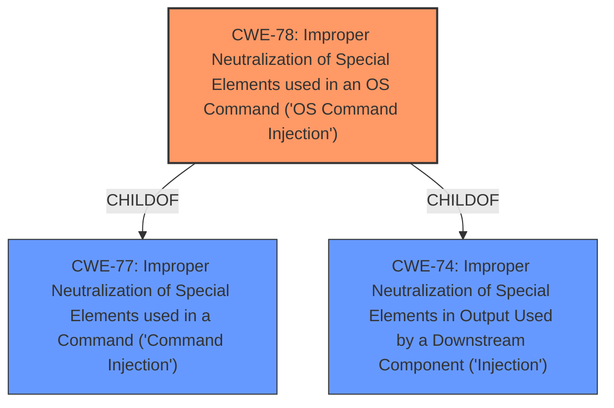

# Analysis for CVE-2021-41383

# Summary
| CWE ID | CWE Name | Confidence | CWE Abstraction Level | CWE Vulnerability Mapping Label | CWE-Vulnerability Mapping Notes |
|---|---|---|---|---|---|
| **CWE-78** | **Improper Neutralization of Special Elements used in an OS Command ('OS Command Injection')** | 1.0 | Base | Primary | Allowed |
| CWE-77 | Improper Neutralization of Special Elements used in a Command ('Command Injection') | 0.7 | Class | Secondary Candidate | Allowed-with-Review |
| CWE-74 | Improper Neutralization of Special Elements in Output Used by a Downstream Component ('Injection') | 0.5 | Class | Secondary Candidate | Discouraged |

## Evidence and Confidence

*   **Confidence Score:** 1.0
*   **Evidence Strength:** HIGH

## Relationship Analysis
The primary relationship influencing the selection is the ChildOf relationship. CWE-78 is a child of CWE-77 and CWE-74. Given the specific nature of the vulnerability involving OS commands, CWE-78 is the most specific and appropriate choice.

## Vulnerability Chain
The vulnerability chain consists of the following:
1.  **Root Cause:** Lack of proper input sanitization of the `ntp_server` field.
2.  **Weakness:** **Command Injection** due to the use of unsanitized input in a `system` call.
3.  **Impact:** Execution of arbitrary shell commands, potentially leading to full device compromise.

## Summary of Analysis
The initial analysis identified a **command injection** vulnerability in NETGEAR R6020 devices due to the lack of input sanitization in the `ntp_server` field. The `setup.cgi` script uses this unsanitized input in a `system` call, allowing an attacker to inject arbitrary shell commands.

The evidence for this assessment is primarily found in the "CVE Reference Links Content Summary": "The vulnerability stems from the lack of proper input sanitization when handling the `ntp_server` variable in the `setup.cgi` script. This unsanitized input is later used in a `system` call within the `ntp_start` function of `rc_apps`." Also, "The primary vulnerability is a **command injection** flaw. The value provided for `ntp_server` is inserted into a system call without proper sanitization, allowing an attacker to inject arbitrary shell commands."

The graph relationships support the selection of CWE-78, as it is a more specific child of the more general CWE-77 and CWE-74.

CWE-78 is the most appropriate choice because the vulnerability specifically involves the execution of OS commands. It is at the optimal level of specificity (Base) and has a clear relationship to the vulnerability description.

Relevant CWE Information:

# Enhanced Context (25 CWEs)
The following CWEs were identified as potentially relevant to this vulnerability:

## CWE-74: Improper Neutralization of Special Elements in Output Used by a Downstream Component ('Injection')
**Abstraction Level**: Class
**Similarity Score**: 0.78
**Source**: dense

**Description**:
The product constructs all or part of a command, data structure, or record using externally-influenced input from an upstream component, but it does not neutralize or incorrectly neutralizes special elements that could modify how it is parsed or interpreted when it is sent to a downstream component.

**Mapping Guidance**:
- Usage: Discouraged
- Rationale: CWE-74 is high-level and often misused when lower-level weaknesses are more appropriate.

## CWE-78: Improper Neutralization of Special Elements used in an OS Command ('OS Command Injection')
**Abstraction Level**: base
**Similarity Score**: 5.03
**Source**: graph

**Description**:
CWE-78: Improper Neutralization of Special Elements used in an OS Command ('OS Command Injection')

**Mapping Guidance**:
- Usage: Allowed
- Rationale: This CWE entry is at the Base level of abstraction, which is a preferred level of abstraction for mapping to the root causes of vulnerabilities.

## CWE-77: Improper Neutralization of Special Elements used in a Command ('Command Injection')
**Abstraction:** Class
**Status:** Draft

### Description
The product constructs all or part of a command using externally-influenced input from an upstream component, but it does not neutralize or incorrectly neutralizes special elements that could modify the intended command when it is sent to a downstream component.

### Mapping Details

**CWE-78: Improper Neutralization of Special Elements used in an OS Command ('OS Command Injection')**
*   **Technical Explanation:** The vulnerability allows an attacker to inject and execute arbitrary OS commands due to the lack of sanitization of the `ntp_server` input field. This directly aligns with the description of CWE-78, which focuses on the improper neutralization of special elements used in OS commands.
*   **Security Implications and Potential Impact:** Successful exploitation allows the attacker to execute arbitrary shell commands, leading to potential full device compromise, unauthorized access, and malicious software installation.
*   **Parent-Child Relationships and Chain Patterns:** CWE-78 is a child of CWE-77 (Improper Neutralization of Special Elements used in a Command) and CWE-74 (Improper Neutralization of Special Elements in Output Used by a Downstream Component ('Injection')). This hierarchical relationship indicates that CWE-78 is a more specific case of a broader class of **command injection** vulnerabilities.
*   **Primary/Secondary Weakness:** This is the primary weakness.
*   **MITRE Mapping Guidance:** The MITRE mapping guidance for CWE-78 states that it is at the Base level of abstraction, which is a preferred level for mapping. The guidance also emphasizes carefully reading the name and description to ensure a proper fit.

**CWE-77: Improper Neutralization of Special Elements used in a Command ('Command Injection')**
*   **Technical Explanation:** While CWE-78 is more specific, CWE-77 is still relevant as it describes the general class of **command injection** vulnerabilities. The product constructs a command using externally-influenced input without proper neutralization.
*   **Security Implications and Potential Impact:** Similar to CWE-78, the impact involves the execution of unintended commands, though not explicitly limited to OS commands.
*   **Parent-Child Relationships and Chain Patterns:** CWE-77 is a parent of CWE-78, indicating a broader category of **command injection** vulnerabilities.
*   **Primary/Secondary Weakness:** This is a secondary weakness.
*   **MITRE Mapping Guidance:** The MITRE mapping guidance for CWE-77 suggests reviewing its children to find a better fit, which further supports the selection of CWE-78.

**CWE-74: Improper Neutralization of Special Elements in Output Used by a Downstream Component ('Injection')**
*   **Technical Explanation:** CWE-74 is a high-level class describing injection vulnerabilities in general. The lack of proper neutralization of special elements leads to the modification of how the downstream component parses the input.
*   **Security Implications and Potential Impact:** The impact is broad, covering various injection types, not just command execution.
*   **Parent-Child Relationships and Chain Patterns:** CWE-74 is a parent of both CWE-77 and CWE-78, making it a very general classification.
*   **Primary/Secondary Weakness:** This is a secondary weakness.
*   **MITRE Mapping Guidance:** The MITRE mapping guidance discourages the use of CWE-74 when lower-level weaknesses are more appropriate, which supports the selection of CWE-78.

**CWEs Considered But Not Used:**

*   **CWE-79 (Improper Neutralization of Input During Web Page Generation ('Cross-site Scripting')):** This CWE was considered but not used because the vulnerability is about **command injection**, not cross-site scripting. The injected input is used to execute commands on the server, not to inject malicious scripts into web pages served to other users.
*   **CWE-116 (Improper Encoding or Escaping of Output):** This CWE was considered but not used because, while encoding/escaping issues can lead to injection vulnerabilities, the primary issue here is the lack of any sanitization, not specifically improper encoding.
*   **CWE-95 (Improper Neutralization of Directives in Dynamically Evaluated Code ('Eval Injection')):** This CWE was considered, but the code is not being dynamically evaluated as code, but rather being passed as commands to the operating system.
*   **CWE-259 (Use of Hard-coded Password):** This CWE was not applicable as the vulnerability