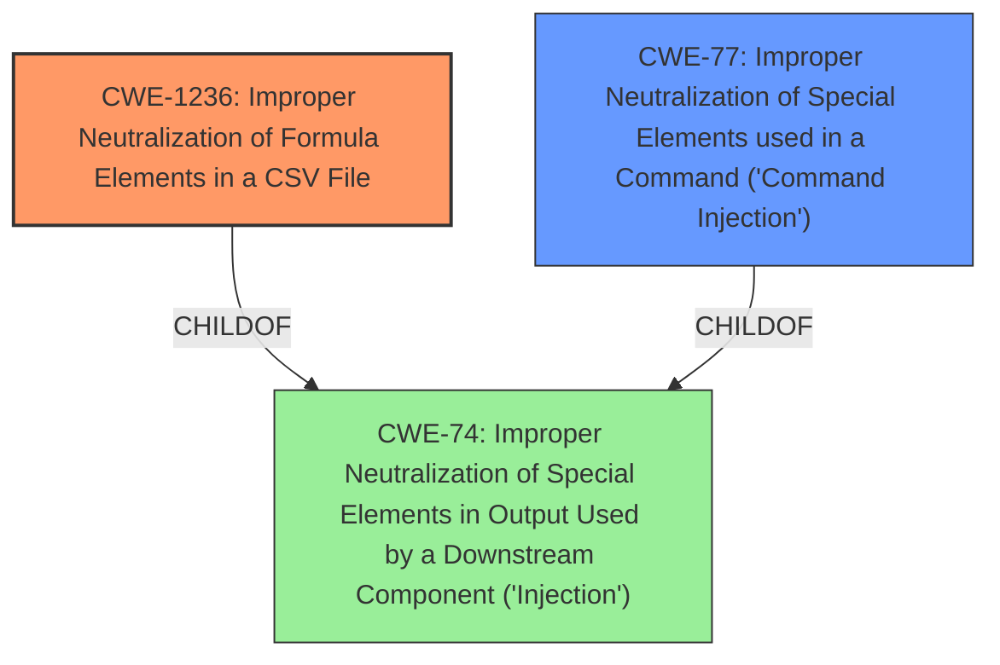

# Raw Analyzer Response for CVE-2021-41390

# Summary
| CWE ID    | CWE Name                                                                        | Confidence | CWE Abstraction Level | CWE Vulnerability Mapping Label | CWE-Vulnerability Mapping Notes |
| :---------- | :------------------------------------------------------------------------------ | :--------- | :---------------------- | :------------------------------ | :------------------------------ |
| CWE-1236    | Improper Neutralization of Formula Elements in a CSV File                      | 0.95       | Base                    | Primary CWE                     | Allowed                       |
| CWE-77      | Improper Neutralization of Special Elements used in a Command ('Command Injection') | 0.6        | Class                   | Secondary Candidate             | Allowed-with-Review           |

## Evidence and Confidence

*   **Confidence Score:** 0.9
*   **Evidence Strength:** HIGH

## Relationship Analysis
The primary CWE, CWE-1236 [Improper Neutralization of Formula Elements in a CSV File], is a Base level CWE that accurately describes the **command injection** vulnerability via CSV files. It is related to CWE-74 [Improper Neutralization of Special Elements in Output Used by a Downstream Component ('Injection')] as a child.

CWE-77 [Improper Neutralization of Special Elements used in a Command ('Command Injection')] is a Class level CWE and a parent of CWE-78 [Improper Neutralization of Special Elements used in an OS Command ('OS Command Injection')]. It is a more general form of command injection, which could apply, but CWE-1236 is more specific.

## Vulnerability Chain
The vulnerability chain involves the **improper neutralization** of formula elements, leading to **command injection** when the CSV file is opened in spreadsheet software. The chain can be described as:

1.  User input is not properly sanitized.
2.  Malicious formulas are injected into the "Configuration Name" field.
3.  A CSV report is generated.
4.  When the CSV file is opened, the injected formulas are executed.

## Summary of Analysis
The initial assessment strongly points towards CWE-1236 [Improper Neutralization of Formula Elements in a CSV File] as the primary CWE. The vulnerability description explicitly mentions CSV Injection, and the details provided in the CVE Reference Links Content Summary align perfectly with the characteristics of CWE-1236.
The weakness involves **improper neutralization** of special elements that are then interpreted as commands when the CSV file is opened.

The evidence includes:

*   "Security Provider Endpoint in the User Profile Management Section is vulnerable to CSV Injection."
*   "The application does not properly sanitize user-supplied input in the 'Configuration Name' field when creating or editing a security provider."
*   "Maliciously crafted formulas can be injected into the 'Configuration Name' field. When a report is generated in CSV format, the injected formulas are executed when the file is opened in spreadsheet software."

While CWE-77 [Improper Neutralization of Special Elements used in a Command ('Command Injection')] was also considered, it is a broader category. CWE-1236 provides a more precise classification for this specific type of **command injection** vulnerability.

The relationships between the CWEs helped in determining the best fit. CWE-1236 being a child of CWE-74 [Improper Neutralization of Special Elements in Output Used by a Downstream Component ('Injection')] indicates that it is a more specific type of injection.

Therefore, CWE-1236 is the most appropriate CWE as it is at the Base level of abstraction and directly addresses the vulnerability.
CWE-77 is a secondary candidate because it represents a more general description of command injection.