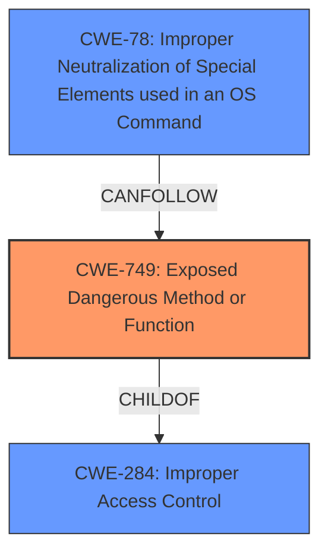

# Enhanced Analysis for CVE-2021-41392

# Summary
| CWE ID | CWE Name | Confidence | CWE Abstraction Level | CWE Vulnerability Mapping Label | CWE-Vulnerability Mapping Notes |
|---|---|---|---|---|---|
| CWE-749 | Exposed Dangerous Method or Function | 0.9 | Base | Allowed | Primary CWE |
| CWE-78 | Improper Neutralization of Special Elements used in an OS Command ('OS Command Injection') | 0.7 | Base | Allowed | Secondary CWE |

## Evidence and Confidence

*   **Confidence Score:** 0.8
*   **Evidence Strength:** HIGH

## Relationship Analysis
The primary relationship that influenced the CWE selection was the parent-child relationship between CWE-284 (Improper Access Control) and CWE-749 (Exposed Dangerous Method or Function). CWE-749 is a Base level weakness that is a child of CWE-284, indicating that it represents a more specific type of access control issue where a dangerous method or function is exposed without proper restrictions. The vulnerability description clearly indicates the exposure of a dangerous method (`openExternal`) in the `static/main-preload.js` file, making CWE-749 a more fitting choice. Additionally, CWE-78 (Improper Neutralization of Special Elements used in an OS Command) can be a consequence of CWE-749 if the exposed function allows for the execution of OS commands with improper neutralization of input.



## Vulnerability Chain
The vulnerability chain starts with the exposure of a dangerous method or function (CWE-749), specifically the `openExternal` function in `static/main-preload.js`. This function lacks proper URL validation. Because it lacks validation, it allows for arbitrary command execution, leading to OS Command Injection (CWE-78).

## Summary of Analysis
The initial analysis and criticism focused on identifying the root cause of the vulnerability. The vulnerability description and the CVE reference summary clearly point to the **unsafe usage of the `openShellExternal` API due to lack of proper URL filtering** which allowed arbitrary command execution.

The evidence for CWE-749 is strong: "The `static/main-preload.js` file in BoostNote-App introduced a dangerous API, `openShellExternal`, which allowed arbitrary access on the unsafe renderer process." This directly supports the "Exposed Dangerous Method or Function" classification. The evidence for CWE-78 is also present: "Arbitrary command execution vulnerability in the renderer process. An attacker could potentially execute arbitrary commands on a user's system by crafting malicious links." This supports the OS Command Injection classification, as the lack of proper input validation on the exposed function leads to the ability to execute arbitrary commands.

The graph relationships influenced the final selection by highlighting the connection between the exposed function and the potential for OS Command Injection. While CWE-749 is the primary weakness, CWE-78 represents a likely consequence of this weakness when the exposed function is used without proper input validation.

The selected CWEs are at the optimal level of specificity because they accurately represent the **root cause** (CWE-749) and a likely **impact** (CWE-78) of the vulnerability. CWE-749 describes the **exposure of the dangerous `openShellExternal` API**, while CWE-78 describes the **resulting command injection vulnerability**. These CWEs provide a detailed and accurate representation of the vulnerability.

Relevant CWE Information:

# Enhanced Context (25 CWEs)

## CWE-80: Improper Neutralization of Script-Related HTML Tags in a Web Page (Basic XSS)
This CWE was not selected because the vulnerability description does not specifically mention cross-site scripting.

## CWE-74: Improper Neutralization of Special Elements in Output Used by a Downstream Component ('Injection')
This CWE was not selected because it is a high-level class, and more specific CWEs like CWE-78 are more appropriate.

## CWE-116: Improper Encoding or Escaping of Output
This CWE was not selected because the primary issue is not related to encoding or escaping, but rather the exposure of a dangerous method.

## CWE-184: Incomplete List of Disallowed Inputs
This CWE was not selected because the issue is not about an incomplete list of disallowed inputs, but rather the lack of proper validation on the input used by the exposed function.

## CWE-138: Improper Neutralization of Special Elements
This CWE was not selected because it is a high-level class, and more specific CWEs like CWE-78 are more appropriate.

## CWE-1289: Improper Validation of Unsafe Equivalence in Input
This CWE was not selected because the vulnerability does not revolve around unsafe equivalence of input.

## CWE-610: Externally Controlled Reference to a Resource in Another Sphere
This CWE was considered but ultimately not selected as the primary CWE. While the `openExternal` function does reference an external resource, the core issue is the exposure of the dangerous function itself, making CWE-749 a more direct and accurate representation of the vulnerability.
## CWE-451: User Interface (UI) Misrepresentation of Critical Information
This CWE was not selected because the vulnerability is not related to UI misrepresentation.

## CWE-113: Improper Neutralization of CRLF Sequences in HTTP Headers ('HTTP Request/Response Splitting')
This CWE was not selected because the vulnerability is not related to HTTP request/response splitting.

## CWE-41: Improper Resolution of Path Equivalence
This CWE was not selected because the vulnerability is not related to path equivalence issues.

## CWE-427: Uncontrolled Search Path Element
This CWE was not selected because the vulnerability is not related to uncontrolled search path elements.

## CWE-79: Improper Neutralization of Input During Web Page Generation ('Cross-site Scripting')
This CWE was not selected because the vulnerability description does not specifically mention cross-site scripting.

## CWE-88: Improper Neutralization of Argument Delimiters in a Command ('Argument Injection')
This CWE was not selected because while argument injection could be a concern, the primary issue is the exposed function leading to command injection. CWE-78 more directly covers the command injection aspect.

## CWE-22: Improper Limitation of a Pathname to a Restricted Directory ('Path Traversal')
This CWE was not selected because the vulnerability is not related to path traversal.

## CWE-116: Improper Encoding or Escaping of Output
This CWE was not selected because the primary issue is not related to encoding or escaping, but rather the exposure of a dangerous method.

## CWE-78: Improper Neutralization of Special Elements used in an OS Command ('OS Command Injection')
CWE-78 was selected as a secondary CWE because it represents a potential impact of the exposed dangerous function (CWE-749). The lack of proper validation on the `openExternal` function allows for arbitrary command execution, which falls under the definition of OS Command Injection.

## CWE-22: Improper Limitation of a Pathname to a Restricted Directory ('Path Traversal')
This CWE was not selected because the vulnerability is not related to path traversal.

## CWE-190: Integer Overflow or Wraparound
This CWE was not selected because the vulnerability is not related to integer overflows.

## CWE-1284: Improper Validation of Specified Quantity in Input
This CWE was not selected because the vulnerability is not related to the validation of specified quantities in input.

## CWE-494: Download of Code Without Integrity Check
This CWE was not selected because the vulnerability is not related to the download of code without integrity checks.

## CWE-183: Permissive List of Allowed Inputs
This CWE was not selected because the vulnerability is not about a permissive list of allowed inputs, but rather the lack of proper validation on the input used by the exposed function.

## CWE-123: Write-what-where Condition
This CWE was not selected because the vulnerability is not directly related to a write-what-where condition.

## CWE-426: Untrusted Search Path
This CWE was not selected because the vulnerability is not related to untrusted search paths.

## CWE-915: Improperly Controlled Modification of Dynamically-Determined Object Attributes
This CWE was not selected because the vulnerability is not related to the modification of dynamically-determined object attributes.

## CWE-502: Deserialization of Untrusted Data
This CWE was not selected because the vulnerability is not related to deserialization of untrusted data.


## CWE Relationship Analysis

Current CWEs represent these abstraction levels: .


### Vulnerability Chain Analysis

**Chain starting from CWE-502:**
- 502 (Deserialization of Untrusted Data) - ROOT


**Chain starting from CWE-123:**
- 123 (Write-what-where Condition) - ROOT


### CWE Relationship Diagram

```mermaid
graph TD
    classDef primary fill:#f96,stroke:#333,stroke-width:2px
    classDef secondary fill:#69f,stroke:#333
    classDef tertiary fill:#9e9,stroke:#333
```