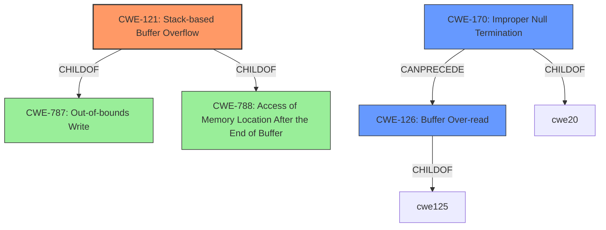

# Analysis Report for CVE-2021-41581

# Vulnerability Analysis Report: CVE-2021-41581

## Description


## Analysis (with Relationship Data)

# Summary
| CWE ID | CWE Name | Confidence | CWE Abstraction Level | CWE Vulnerability Mapping Label | CWE-Vulnerability Mapping Notes |
|---|---|---|---|---|---|
| CWE-121 | Stack-based Buffer Overflow | 0.9 | Variant | Primary | Allowed |
| CWE-126 | Buffer Over-read | 0.7 | Variant | Secondary | Allowed |
| CWE-170 | Improper Null Termination | 0.6 | Base | Secondary | Allowed |

## Evidence and Confidence

*   **Confidence Score:** 0.8
*   **Evidence Strength:** HIGH

## Relationship Analysis
The primary CWE is CWE-121, which is a variant of CWE-787 (Out-of-bounds Write) and CWE-788 (Access of Memory Location After the End of Buffer). CWE-126 (Buffer Over-read) is a related weakness, as the **stack-based buffer over-read** leads to reading data beyond the intended buffer. CWE-170 (Improper Null Termination) is another related issue, as the vulnerability description mentions that the buffer lacks null termination, which can contribute to the over-read. The relationships are as follows:



## Vulnerability Chain
The vulnerability chain starts with the **stack-based buffer over-read** due to the **lack of null termination** when the input exceeds `DOMAIN_PART_MAX_LEN`. This leads to reading beyond the intended buffer.

## Summary of Analysis
The primary weakness is a **stack-based buffer over-read** (CWE-121), as the vulnerability description explicitly mentions this. The evidence supports this classification: "x509_constraints_parse_mailbox in lib/libcrypto/x509/x509_constraints.c in LibreSSL through 3.4.0 has a **stack-based buffer over-read**." The **stack-based buffer over-read** (CWE-121) leads to reading data beyond the intended buffer, which can be classified as CWE-126 (Buffer Over-read). The **lack of null termination** (CWE-170) contributes to this vulnerability.
The analysis is based on the provided evidence and the relationships between the CWEs.

Relevant CWE Information:

# Enhanced Context (25 CWEs)
The following CWEs were identified as potentially relevant to this vulnerability:

## CWE-805: Buffer Access with Incorrect Length Value
**Abstraction Level**: Base
**Similarity Score**: 0.78
**Source**: dense

**Description**:
The product uses a sequential operation to read or write a buffer, but it uses an incorrect length value that causes it to access memory that is outside of the bounds of the buffer.

**Mapping Guidance**:
- Usage: Allowed
- Rationale: This CWE entry is at the Base level of abstraction, which is a preferred level of abstraction for mapping to the root causes of vulnerabilities.

CWE-805 could be applicable if the code uses an incorrect length value when accessing the buffer. However, the provided information focuses on the **stack-based buffer over-read** and **lack of null termination**, making CWE-121 more relevant.

## CWE-131: Incorrect Calculation of Buffer Size
**Abstraction Level**: Base
**Similarity Score**: 0.78
**Source**: dense

**Description**:
The product does not correctly calculate the size to be used when allocating a buffer, which could lead to a buffer overflow.

**Mapping Guidance**:
- Usage: Allowed
- Rationale: This CWE entry is at the Base level of abstraction, which is a preferred level of abstraction for mapping to the root causes of vulnerabilities.

CWE-131 could be applicable if the buffer size is incorrectly calculated. However, the vulnerability description focuses on the **stack-based buffer over-read** and **lack of null termination**, which are better captured by CWE-121.

## CWE-191: Integer Underflow (Wrap or Wraparound)
**Abstraction Level**: Base
**Similarity Score**: 0.77
**Source**: dense

**Description**:
The product subtracts one value from another, such that the result is less than the minimum allowable integer value, which produces a value that is not equal to the correct result.

**Mapping Guidance**:
- Usage: Allowed
- Rationale: This CWE entry is at the Base level of abstraction, which is a preferred level of abstraction for mapping to the root causes of vulnerabilities.

CWE-191 is not relevant to this vulnerability, as it involves integer underflow, which is not mentioned in the description.

## CWE-124: Buffer Underwrite ('Buffer Underflow')
**Abstraction Level**: Base
**Similarity Score**: 0.77
**Source**: dense

**Description**:
The product writes to a buffer using an index or pointer that references a memory location prior to the beginning of the buffer.

**Mapping Guidance**:
- Usage: Allowed
- Rationale: This CWE entry is at the Base level of abstraction, which is a preferred level of abstraction for mapping to the root causes of vulnerabilities.

CWE-124 is not relevant as the vulnerability involves an over-read and not an underwrite.

## CWE-126: Buffer Over-read
**Abstraction Level**: Variant
**Similarity Score**: 0.76
**Source**: dense

**Description**:
The product reads from a buffer using buffer access mechanisms such as indexes or pointers that reference memory locations after the targeted buffer.

**Mapping Guidance**:
- Usage: Allowed
- Rationale: This CWE entry is at the Variant level of abstraction, which is a preferred level of abstraction for mapping to the root causes of vulnerabilities.

CWE-126 is applicable as a secondary weakness because the stack-based buffer overflow results in reading data beyond the intended buffer.

## CWE-193: Off-by-one Error
**Abstraction Level**: Base
**Similarity Score**: 0.76
**Source**: dense

**Description**:
A product calculates or uses an incorrect maximum or minimum value that is 1 more, or 1 less, than the correct value.

**Mapping Guidance**:
- Usage: Allowed
- Rationale: This CWE entry is at the Base level of abstraction, which is a preferred level of abstraction for mapping to the root causes of vulnerabilities.

CWE-193 could be applicable if the vulnerability involved an off-by-one error. However, the provided information focuses on the **stack-based buffer over-read** and **lack of null termination**, which are better captured by CWE-121 and CWE-170.

## CWE-130: Improper Handling of Length Parameter Inconsistency
**Abstraction Level**: Base
**Similarity Score**: 0.76
**Source**: dense

**Description**:
The product parses a formatted message or structure, but it does not handle or incorrectly handles a length field that is inconsistent with the actual length of the associated data.

**Mapping Guidance**:
- Usage: Allowed
- Rationale: This CWE entry is at the Base level of abstraction, which is a preferred level of abstraction for mapping to the root causes of vulnerabilities.

CWE-130 could be applicable if the vulnerability involved improper handling of a length parameter. While there's an issue with the size limit, the core problem stems from the **lack of null termination** and subsequent **buffer over-read**, aligning more closely with CWE-121 and CWE-170.

## CWE-125: Out-of-bounds Read
**Abstraction Level**: Base
**Similarity Score**: 0.75
**Source**: dense

**Description**:
The product reads data past the end, or before the beginning, of the intended buffer.

**Mapping Guidance**:
- Usage: Allowed
- Rationale: This CWE entry is at the Base level of abstraction, which is a preferred level of abstraction for mapping to the root causes of vulnerabilities.

CWE-125 is similar to CWE-126, but CWE-126 is slightly more specific as a variant


## CWE Relationship Analysis

Current CWEs represent these abstraction levels: .


### Vulnerability Chain Analysis

**Chain starting from CWE-121:**
- 121 (Stack-based Buffer Overflow) - ROOT


**Chain starting from CWE-787:**
- 787 (Out-of-bounds Write) - ROOT


### CWE Relationship Diagram

```mermaid
graph TD
    classDef primary fill:#f96,stroke:#333,stroke-width:2px
    classDef secondary fill:#69f,stroke:#333
    classDef tertiary fill:#9e9,stroke:#333
```


*Report generated on 2025-04-02 06:28:43*
