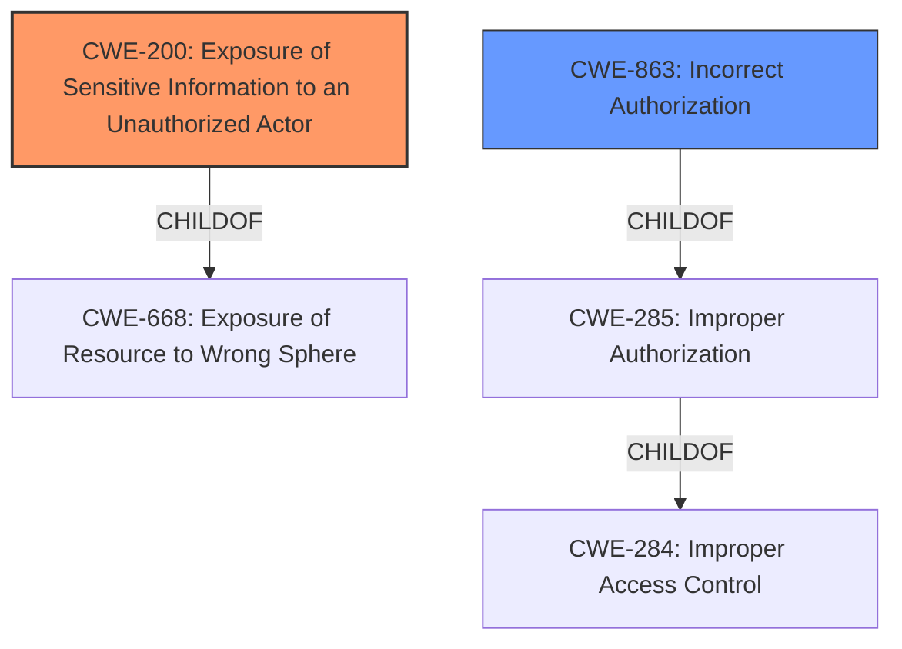

# Raw Analyzer Response for CVE-2021-41584

# Summary
| CWE ID  | CWE Name                                                         | Confidence | CWE Abstraction Level | CWE Vulnerability Mapping Label | CWE-Vulnerability Mapping Notes |
| :-------- | :--------------------------------------------------------------- | :--------- | :-------------------- | :------------------------------ | :------------------------------ |
| CWE-200 | Exposure of Sensitive Information to an Unauthorized Actor | 0.75       | Class                  | Primary CWE                   | Discouraged                  |
| CWE-863 | Incorrect Authorization | 0.65       | Class                  | Secondary Candidate                  | Allowed-with-Review                  |

## Evidence and Confidence

*   **Confidence Score:** 0.70
*   **Evidence Strength:** MEDIUM

## Relationship Analysis
The primary relationship that influenced the selection was the parent-child relationship between CWE-668 (Exposure of Resource to Wrong Sphere) and CWE-200 (Exposure of Sensitive Information to an Unauthorized Actor). CWE-200 is a child of CWE-668, representing a more specific case of exposing resources. CWE-863 (Incorrect Authorization) also has a parent relationship with CWE-285 (Improper Authorization) further up the chain to CWE-284.

## Vulnerability Chain
The vulnerability chain starts with **improper** access control due to the **incorrect** handling of the "X-Gradle-Enterprise-Ajax-Request" header, which leads to the **exposure** of sensitive information. The chain can be summarized as follows:
1.  **Improper Access Control (Implicit):** The application **fails to** properly validate the request based on the presence of the "X-Gradle-Enterprise-Ajax-Request" header.
2.  **Incorrect Authorization (CWE-863):** Because of the above **failure**, the authorization check is bypassed.
3.  **Exposure of Sensitive Information (CWE-200):** As a result, the application reveals protected information in the response body, despite returning an unauthorized status code.

## Summary of Analysis
The initial analysis focused on identifying the root cause and the resulting impact of the vulnerability. The vulnerability description and CVE reference links clearly indicate that the **improper** handling of the "X-Gradle-Enterprise-Ajax-Request" header leads to unauthorized access to sensitive information.
The primary CWE selected is CWE-200 (Exposure of Sensitive Information to an Unauthorized Actor) because the vulnerability ultimately results in the **exposure** of build data and application configuration information to unauthorized actors. The CVE Reference Links Content Summary confirms this, stating that "the application reveals protected information in the response body, despite returning an unauthorized status code."
CWE-863 (Incorrect Authorization) was considered as a secondary CWE because the **improper** handling of the "X-Gradle-Enterprise-Ajax-Request" header effectively bypasses authorization checks. However, CWE-200 was chosen as primary because it more directly represents the resulting impact of the vulnerability.
The selection of CWE-200 and CWE-863 is based on the provided evidence and the MITRE mapping guidance. While CWE-200 is generally discouraged due to its broad nature, it is appropriate in this case because the core issue is the **exposure** of sensitive information as a direct result of the **improper** handling of the request header.

Relevant CWE Information:

# Enhanced Context (25 CWEs)
The following CWEs were identified as potentially relevant to this vulnerability:

## CWE-614: Sensitive Cookie in HTTPS Session Without 'Secure' Attribute
**Abstraction Level**: Variant
**Similarity Score**: 0.78
**Source**: dense

**Description**:
The Secure attribute for sensitive cookies in HTTPS sessions is not set, which could cause the user agent to send those cookies in plaintext over an HTTP session.

**Mapping Guidance**:
- Usage: Allowed
- Rationale: This CWE entry is at the Variant level of abstraction, which is a preferred level of abstraction for mapping to the root causes of vulnerabilities.

## CWE-538: Insertion of Sensitive Information into Externally-Accessible File or Directory
**Abstraction Level**: Base
**Similarity Score**: 0.77
**Source**: dense

**Description**:
The product places sensitive information into files or directories that are accessible to actors who are allowed to have access to the files, but not to the sensitive information.

**Mapping Guidance**:
- Usage: Allowed
- Rationale: This CWE entry is at the Base level of abstraction, which is a preferred level of abstraction for mapping to the root causes of vulnerabilities.

## CWE-212: Improper Removal of Sensitive Information Before Storage or Transfer
**Abstraction Level**: Base
**Similarity Score**: 0.76
**Source**: dense

**Description**:
The product stores, transfers, or shares a resource that contains sensitive information, but it does not properly remove that information before the product makes the resource available to unauthorized actors.

**Mapping Guidance**:
- Usage: Allowed
- Rationale: This CWE entry is at the Base level of abstraction, which is a preferred level of abstraction for mapping to the root causes of vulnerabilities.

## CWE-226: Sensitive Information in Resource Not Removed Before Reuse
**Abstraction Level**: Base
**Similarity Score**: 0.76
**Source**: dense

**Description**:
The product releases a resource such as memory or a file so that it can be made available for reuse, but it does not clear or "zeroize" the information contained in the resource before the product performs a critical state transition or makes the resource available for reuse by other entities.

**Mapping Guidance**:
- Usage: Allowed
- Rationale: This CWE entry is at the Base level of abstraction, which is a preferred level of abstraction for mapping to the root causes of vulnerabilities.

## CWE-319: Cleartext Transmission of Sensitive Information
**Abstraction Level**: Base
**Similarity Score**: 0.76
**Source**: dense

**Description**:
The product transmits sensitive or security-critical data in cleartext in a communication channel that can be sniffed by unauthorized actors.

**Mapping Guidance**:
- Usage: Allowed
- Rationale: This CWE entry is at the Base level of abstraction, which is a preferred level of abstraction for mapping to the root causes of vulnerabilities.

## CWE-668: Exposure of Resource to Wrong Sphere
**Abstraction Level**: Class
**Similarity Score**: 0.76
**Source**: dense

**Description**:
The product exposes a resource to the wrong control sphere, providing unintended actors with inappropriate access to the resource.

**Mapping Guidance**:
- Usage: Discouraged
- Rationale: CWE-668 is high-level and is often misused as a catch-all when lower-level CWE IDs might be applicable. It is sometimes used for low-information vulnerability reports [REF-1287]. It is a level-1 Class (i.e., a child of a Pillar). It is not useful for trend analysis.

## CWE-807: Reliance on Untrusted Inputs in a Security Decision
**Abstraction Level**: Base
**Similarity Score**: 0.75
**Source**: dense

**Description**:
The product uses a protection mechanism that relies on the existence or values of an input, but the input can be modified by an untrusted actor in a way that bypasses the protection mechanism.

**Mapping Guidance**:
- Usage: Allowed
- Rationale: This CWE entry is at the Base level of abstraction, which is a preferred level of abstraction for mapping to the root causes of vulnerabilities.

## CWE-497: Exposure of Sensitive System Information to an Unauthorized Control Sphere
**Abstraction Level**: Base
**Similarity Score**: 0.75
**Source**: dense

**Description**:
The product does not properly prevent sensitive system-level information from being accessed by unauthorized actors who do not have the same level of access to the underlying system as the product does.

**Mapping Guidance**:
- Usage: Allowed
- Rationale: This CWE entry is at the Base level of abstraction, which is a preferred level of abstraction for mapping to the root causes of vulnerabilities.

## CWE-200: Exposure of Sensitive Information to an Unauthorized Actor
**Abstraction Level**: Class
**Similarity Score**: 0.75
**Source**: dense

**Description**:
The product exposes sensitive information to an actor that is not explicitly authorized to have access to that information.

**Mapping Guidance**:
- Usage: Discouraged
- Rationale: CWE-200 is commonly misused to represent the loss of confidentiality in a vulnerability