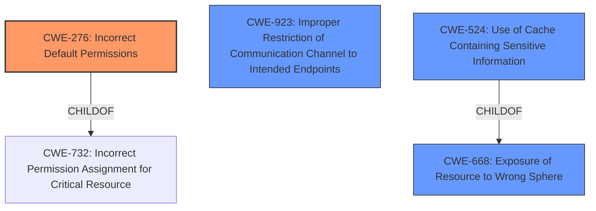

# Analysis Report for CVE-2021-41589

# Vulnerability Analysis Report: CVE-2021-41589

## Description


## Analysis (with Relationship Data)

# Summary
| CWE ID | CWE Name | Confidence | CWE Abstraction Level | CWE Vulnerability Mapping Label | CWE-Vulnerability Mapping Notes |
|---|---|---|---|---|---|
| CWE-276 | Incorrect Default Permissions | 1 | Base | Allowed | Primary CWE |
| CWE-668 | Exposure of Resource to Wrong Sphere | 0.7 | Class | Discouraged | Secondary Candidate |
| CWE-923 | Improper Restriction of Communication Channel to Intended Endpoints | 0.6 | Class | Allowed-with-Review | Secondary Candidate |
| CWE-524 | Use of Cache Containing Sensitive Information | 0.5 | Base | Allowed | Secondary Candidate |

## Evidence and Confidence

*   **Confidence Score:** 1
*   **Evidence Strength:** HIGH

## Relationship Analysis
The primary CWE selected is CWE-276 (Incorrect Default Permissions), which is a base-level CWE. Several other CWEs were considered, including class-level CWE-668 and CWE-923 and base-level CWE-524.
CWE-276 is related to CWE-732 (Incorrect Permission Assignment for Critical Resource) through a ChildOf relationship, but CWE-276 is more specific because it focuses on default permissions set during installation.
CWE-668 (Exposure of Resource to Wrong Sphere) is a high-level class and is too general.
CWE-923 (Improper Restriction of Communication Channel to Intended Endpoints) is also a class-level CWE and not as directly relevant as CWE-276.
CWE-524 (Use of Cache Containing Sensitive Information) is relevant but less direct as it is the consequence of the **incorrect default permissions**



## Vulnerability Chain
The vulnerability chain starts with **incorrect default permissions** (CWE-276), leading to **unrestricted access** to the build cache and configuration UI. This allows a malicious actor to populate the cache with manipulated entries, ultimately resulting in remote code execution.

## Summary of Analysis
The initial analysis focused on the **default open configuration** that allows anonymous access to the configuration user interface and the build cache. The retriever results indicated CWE-276 (Incorrect Default Permissions) as a top candidate, which aligns well with the root cause. The CVE Reference Links Content Summary explicitly mentions the lack of access controls as a key weakness, supporting the selection of CWE-276.

The vulnerability description states "This configuration allows anonymous access to the configuration user interface and anonymous write access to the build cache." This directly supports the choice of CWE-276.

CWE-276 is at the base level of abstraction, which is preferred. The other considered CWEs, such as CWE-668 and CWE-923, are at the class level and are less specific. CWE-524 is relevant as the cache is being used, but the initial flaw is the **incorrect default permissions** which is why CWE-276 is chosen.

Relevant CWE Information:

# Enhanced Context (25 CWEs)

## CWE-1289: Improper Validation of Unsafe Equivalence in Input
**Abstraction Level**: Base
**Similarity Score**: 0.77
**Source**: dense

**Description**:
The product receives an input value that is used as a resource identifier or other type of reference, but it does not validate or incorrectly validates that the input is equivalent to a potentially-unsafe value.
**NOT USED:** Not relevant as the core issue isn't about validating input equivalence but rather about the initial permissions configuration.

## CWE-276: Incorrect Default Permissions
**Abstraction Level**: Base
**Similarity Score**: 0.76
**Source**: dense

**Description**:
During installation, installed file permissions are set to allow anyone to modify those files.
**USED:** The root cause of the vulnerability. The default configuration allows anonymous access, violating proper permission settings.

## CWE-668: Exposure of Resource to Wrong Sphere
**Abstraction Level**: Class
**Similarity Score**: 0.76
**Source**: dense

**Description**:
The product exposes a resource to the wrong control sphere, providing unintended actors with inappropriate access to the resource.
**NOT USED:** Considered but deemed too high-level. While technically true, it doesn't pinpoint the root cause as precisely as CWE-276.

## CWE-345: Insufficient Verification of Data Authenticity
**Abstraction Level**: Class
**Similarity Score**: 0.76
**Source**: dense

**Description**:
The product does not sufficiently verify the origin or authenticity of data, in a way that causes it to accept invalid data.
**NOT USED:** Not directly applicable. The vulnerability isn't primarily about data authenticity but about unauthorized access due to **improper default permissions**.

## CWE-297: Improper Validation of Certificate with Host Mismatch
**Abstraction Level**: Variant
**Similarity Score**: 0.76
**Source**: dense

**Description**:
The product communicates with a host that provides a certificate, but the product does not properly ensure that the certificate is actually associated with that host.
**NOT USED:** Not relevant; no certificate validation issues are mentioned.

## CWE-941: Incorrectly Specified Destination in a Communication Channel
**Abstraction Level**: Base
**Similarity Score**: 0.75
**Source**: dense

**Description**:
The product creates a communication channel to initiate an outgoing request to an actor, but it does not correctly specify the intended destination for that actor.
**NOT USED:** The issue is not about incorrect specification of the destination.

## CWE-610: Externally Controlled Reference to a Resource in Another Sphere
**Abstraction Level**: Class
**Similarity Score**: 0.75
**Source**: dense

**Description**:
The product uses an externally controlled name or reference that resolves to a resource that is outside of the intended control sphere.
**NOT USED:** It is not about externally controlled reference

## CWE-303: Incorrect Implementation of Authentication Algorithm
**Abstraction Level**: Base
**Similarity Score**: 0.75
**Source**: dense

**Description**:
The requirements for the product dictate the use of an established authentication algorithm, but the implementation of the algorithm is incorrect.
**NOT USED:** No authentication algorithms are mentioned.

## CWE-807: Reliance on Untrusted Inputs in a Security Decision
**Abstraction Level**: Base
**Similarity Score**: 0.75
**Source**: dense

**Description**:
The product uses a protection mechanism that relies on the existence or values of an input, but the input can be modified by an untrusted actor in a way that bypasses the protection mechanism.
**NOT USED:** Not the primary issue.

## CWE-657: Violation of Secure Design Principles
**Abstraction Level**: Class
**Similarity Score**: 0.75
**Source**: dense

**Description**:
The product violates well-established principles for secure design.
**NOT USED:** Too generic.

## CWE-276: Incorrect Default Permissions
**Abstraction Level**: Base
**Similarity Score**: 5667.43
**Source**: sparse

**Description**:
During installation, installed file permissions are set to allow anyone to modify those files.
**USED:** The root cause of the vulnerability.

## CWE-923: Improper Restriction of Communication Channel to Intended Endpoints
**Abstraction Level**: Class
**Similarity Score**: 5372.29
**Source**: sparse

**Description**:
The product establishes a communication channel to (or from) an endpoint for privileged or protected operations, but it does not properly ensure that it is communicating with the correct endpoint.
**NOT USED:** Not a direct fit.

## CWE-668: Exposure of Resource to Wrong Sphere
**Abstraction Level**: Class
**Similarity Score**: 5354.82
**Source**: sparse

**Description**:
The product exposes a resource to the wrong control sphere, providing unintended actors with inappropriate access to the resource.
**NOT USED:** Considered but too general.

## CWE-59: Improper Link Resolution Before File Access ('Link Following')
**Abstraction Level**: Base
**Similarity Score**: 5341.36
**Source**: sparse

**Description**:
The product attempts to access a file based on the filename, but it does not properly prevent that


## CWE Relationship Analysis

Current CWEs represent these abstraction levels: .


### Vulnerability Chain Analysis

**Chain starting from CWE-732:**
- 732 (Incorrect Permission Assignment for Critical Resource) - ROOT


**Chain starting from CWE-657:**
- 657 (Violation of Secure Design Principles) - ROOT


### CWE Relationship Diagram

```mermaid
graph TD
    classDef primary fill:#f96,stroke:#333,stroke-width:2px
    classDef secondary fill:#69f,stroke:#333
    classDef tertiary fill:#9e9,stroke:#333
```


*Report generated on 2025-04-02 10:08:38*
