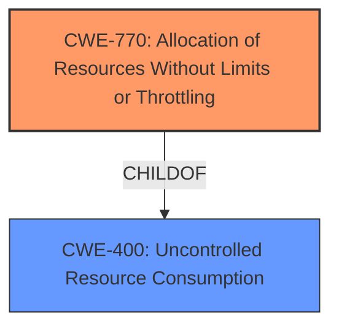

# Analysis Report for CVE-2021-41591

# Vulnerability Analysis Report: CVE-2021-41591

## Description


## Analysis (with Relationship Data)

# Summary
| CWE ID | CWE Name | Confidence | CWE Abstraction Level | CWE Vulnerability Mapping Label | CWE-Vulnerability Mapping Notes |
|---|---|---|---|---|---|
| CWE-770 | Allocation of Resources Without Limits or Throttling | 0.8 | Base | Allowed | Primary CWE |
| CWE-400 | Uncontrolled Resource Consumption | 0.6 | Class | Allowed-with-Review | Secondary CWE |

## Evidence and Confidence

*   **Confidence Score:** 0.7
*   **Evidence Strength:** HIGH

## Relationship Analysis
The primary CWE is CWE-770 (Allocation of Resources Without Limits or Throttling), which is a base-level CWE. It is a child of CWE-400 (Uncontrolled Resource Consumption), which represents a more general class of vulnerabilities. The vulnerability involves a **lack of limits** on the `dust_limit_satoshis` parameter, allowing an attacker to inflate this limit, leading to a loss of funds. This directly aligns with CWE-770's description of allocating resources without restrictions.



## Vulnerability Chain
The chain of events for this vulnerability is as follows:
1.  **Root Cause:** **Lack of validation** and **unbounded dust limit** on `dust_limit_satoshis`.
2.  **Weakness:** **Allocation of resources without limits or throttling** (CWE-770), allowing a malicious peer to inflate the dust limit.
3.  **Impact:** Loss of funds due to **dust HTLC exposure**.

## Summary of Analysis
The initial assessment focused on the **dust HTLC exposure** as the core issue. The analysis considered several CWEs, including those related to information exposure and access control. However, the key aspect of the vulnerability is the **lack of a limit** on the `dust_limit_satoshis` parameter, which leads to excessive resource consumption by a malicious peer.

The evidence from the CVE Reference Links Content Summary clearly supports this: "The lack of a check on the counterparty's announced `dust_limit_satoshis` during channel opening allows a malicious actor to set a high dust limit." This directly aligns with the description of CWE-770, which states, "The product allocates a reusable resource or group of resources on behalf of an actor without imposing any restrictions on the size or number of resources that can be allocated."

CWE-200 (Exposure of Sensitive Information to an Unauthorized Actor) and its related CWEs were considered but deemed less relevant because the primary issue is not the exposure of information but the **uncontrolled allocation of resources**. The problem is the **lack of limits** which leads to loss of funds and the **exposure** is only a symptom. Similarly, CWE-863 (Incorrect Authorization) and CWE-1220 (Insufficient Granularity of Access Control) were not selected because the vulnerability doesn't primarily revolve around authorization or access control issues. Instead, it centers on the **unrestricted allocation of resources**, specifically the `dust_limit_satoshis` parameter.

The final decision to select CWE-770 is based on the specific evidence of **missing checks** and **unbounded limits**, which directly leads to the **allocation of resources without throttling**. This is the most accurate and specific representation of the vulnerability's root cause.

Relevant CWE Information:

## CWE-668: Exposure of Resource to Wrong Sphere
**Abstraction Level**: Class
**Similarity Score**: 0.75
**Source**: dense

**Description**:
The product exposes a resource to the wrong control sphere, providing unintended actors with inappropriate access to the resource.

**Mapping Guidance**:
- Usage: Discouraged
- Rationale: CWE-668 is high-level and is often misused as a catch-all when lower-level CWE IDs might be applicable. It is sometimes used for low-information vulnerability reports [REF-1287]. It is a level-1 Class (i.e., a child of a Pillar). It is not useful for trend analysis.


## CWE Relationship Analysis

Current CWEs represent these abstraction levels: .


### Vulnerability Chain Analysis

**Chain starting from CWE-200:**
- 200 (Exposure of Sensitive Information to an Unauthorized Actor) - ROOT


**Chain starting from CWE-668:**
- 668 (Exposure of Resource to Wrong Sphere) - ROOT


### CWE Relationship Diagram

```mermaid
graph TD
    classDef primary fill:#f96,stroke:#333,stroke-width:2px
    classDef secondary fill:#69f,stroke:#333
    classDef tertiary fill:#9e9,stroke:#333
```


*Report generated on 2025-04-02 09:09:10*
