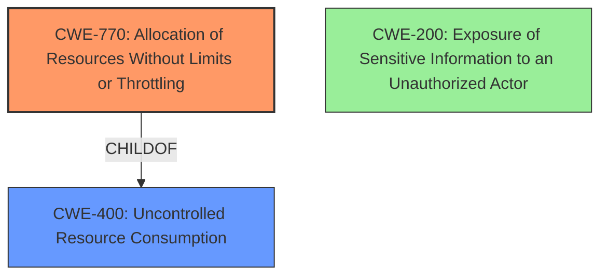

# Analysis for CVE-2021-41593

# Summary
| CWE ID    | CWE Name                                                               | Confidence | CWE Abstraction Level | CWE Vulnerability Mapping Label | CWE-Vulnerability Mapping Notes |
| :--------- | :--------------------------------------------------------------------- | :--------- | :---------------------- | :------------------------------ | :---------------------------- |
| CWE-770   | Allocation of Resources Without Limits or Throttling                   | 0.9        | Base                    | Primary CWE                    | Allowed                       |
| CWE-400   | Uncontrolled Resource Consumption                                     | 0.7        | Class                   | Secondary Candidate             | Allowed-With-Review           |
| CWE-200   | Exposure of Sensitive Information to an Unauthorized Actor            | 0.5        | Class                   | Secondary Candidate             | Discouraged                    |

## Evidence and Confidence

*   **Confidence Score:** 0.8
*   **Evidence Strength:** HIGH

## Relationship Analysis
The primary CWE selected is CWE-770, which describes the **allocation of resources without limits or throttling**. This is a base-level CWE and a child of CWE-400, which is uncontrolled resource consumption. CWE-200 (Exposure of Sensitive Information to an Unauthorized Actor) was also considered but not chosen as the primary because the root cause is not primarily about information exposure but about the **uncontrolled allocation of HTLC resources**. The relationship between CWE-770 and CWE-400 helps refine the classification to the more specific issue of uncontrolled resource allocation.

## Vulnerability Chain
The chain of events is as follows:
1.  **Root Cause:** **Uncontrolled allocation of dust HTLCs** due to **insufficient validation** of dust limits during channel opening. This aligns with CWE-770 (Allocation of Resources Without Limits or Throttling).
2.  **Weakness:** The BOLT specification **lacked a requirement for counterparty verification** of dust limits.
3.  **Weakness:** Implementations **didn't enforce a limit on the sum of in-flight HTLCs**.
4.  **Weakness:** Attackers could **manipulate the `update_fee` mechanism** to increase funds at risk.
5.  **Impact:** **Loss of funds** due to dust HTLC exposure.

## Summary of Analysis
The initial analysis focused on the vulnerability description and the provided CVE reference content summary. The core issue is the **dust HTLC exposure**, leading to a **loss of funds**. The content highlights the **lack of proper limits** on dust HTLCs as the root cause.

The selection of CWE-770 is based on the evidence from the CVE reference content summary, which states: "Implementations didn't enforce a limit on the sum of in-flight HTLCs that could be trimmed as fees." This directly supports the **allocation of resources without limits**.

The graph relationships influenced the decision by highlighting the connection between CWE-770 and the broader category of CWE-400 (Uncontrolled Resource Consumption). While CWE-400 is relevant, CWE-770 provides a more specific classification that aligns with the technical details of the vulnerability.

The chosen CWEs are at the optimal level of specificity because CWE-770 directly addresses the root cause of the vulnerability, which is the **uncontrolled allocation of HTLC resources**. It's more specific than CWE-400 and more accurate than CWE-200, which focuses on the impact (information exposure) rather than the cause (**uncontrolled resource allocation**).

Relevant CWE Information:

# Enhanced Context (25 CWEs)

## CWE-538: Insertion of Sensitive Information into Externally-Accessible File or Directory
**Abstraction Level**: Base
**Similarity Score**: 0.75
**Source**: dense

**Description**:
The product places sensitive information into files or directories that are accessible to actors who are allowed to have access to the files, but not to the sensitive information.

**Mapping Guidance**:
- Usage: Allowed
- Rationale: This CWE entry is at the Base level of abstraction, which is a preferred level of abstraction for mapping to the root causes of vulnerabilities.

## CWE-226: Sensitive Information in Resource Not Removed Before Reuse
**Abstraction Level**: Base
**Similarity Score**: 0.74
**Source**: dense

**Description**:
The product releases a resource such as memory or a file so that it can be made available for reuse, but it does not clear or "zeroize" the information contained in the resource before the product performs a critical state transition or makes the resource available for reuse by other entities.

**Mapping Guidance**:
- Usage: Allowed
- Rationale: This CWE entry is at the Base level of abstraction, which is a preferred level of abstraction for mapping to the root causes of vulnerabilities.

## CWE-213: Exposure of Sensitive Information Due to Incompatible Policies
**Abstraction Level**: Base
**Similarity Score**: 0.74
**Source**: dense

**Description**:
The product's intended functionality exposes information to certain actors in accordance with the developer's security policy, but this information is regarded as sensitive according to the intended security policies of other stakeholders such as the product's administrator, users, or others whose information is being processed.

**Mapping Guidance**:
- Usage: Allowed
- Rationale: This CWE entry is at the Base level of abstraction, which is a preferred level of abstraction for mapping to the root causes of vulnerabilities.

## CWE-497: Exposure of Sensitive System Information to an Unauthorized Control Sphere
**Abstraction Level**: Base
**Similarity Score**: 0.73
**Source**: dense

**Description**:
The product does not properly prevent sensitive system-level information from being accessed by unauthorized actors who do not have the same level of access to the underlying system as the product does.

**Mapping Guidance**:
- Usage: Allowed
- Rationale: This CWE entry is at the Base level of abstraction, which is a preferred level of abstraction for mapping to the root causes of vulnerabilities.

## CWE-668: Exposure of Resource to Wrong Sphere
**Abstraction Level**: Class
**Similarity Score**: 0.72
**Source**: dense

**Description**:
The product exposes a resource to the wrong control sphere, providing unintended actors with inappropriate access to the resource.

**Mapping Guidance**:
- Usage: Discouraged
- Rationale: CWE-668 is high-level and is often misused as a catch-all when lower-level CWE IDs might be applicable. It is sometimes used for low-information vulnerability reports [REF-1287]. It is a level-1 Class (i.e., a child of a Pillar). It is not useful for trend analysis.

## CWE-359: Exposure of Private Personal Information to an Unauthorized Actor
**Abstraction Level**: Base
**Similarity Score**: 0.72
**Source**: dense

**Description**:
The product does not properly prevent a person's private, personal information from being accessed by actors who either (1) are not explicitly authorized to access the information or (2) do not have the implicit consent of the person about whom the information is collected.

**Mapping Guidance**:
- Usage: Allowed
- Rationale: This CWE entry is at the Base level of abstraction, which is a preferred level of abstraction for mapping to the root causes of vulnerabilities.

## CWE-202: Exposure of Sensitive Information Through Data Queries
**Abstraction Level**: Base
**Similarity Score**: 0.72
**Source**: dense

**Description**:
When trying to keep information confidential, an attacker can often infer some of the information by using statistics.

**Mapping Guidance**:
- Usage: Allowed
- Rationale: This CWE entry is at the Base level of abstraction, which is a preferred level of abstraction for mapping to the root causes of vulnerabilities.

## CWE-212: Improper Removal of Sensitive Information Before Storage or Transfer
**Abstraction Level**: Base
**Similarity Score**: 0.72
**Source**: dense

**Description**:
The product stores, transfers, or shares a resource that contains sensitive information, but it does not properly remove that information before the product makes the resource available to unauthorized actors.

**Mapping Guidance**:
- Usage: Allowed
- Rationale: This CWE entry is at the Base level of abstraction, which is a preferred level of abstraction for mapping to the root causes of vulnerabilities.

## CWE-200: Exposure of Sensitive Information to an Unauthorized Actor
**Abstraction Level**: Class
**Similarity Score**: 0.71
**Source**: dense

**Description**:
The product exposes sensitive information to an actor that is not explicitly authorized to have access to that information.

**Mapping Guidance**:
- Usage: Discouraged