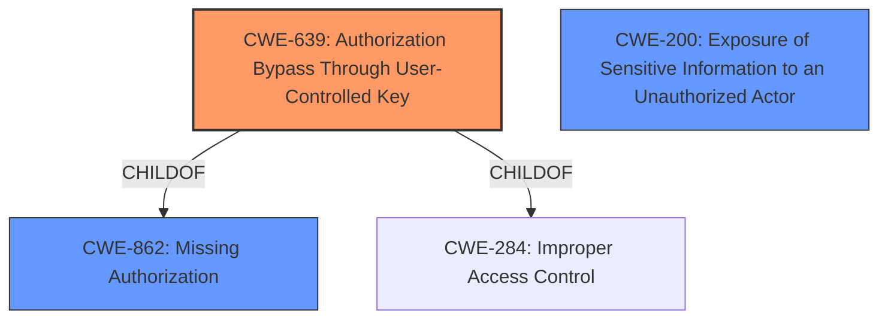

# Analysis for CVE-2021-41608

# Summary
| CWE ID | CWE Name | Confidence | CWE Abstraction Level | CWE Vulnerability Mapping Label | CWE-Vulnerability Mapping Notes |
|---|---|---|---|---|---|
| CWE-639 | Authorization Bypass Through User-Controlled Key | 0.9 | Base | Allowed | Primary CWE |
| CWE-862 | Missing Authorization | 0.7 | Class | Allowed-with-Review | Secondary Candidate |
| CWE-200 | Exposure of Sensitive Information to an Unauthorized Actor | 0.5 | Class | Discouraged | Secondary Candidate |

## Evidence and Confidence

*   **Confidence Score:** 0.8
*   **Evidence Strength:** HIGH

## Relationship Analysis
The primary relationship impacting the decision is that CWE-639 "Authorization Bypass Through User-Controlled Key" is a child of both CWE-863 "Incorrect Authorization" and CWE-284 "Improper Access Control". Since the vulnerability involves modifying a key value to access another user's data, CWE-639 is a more specific and accurate representation of the weakness than its parents. CWE-862 "Missing Authorization" and CWE-200 "Exposure of Sensitive Information to an Unauthorized Actor" were considered, but CWE-639 better captures the mechanism of the authorization bypass. The abstraction levels were considered, favoring the Base level CWE-639 over the Class level CWE-862 and CWE-200 where there was sufficient evidence to do so.

## Vulnerability Chain
The vulnerability chain starts with the **missing authorization** check in the `UploadedImageDisplay.aspx` endpoint. This leads to the ability to bypass access controls by modifying the ID parameter (user-controlled key), resulting in the **file disclosure** of sensitive user-submitted data.

Missing Authorization -> Authorization Bypass Through User-Controlled Key -> Information Disclosure

## Summary of Analysis
The initial analysis considered multiple CWEs, including CWE-639, CWE-862, and CWE-200. The final decision to prioritize CWE-639 was based on the specific mechanism of the vulnerability, which involves modifying a user-controlled key to bypass authorization.

The evidence from the "CVE Reference Links Content Summary" section strongly supports this classification:
- "Broken Access Control in the `UploadedImageDisplay.aspx` endpoint"
- "Unauthenticated access to uploaded files... does not require authentication to access files through the `UploadedImageDisplay.aspx?ID=(x)` endpoint."
- "Predictable file IDs: Files are stored in the database sequentially, allowing attackers to enumerate them by incrementing the ID parameter value."
- "Information Disclosure: Unauthenticated attackers can access and download all uploaded files."

The graph relationships further reinforce the selection of CWE-639 as the most specific and accurate representation of the vulnerability. The vulnerability involves an **authorization bypass** (CWE-639) achieved by manipulating a user-controlled key, which falls under the broader category of **improper access control** (CWE-284) and **incorrect authorization** (CWE-862). CWE-639 is at the optimal level of specificity because it directly reflects the attack vector and the root cause of the vulnerability.

Relevant CWE Information:

# Enhanced Context (25 CWEs)
The following CWEs were identified as potentially relevant to this vulnerability:

## CWE-639: Authorization Bypass Through User-Controlled Key
**Technical Explanation:**

The vulnerability in SelectSurvey.NET allows an unauthenticated attacker to access sensitive files by manipulating the `ID` parameter in the `UploadedImageDisplay.aspx` endpoint. This bypasses the intended authorization mechanism, enabling the attacker to retrieve files they should not have access to. The vulnerability aligns with the characteristics of CWE-639, where the system's authorization functionality fails to prevent unauthorized access by modifying a user-controlled key value.

**Security Implications:**

The security implication is significant, as it leads to **unauthorized information disclosure**. An attacker can potentially access all uploaded files, including sensitive documents like resumes, contracts, and spreadsheets, leading to a data breach.

**Hierarchical Relationships:**

CWE-639 is a child of CWE-863 (**Incorrect Authorization**) and CWE-284 (**Improper Access Control**). This relationship indicates that the vulnerability is a specific instance of a more general authorization issue.

**Primary/Secondary Weakness:**

CWE-639 is the primary weakness, as it directly reflects the root cause of the vulnerability.

**MITRE Mapping Guidance:**

The MITRE mapping guidance for CWE-639 allows its usage and states that "This CWE entry is at the Base level of abstraction, which is a preferred level of abstraction for mapping to the root causes of vulnerabilities."

## CWE-862: Missing Authorization
**Technical Explanation:**

The product does not perform an authorization check when an actor attempts to access a resource or perform an action. This is a broader classification that applies because the system lacks proper authorization checks for accessing the uploaded files.

**Security Implications:**

The security implication is unauthorized access to resources, leading to potential data breaches and other security compromises.

**Hierarchical Relationships:**

CWE-862 is a child of CWE-285 and CWE-284, indicating that it is a specific instance of a more general access control issue.

**Primary/Secondary Weakness:**

CWE-862 is considered a secondary weakness because while the system lacks authorization checks, the specific vulnerability is triggered by manipulating a user-controlled key (CWE-639).

**MITRE Mapping Guidance:**

The MITRE mapping guidance for CWE-862 allows its usage with review and suggests examining its children for a better fit, which in this case is CWE-639.

## CWE-200: Exposure of Sensitive Information to an Unauthorized Actor
**Technical Explanation:**

The product exposes sensitive information to an actor that is not explicitly authorized to have access to that information. This CWE applies because the vulnerability results in the disclosure of sensitive user-submitted data to an unauthenticated attacker.

**Security Implications:**

The security implication is the unauthorized disclosure of sensitive information, leading to potential privacy violations and other security compromises.

**Hierarchical Relationships:**

CWE-200 is a child of CWE-668, indicating that it is a specific instance of a more general resource exposure issue.

**Primary/Secondary Weakness:**

CWE-200 is considered a secondary weakness because it represents the impact of the vulnerability rather than the root cause. The root cause is the **authorization bypass** (CWE-639) that leads to the information exposure.

**MITRE Mapping Guidance:**

The MITRE mapping guidance for CWE-200 discourages its usage as it is commonly misused to represent the loss of confidentiality, which is a technical impact rather than a root cause error.

## Other CWEs Considered but Not Used:

- CWE-306 (Missing Authentication for Critical Function): While there's a lack of authentication, the vulnerability is more about bypassing authorization via manipulating the ID, making CWE-639 a better fit.
- CWE-434 (Unrestricted Upload of File with Dangerous Type): This doesn't apply because the issue isn't about the type of file uploaded, but about accessing existing files without authorization.
- CWE-472 (External Control of Assumed-Immutable Web Parameter): This is related, but CWE-639 is more specific to the authorization bypass mechanism.