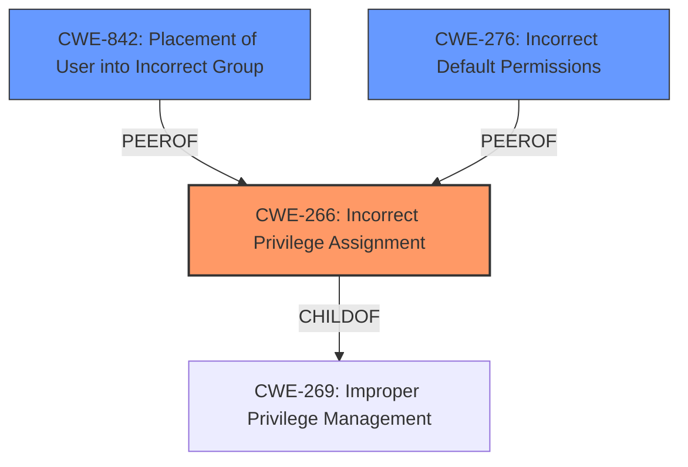

# Raw Analyzer Response for CVE-2021-41617

# Summary
| CWE ID | CWE Name | Confidence | CWE Abstraction Level | CWE Vulnerability Mapping Label | CWE-Vulnerability Mapping Notes |
|---|---|---|---|---|---|
| CWE-266 | Incorrect Privilege Assignment | 0.9 | Base | Allowed | Primary CWE |
| CWE-842 | Placement of User into Incorrect Group | 0.7 | Base | Allowed | Secondary Candidate |
| CWE-276 | Incorrect Default Permissions | 0.6 | Base | Allowed | Secondary Candidate |

## Evidence and Confidence

*   **Confidence Score:** 0.9
*   **Evidence Strength:** HIGH

## Relationship Analysis
The primary CWE is CWE-266, which is a Base level CWE that accurately reflects the **incorrect assignment of privileges**. CWE-266 is a child of the Class-level CWE-269 (Improper Privilege Management). Other considered CWEs, such as CWE-842 and CWE-276 are also at the Base level and provide alternative perspectives on the root cause. These relationships help to ensure the selected CWE is at the appropriate level of specificity.

## Vulnerability Chain
The vulnerability chain starts with the **incorrect initialization of supplemental groups** in sshd. This leads to helper programs inheriting the privileges of the sshd process instead of the intended user, ultimately resulting in privilege escalation.

## Summary of Analysis
The initial assessment focuses on the **incorrect initialization of supplemental groups** as the root cause, leading to privilege escalation. The analysis relies heavily on the "Vulnerability Description Key Phrases" and "CVE Reference Links Content Summary", specifically: "**supplemental groups are not initialized as expected**" and "sshd fails to correctly initialize supplemental groups when executing commands using AuthorizedKeysCommand or AuthorizedPrincipalsCommand with a different user specified, inheriting sshd process groups instead."

CWE-266 (Incorrect Privilege Assignment) is selected as the primary CWE because it directly addresses the root cause where the software **incorrectly assigns privileges** (group memberships) to a process. This is supported by the retriever results and the detailed description of CWE-266, which states: "A product incorrectly assigns a privilege to a particular actor, creating an unintended sphere of control for that actor."

CWE-842 (Placement of User into Incorrect Group) was considered as a secondary CWE, since the root cause is **supplemental groups are not initialized as expected**, but ultimately this is about group membership so it is a candidate.

CWE-276 (Incorrect Default Permissions) was also considered as a secondary CWE, but deemed less appropriate.

The selection of CWE-266 is at the optimal level of specificity (Base) and is supported by the evidence and mapping guidance.

Relevant CWE Information:

# Enhanced Context (25 CWEs)

## CWE-266: Incorrect Privilege Assignment
**Abstraction Level**: Base
**Similarity Score**: 0.77
**Source**: dense

**Description**:
A product incorrectly assigns a privilege to a particular actor, creating an unintended sphere of control for that actor.

**Mapping Guidance**:
- Usage: Allowed
- Rationale: This CWE entry is at the Base level of abstraction, which is a preferred level of abstraction for mapping to the root causes of vulnerabilities.