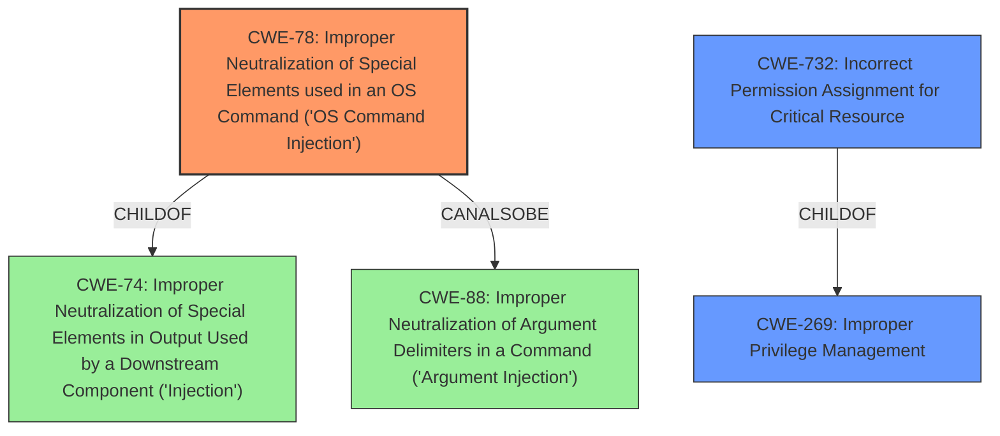

# Enhanced Analysis for CVE-2021-41619

# Summary
| CWE ID | CWE Name | Confidence | CWE Abstraction Level | CWE Vulnerability Mapping Label | CWE-Vulnerability Mapping Notes |
|---|---|---|---|---|---|
| CWE-78 | Improper Neutralization of Special Elements used in an OS Command ('OS Command Injection') | 0.9 | Base | Allowed | Primary CWE.  The ability to specify JVM options like `-XX:OnOutOfMemoryError` allows for execution of arbitrary commands on the host system. |
| CWE-269 | Improper Privilege Management | 0.6 | Class | Discouraged | Secondary CWE. The vulnerability requires administrative access, highlighting a potential issue with privilege management, but the root cause is the command injection. |
| CWE-732 | Incorrect Permission Assignment for Critical Resource | 0.5 | Class | Allowed-with-Review | Secondary CWE. Administrative access to the application's configuration interface suggests a potential permissions issue, but the primary weakness is the command injection via JVM options.|

## Evidence and Confidence

*   **Confidence Score:** 0.9
*   **Evidence Strength:** HIGH

## Relationship Analysis
The primary relationship is that **CWE-78** [Improper Neutralization of Special Elements used in an OS Command ('OS Command Injection')] is a child of **CWE-74** [Improper Neutralization of Special Elements in Output Used by a Downstream Component ('Injection')]. **CWE-78** is at the Base level, which is more specific than the Class level of **CWE-74**, making it a better fit. **CWE-78** can also be related to **CWE-88** [Improper Neutralization of Argument Delimiters in a Command ('Argument Injection')], if the injected commands are constructed using improperly delimited arguments. The relationship between **CWE-269** [Improper Privilege Management] and **CWE-732** [Incorrect Permission Assignment for Critical Resource] indicates that permission issues can sometimes lead to privilege management problems.



## Vulnerability Chain
The vulnerability chain starts with the **improper configuration of JVM startup options** in the application's administrative interface. This leads to the ability to specify commands for execution on the host system via options like `-XX:OnOutOfMemoryError`, resulting in **OS Command Injection (CWE-78)** and ultimately, **Remote Code Execution**. The requirement for administrative access suggests a potential weakness in **Privilege Management (CWE-269)** or **Incorrect Permission Assignment (CWE-732)**, but these are contributing factors rather than the primary cause.

## Summary of Analysis
The analysis indicates that **CWE-78** [Improper Neutralization of Special Elements used in an OS Command ('OS Command Injection')] is the most appropriate primary CWE. This is based on the evidence that arbitrary JVM startup options can be specified via the application's admin interface, leading to the execution of commands on the host system. The "CVE Reference Links Content Summary" clearly states that the "Root Cause of Vulnerability" is the "ability to specify arbitrary Java Virtual Machine (JVM) startup options...allow the execution of a command on the host."

The relationship analysis highlights that **CWE-78** is a specific type of injection, making it a better fit than the more general **CWE-74** [Improper Neutralization of Special Elements in Output Used by a Downstream Component ('Injection')].

**CWE-269** [Improper Privilege Management] and **CWE-732** [Incorrect Permission Assignment for Critical Resource] were considered because the attacker needs administrative access, suggesting a potential permissions or privilege management issue. However, these are secondary to the primary weakness of command injection. The focus is on the **improper neutralization** of special elements, rather than a core privilege management flaw. The admin access is a prerequisite, not the root cause.

The selection of **CWE-78** is at the optimal level of specificity because it directly addresses the **root cause** of the vulnerability: the ability to inject OS commands via JVM startup options. This aligns with the goal of identifying the precise weakness that leads to the vulnerability.

Relevant CWE Information:
- **CWE-78**: The product constructs an OS command using externally-influenced input but **does not neutralize** special elements that could modify the intended command. This aligns with the vulnerability description, where arbitrary JVM options can be specified, allowing for command execution.
- **CWE-269**: The product does not properly assign, modify, track, or check privileges. While administrative access is required, the **root cause** is the **lack of input validation** and **improper neutralization** of special elements, not a fundamental flaw in privilege management.
- **CWE-732**: The product specifies permissions for a security-critical resource in a way that allows that resource to be read or modified by unintended actors. While the admin interface can be considered a critical resource, the primary issue is the **lack of input validation**, not an incorrect permission assignment.

The other CWEs listed were considered but deemed less relevant because they did not directly address the **root cause** of the vulnerability. For example, **CWE-502** [Deserialization of Untrusted Data] and **CWE-1336** [Improper Neutralization of Special Elements Used in a Template Engine] are not applicable because the vulnerability does not involve deserialization or template engines. Similarly, **CWE-306** [Missing Authentication for Critical Function] is not the primary issue, as the attacker needs administrative access, implying that some form of authentication is present, even if flawed.


## CWE Relationship Analysis

Current CWEs represent these abstraction levels: .


### Vulnerability Chain Analysis

**Chain starting from CWE-732:**
- 732 (Incorrect Permission Assignment for Critical Resource) - ROOT


**Chain starting from CWE-502:**
- 502 (Deserialization of Untrusted Data) - ROOT


### CWE Relationship Diagram

```mermaid
graph TD
    classDef primary fill:#f96,stroke:#333,stroke-width:2px
    classDef secondary fill:#69f,stroke:#333
    classDef tertiary fill:#9e9,stroke:#333
```