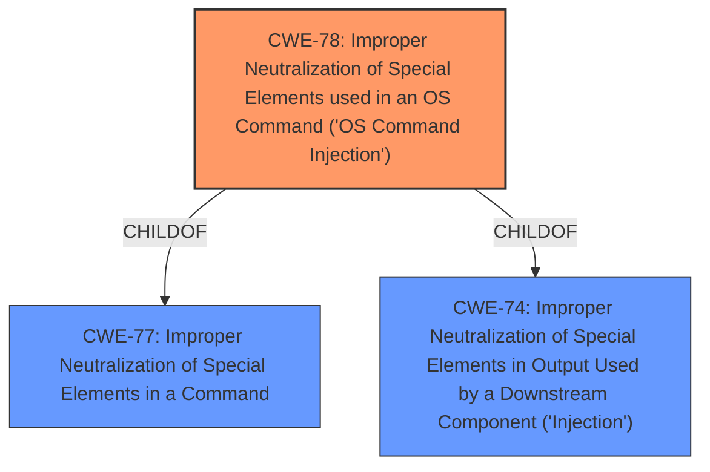

# Enhanced Analysis for CVE-2021-41653

# Summary
| CWE ID  | CWE Name                                                                        | Confidence | CWE Abstraction Level | CWE Vulnerability Mapping Label | CWE-Vulnerability Mapping Notes |
| :-------- | :------------------------------------------------------------------------------ | :---------- | :---------------------- | :------------------------------ | :------------------------------ |
| CWE-78    | Improper Neutralization of Special Elements used in an OS Command ('OS Command Injection') | 1         | Base                    | Primary                         | Allowed                       |

## Evidence and Confidence

*   **Confidence Score:** 1
*   **Evidence Strength:** HIGH

## Relationship Analysis
The primary relationship influencing the selection of CWE-78 is its nature as a **Base** level CWE that directly addresses the **root cause** of the vulnerability. The other potential CWEs were either too abstract or represented related but not central issues.



## Vulnerability Chain
The vulnerability chain starts with the **lack of input sanitization**, leading to **command injection** and culminating in **remote code execution**.
  - **Root Cause:** **Lack of Input Sanitization**
  - **Weakness:** **Command Injection** (CWE-78)
  - **Impact:** Remote Code Execution

## Summary of Analysis
The analysis identified CWE-78 as the most appropriate classification for this vulnerability. This determination is based on the vulnerability description, which clearly states that the **PING function is vulnerable to remote code execution via a crafted payload in an IP address input field**, and the CVE reference summary, which highlights the **lack of proper sanitization of user-provided input** that allows attackers to **inject arbitrary shell commands.**

The selection of CWE-78 is further supported by the **Retriever Results**, which lists it as the top CWE with a base level of abstraction. The vulnerability description aligns well with the CWE's description: **"The product constructs all or part of an OS command using externally-influenced input... but it does not neutralize or incorrectly neutralizes special elements that could modify the intended OS command."**

The MITRE mapping guidance for CWE-78 recommends its use, stating: **"This CWE entry is at the Base level of abstraction, which is a preferred level of abstraction for mapping to the root causes of vulnerabilities."** This reinforces the decision to classify the vulnerability as CWE-78.

Other CWEs Considered:

*   CWE-94 (Improper Control of Generation of Code ('Code Injection')): While remote code execution is the impact, the root cause is the improper neutralization of special elements in a command, making CWE-78 a more accurate fit.
*   CWE-290 (Authentication Bypass by Spoofing): Not relevant as the vulnerability is about command injection, not authentication.
*   CWE-138 (Improper Neutralization of Special Elements): Too high-level. CWE-78 is a more specific base level weakness.
*   CWE-20 (Improper Input Validation): Too high-level and general. CWE-78 captures the specific weakness of OS command injection due to missing neutralization.
*   CWE-184 (Incomplete List of Disallowed Inputs): Possibly related, but the core issue is not about a list of disallowed inputs, but the lack of any sanitization.

The final decision to use CWE-78 is based on the evidence of **command injection** due to **missing input sanitization**, the guidance provided by MITRE, and the specificity of the CWE in addressing the root cause of the vulnerability.


## CWE Relationship Analysis

Current CWEs represent these abstraction levels: .


### Vulnerability Chain Analysis

**Chain starting from CWE-290:**
- 290 (Authentication Bypass by Spoofing) - ROOT


**Chain starting from CWE-78:**
- 78 (Improper Neutralization of Special Elements used in an OS Command ('OS Command Injection')) - ROOT


### CWE Relationship Diagram

```mermaid
graph TD
    classDef primary fill:#f96,stroke:#333,stroke-width:2px
    classDef secondary fill:#69f,stroke:#333
    classDef tertiary fill:#9e9,stroke:#333
```