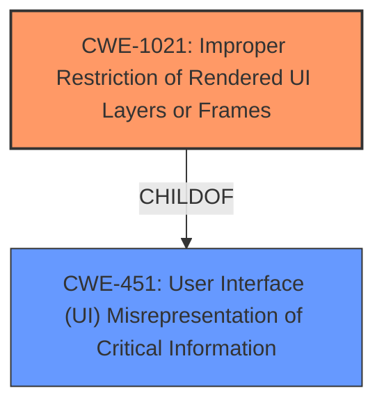

# Enhanced Analysis for CVE-2021-41657

# Summary
| CWE ID | CWE Name | Confidence | CWE Abstraction Level | CWE Vulnerability Mapping Label | CWE-Vulnerability Mapping Notes |
|---|---|---|---|---|---|
| CWE-1021 | Improper Restriction of Rendered UI Layers or Frames | 1.0 | Base | Allowed | Primary CWE |
| CWE-451 | User Interface (UI) Misrepresentation of Critical Information | 0.5 | Class | Allowed-with-Review | Secondary Candidate |

## Evidence and Confidence

*   **Confidence Score:** 0.8
*   **Evidence Strength:** HIGH

## Relationship Analysis
The primary relationship considered was the ChildOf relationship, specifically how CWE-1021 (Improper Restriction of Rendered UI Layers or Frames) is a child of CWE-451 (User Interface (UI) Misrepresentation of Critical Information). This influenced the decision to consider CWE-451 as a potential, though less specific, mapping. The analysis focused on identifying the most precise weakness, leading to prioritizing the base-level CWE-1021 due to its direct relevance to the clickjacking issue.



## Vulnerability Chain
The vulnerability chain consists of the following sequence:
  1.  **Root Cause:** **Improper Restriction of Rendered UI Layers or Frames** (CWE-1021) due to **insufficient input validation** of iFrame data.
  2.  **Weakness:** The application **fails to properly validate or sanitize** the iFrame data, allowing the injection of malicious iFrame code.
  3.  **Impact:** Clickjacking attack, where users are tricked into performing unintended actions. This can also be seen as **User Interface (UI) Misrepresentation of Critical Information** (CWE-451), though this is a higher-level abstraction.

## Summary of Analysis
The initial analysis identified CWE-1021 as the most suitable mapping due to its direct relevance to the clickjacking vulnerability resulting from **improperly restricting rendered UI layers or frames**. The "CVE Reference Links Content Summary" explicitly states "**Improper Restriction of Rendered UI Layers or Frames:** The application does not properly validate or sanitize the iFrame data, allowing an attacker to inject malicious iFrame code" which directly aligns with the description of CWE-1021.

CWE-451 was considered due to its parent relationship with CWE-1021. However, it was deemed less specific because it broadly covers UI misrepresentation, whereas CWE-1021 directly addresses the frame restriction issue leading to clickjacking.

The final decision is based on the evidence provided and the specificity of CWE-1021, making it the optimal choice for representing the vulnerability. The selection aligns with MITRE's guidance to choose the most specific, base-level CWE when available.

Relevant CWE Information:

# Enhanced Context (25 CWEs)
The following CWEs were identified as potentially relevant to this vulnerability:

## CWE-1021: Improper Restriction of Rendered UI Layers or Frames
**Abstraction Level**: Base
**Similarity Score**: 0.082
**Source**: sparse

**Description**:
The web application does not restrict or incorrectly restricts frame objects or UI layers that belong to another application or domain, which can lead to user confusion about which interface the user is interacting with.

**Mapping Guidance**:
**Usage:** Allowed
**Rationale:** This CWE entry is at the Base level of abstraction, which is a preferred level of abstraction for mapping to the root causes of vulnerabilities.

## CWE-451: User Interface (UI) Misrepresentation of Critical Information
**Abstraction Level**: Class
**Similarity Score**: 0.047
**Source**: sparse

**Description**:
The user interface (UI) does not properly represent critical information to the user, allowing the information - or its source - to be obscured or spoofed. This is often a component in phishing attacks.

**Mapping Guidance**:
**Usage:** Allowed-with-Review
**Rationale:** This CWE entry is a Class and might have Base-level children that would be more appropriate
**Comments:** Examine children of this entry to see if there is a better fit

## CWE Selection Details:

### CWE-1021: Improper Restriction of Rendered UI Layers or Frames
*   **Rationale:** The vulnerability description clearly indicates that the application **does not properly validate or sanitize iFrame data**, which directly leads to a clickjacking attack. This aligns perfectly with the description of CWE-1021, which addresses the **improper restriction of frame objects or UI layers**.
*   **Evidence:** The "CVE Reference Links Content Summary" states: "**Improper Restriction of Rendered UI Layers or Frames:** The application does not properly validate or sanitize the iFrame data, allowing an attacker to inject malicious iFrame code."
*   **Security Implications:** Attackers can embed the application within a malicious iFrame, tricking users into performing unintended actions.
*   **Abstraction Level:** Base, providing the most specific representation of the weakness.
*   **Usage:** Allowed, according to MITRE's mapping guidance.
*   **Confidence:** 1.0

### CWE-451: User Interface (UI) Misrepresentation of Critical Information
*   **Rationale:** This CWE was considered because clickjacking inherently involves misrepresenting the UI to the user. However, it's a higher-level abstraction compared to CWE-1021.
*   **Evidence:** Clickjacking involves tricking users into interacting with unintended elements, which can be seen as a form of UI misrepresentation.
*   **Security Implications:** Users are misled into performing actions they did not intend to, leading to potential compromise of their accounts or systems.
*   **Abstraction Level:** Class, less specific than CWE-1021.
*   **Usage:** Allowed-with-Review, suggesting that a more specific CWE might be available.
*   **Confidence:** 0.5

### Other CWEs Considered But Not Used:
*   **CWE-79 (Improper Neutralization of Input During Web Page Generation ('Cross-site Scripting')):** While there is input being injected, the primary issue isn't the generation of a web page with un-neutralized input, but rather the lack of frame restrictions. Therefore, XSS is not the core weakness.
*   **CWE-22 (Improper Limitation of a Pathname to a Restricted Directory ('Path Traversal')) and CWE-73 (External Control of File Name or Path):** These CWEs relate to file path manipulation, which is not relevant to the described clickjacking vulnerability.
*   **CWE-94 (Improper Control of Generation of Code ('Code Injection')):** The vulnerability does not involve the generation of code, making this CWE inappropriate.
*   **CWE-611 (Improper Restriction of XML External Entity Reference):** This CWE is specific to XML and is not relevant to the iFrame injection described.
*   **CWE-502 (Deserialization of Untrusted Data):** This CWE focuses on deserialization issues, which are not present in this vulnerability.


## CWE Relationship Analysis

Current CWEs represent these abstraction levels: .


### Vulnerability Chain Analysis

**Chain starting from CWE-502:**
- 502 (Deserialization of Untrusted Data) - ROOT


**Chain starting from CWE-79:**
- 79 (Improper Neutralization of Input During Web Page Generation ('Cross-site Scripting')) - ROOT


### CWE Relationship Diagram

```mermaid
graph TD
    classDef primary fill:#f96,stroke:#333,stroke-width:2px
    classDef secondary fill:#69f,stroke:#333
    classDef tertiary fill:#9e9,stroke:#333
```