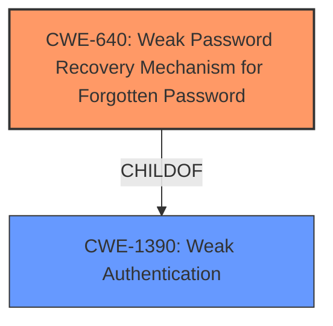

# Analysis Report for CVE-2021-41696

# Vulnerability Analysis Report: CVE-2021-41696

## Description


## Analysis (with Relationship Data)

# Summary
| CWE ID | CWE Name | Confidence | CWE Abstraction Level | CWE Vulnerability Mapping Label | CWE-Vulnerability Mapping Notes |
|---|---|---|---|---|---|
| CWE-640 | Weak Password Recovery Mechanism for Forgotten Password | 0.9 | Base | Allowed-with-Review | Primary CWE. The vulnerability is a **weak password reset mechanism**. |
| CWE-1390 | Weak Authentication | 0.7 | Class | Allowed-with-Review | Secondary CWE. The **weak password reset mechanism** leads to authentication bypass. |

## Evidence and Confidence

*   **Confidence Score:** 0.9
*   **Evidence Strength:** HIGH

## Relationship Analysis
The primary CWE is CWE-640, which is a child of CWE-1390. This indicates that the **weak password reset mechanism** is a specific type of **weak authentication**. The hierarchical relationship supports choosing CWE-640 as the primary because it's more specific.



## Vulnerability Chain
The vulnerability chain starts with a **weak password reset mechanism** (CWE-640), leading to an authentication bypass (CWE-1390).
- Root Cause: CWE-640
- Impact: CWE-1390

## Summary of Analysis
The initial analysis identified a **weak password reset mechanism** leading to an authentication bypass. The Retriever Results listed CWE-640 as a potential match. The final decision is to use CWE-640 as the primary CWE because it describes the specific weakness in the password reset mechanism. CWE-1390 is added as a secondary CWE because the **weak password reset mechanism** leads to bypassing authentication.

The evidence from the vulnerability description is: "An authentication bypass (account takeover) vulnerability exists in Premiumdatingscript 4.2.7.7 due to a **weak password reset mechanism** in requests\user.php."

The graph relationships influenced the final selection by providing a hierarchical context. CWE-640 is a child of CWE-1390, making CWE-640 more specific.

The selected CWEs are at the optimal level of specificity because CWE-640 directly addresses the root cause, a **weak password reset mechanism**, while CWE-1390 covers the impact, the resulting authentication bypass.

Relevant CWE Information:

# Enhanced Context (25 CWEs)
The following CWEs were identified as potentially relevant to this vulnerability:

## CWE-916: Use of Password Hash With Insufficient Computational Effort
**Abstraction Level**: Base
**Similarity Score**: 0.81
**Source**: dense

**Description**:
The product generates a hash for a password, but it uses a scheme that does not provide a sufficient level of computational effort that would make password cracking attacks infeasible or expensive.

**Mapping Guidance**:
- Usage: Allowed
- Rationale: This CWE entry is at the Base level of abstraction, which is a preferred level of abstraction for mapping to the root causes of vulnerabilities.

CWE-916 was considered but is not applicable. This CWE relates to the hashing algorithm being computationally weak, which isn't specified in the vulnerability description.

## CWE-836: Use of Password Hash Instead of Password for Authentication
**Abstraction Level**: Base
**Similarity Score**: 0.77
**Source**: dense

**Description**:
The product records password hashes in a data store, receives a hash of a password from a client, and compares the supplied hash to the hash obtained from the data store.

**Mapping Guidance**:
- Usage: Allowed
- Rationale: This CWE entry is at the Base level of abstraction, which is a preferred level of abstraction for mapping to the root causes of vulnerabilities.

CWE-836 was considered but is not applicable. It describes using password hashes for authentication, which isn't the primary issue here.

## CWE-328: Use of Weak Hash
**Abstraction Level**: Base
**Similarity Score**: 0.76
**Source**: dense

**Description**:
The product uses an algorithm that produces a digest (output value) that does not meet security expectations for a hash function that allows an adversary to reasonably determine the original input (preimage attack), find another input that can produce the same hash (2nd preimage attack), or find multiple inputs that evaluate to the same hash (birthday attack).

**Mapping Guidance**:
- Usage: Allowed
- Rationale: This CWE entry is at the Base level of abstraction, which is a preferred level of abstraction for mapping to the root causes of vulnerabilities.

CWE-328 was considered but is not applicable. This CWE is about the hashing algorithm itself being weak, which is not detailed in the vulnerability description.

## CWE-1391: Use of Weak Credentials
**Abstraction Level**: Class
**Similarity Score**: 0.76
**Source**: dense

**Description**:
The product uses weak credentials (such as a default key or hard-coded password) that can be calculated, derived, reused, or guessed by an attacker.

**Mapping Guidance**:
- Usage: Allowed-with-Review
- Rationale: This CWE entry is a Class and might have Base-level children that would be more appropriate

CWE-1391 was considered but is not applicable. This describes using weak default credentials, which is not mentioned in the provided information.

## CWE-331: Insufficient Entropy
**Abstraction Level**: Base
**Similarity Score**: 0.75
**Source**: dense

**Description**:
The product uses an algorithm or scheme that produces insufficient entropy, leaving patterns or clusters of values that are more likely to occur than others.

**Mapping Guidance**:
- Usage: Allowed
- Rationale: This CWE entry is at the Base level of abstraction, which is a preferred level of abstraction for mapping to the root causes of vulnerabilities.

CWE-331 was considered but is not applicable. This refers to issues with entropy, which isn't directly relevant to the **weak password reset mechanism**.

## CWE-330: Use of Insufficiently Random Values
**Abstraction Level**: Class
**Similarity Score**: 0.75
**Source**: dense

**Description**:
The product uses insufficiently random numbers or values in a security context that depends on unpredictable numbers.

**Mapping Guidance**:
- Usage: Discouraged
- Rationale: This CWE entry is a level-1 Class (i.e., a child of a Pillar). It might have lower-level children that would be more appropriate

CWE-330 was considered but is not applicable. This refers to problems with randomness, which isn't the core issue here.

## CWE-335: Incorrect Usage of Seeds in Pseudo-Random Number Generator (PRNG)
**Abstraction Level**: Base
**Similarity Score**: 0.75
**Source**: dense

**Description**:
The product uses a Pseudo-Random Number Generator (PRNG) but does not correctly manage seeds.

**Mapping Guidance**:
- Usage: Allowed
- Rationale: This CWE entry is at the Base level of abstraction, which is a preferred level of abstraction for mapping to the root causes of vulnerabilities.

CWE-335 was considered but is not applicable. This relates to seed management in PRNGs, which isn't relevant to the vulnerability.

## CWE-307: Improper Restriction of Excessive Authentication Attempts
**Abstraction Level**: Base
**Similarity Score**: 0.74
**Source**: dense

**Description**:
The product does not implement sufficient measures to prevent multiple failed authentication attempts within a short time frame.

**Mapping Guidance**:
- Usage: Allowed
- Rationale: This CWE entry is at the Base level of abstraction, which is a preferred level of abstraction for mapping to the root causes of vulnerabilities.

CWE-307 was considered but is not applicable. The vulnerability isn't about limiting login attempts.

## CWE-521: Weak Password Requirements
**Abstraction Level**: Base
**Similarity Score**: 0.74
**Source**: dense

**Description**:
The product does not require that users should have strong passwords, which makes it easier for attackers to compromise user accounts.

**Mapping Guidance**:
- Usage: Allowed
- Rationale: This CWE entry is at the Base level of abstraction, which is a preferred level of abstraction for mapping to the root causes of vulnerabilities.

CWE-521 was considered but is not applicable. It relates to weak password policies and is not about the **password reset mechanism**.

## CWE-759: Use of a One-Way Hash without a Salt
**Abstraction Level**: Variant
**Similarity Score**: 0.74
**Source**: dense

**Description**:
The product uses a one-way cryptographic hash against an input that should not be reversible, such as a password, but the product does not also use a salt as part of the input.

**Mapping Guidance**:
- Usage: Allowed


## CWE Relationship Analysis

Current CWEs represent these abstraction levels: .


### Vulnerability Chain Analysis

**Chain starting from CWE-640:**
- 640 (Weak Password Recovery Mechanism for Forgotten Password) - ROOT


**Chain starting from CWE-916:**
- 916 (Use of Password Hash With Insufficient Computational Effort) - ROOT


### CWE Relationship Diagram

```mermaid
graph TD
    classDef primary fill:#f96,stroke:#333,stroke-width:2px
    classDef secondary fill:#69f,stroke:#333
    classDef tertiary fill:#9e9,stroke:#333
```


*Report generated on 2025-04-02 14:47:41*
