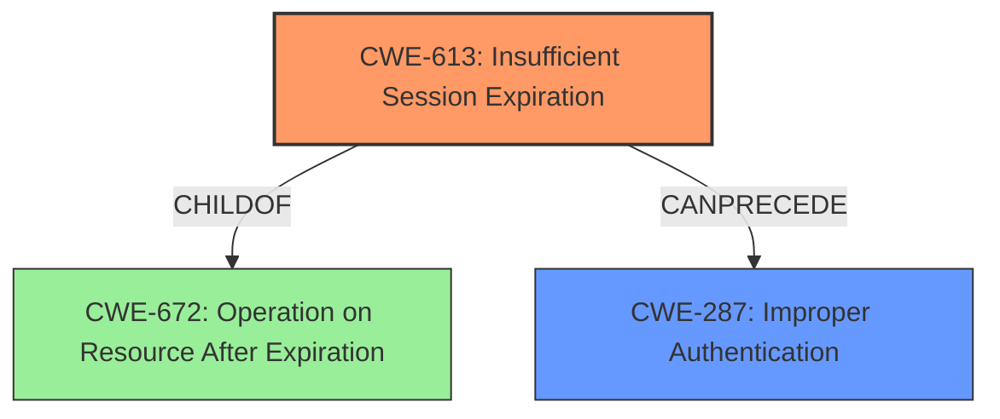

# Analysis for CVE-2021-41716

# Summary
| CWE ID | CWE Name | Confidence | CWE Abstraction Level | CWE Vulnerability Mapping Label | CWE-Vulnerability Mapping Notes |
|---|---|---|---|---|---|
| CWE-613 | Insufficient Session Expiration | 0.8 | Base | Allowed | Primary CWE. The application's OTP reset function uses the id field without proper validation, allowing an attacker to manipulate it and reuse a fixed OTP code associated with that ID. |
| CWE-287 | Improper Authentication | 0.6 | Class | Discouraged | Secondary CWE. The product does not prove or insufficiently proves that the claim is correct. |

## Evidence and Confidence

*   **Confidence Score:** 0.7
*   **Evidence Strength:** HIGH

## Relationship Analysis
The primary relationship impacting the decision is the ChildOf relationship, where CWE-613 is a child of CWE-672 (Operation on Resource After Expiration). Additionally, CWE-613 CanPrecede CWE-287.

## Vulnerability Chain
The vulnerability chain starts with the **OTP fixation vulnerability**, leading to account takeover. The **insufficient validation** of the id field allows the attacker to reuse the OTP, thus bypassing authentication.

## Summary of Analysis
Initially, the description indicates an **OTP fixation vulnerability** in the password reset function. The CVE Reference Links Content Summary section provides more context, stating, "The application's OTP reset function uses the id field without proper validation, allowing an attacker to manipulate it and reuse a fixed OTP code associated with that ID." This points to **insufficient validation** and **authentication bypass**.

CWE-613 (Insufficient Session Expiration) is the best fit because the core issue is that the OTP is not expiring and can be reused, leading to account takeover. The vulnerability description states, "The application did not invalidate previously generated OTP codes. Every OTP ID had a corresponding, static, correct OTP code. The attacker can use an OTP ID and its corresponding OTP code to reset any user account." This aligns directly with the concept of insufficient session expiration, where old session credentials or IDs can be reused.

CWE-287 (Improper Authentication) is considered a secondary weakness as the OTP mechanism itself is flawed, leading to an authentication bypass. However, it is a more general class and CWE-613 is a better, more specific fit.

The final decision is based on the evidence of **OTP fixation** and the ability to reuse OTP codes, which directly corresponds to CWE-613. This CWE is at the Base level of abstraction, providing a specific and accurate representation of the vulnerability.

Relevant CWE Information:

# Enhanced Context (25 CWEs)
The following CWEs were identified as potentially relevant to this vulnerability:

## CWE-274: Improper Handling of Insufficient Privileges
**Abstraction Level**: Base
**Similarity Score**: 0.77
**Source**: dense

**Description**:
The product does not handle or incorrectly handles when it has insufficient privileges to perform an operation, leading to resultant weaknesses.

**Mapping Guidance**:
- Usage: Discouraged
- Rationale: This CWE entry could be deprecated in a future version of CWE.

*This CWE is not relevant as it deals with insufficient privileges, whereas the vulnerability deals with OTP fixation.*

## CWE-303: Incorrect Implementation of Authentication Algorithm
**Abstraction Level**: Base
**Similarity Score**: 0.77
**Source**: dense

**Description**:
The requirements for the product dictate the use of an established authentication algorithm, but the implementation of the algorithm is incorrect.

**Mapping Guidance**:
- Usage: Allowed
- Rationale: This CWE entry is at the Base level of abstraction, which is a preferred level of abstraction for mapping to the root causes of vulnerabilities.

*This CWE could be considered, but it is not as specific as CWE-613, which addresses the session expiration issue directly.*

## CWE-280: Improper Handling of Insufficient Permissions or Privileges 
**Abstraction Level**: Base
**Similarity Score**: 0.77
**Source**: dense

**Description**:
The product does not handle or incorrectly handles when it has insufficient privileges to access resources or functionality as specified by their permissions. This may cause it to follow unexpected code paths that may leave the product in an invalid state.

**Mapping Guidance**:
- Usage: Allowed
- Rationale: This CWE entry is at the Base level of abstraction, which is a preferred level of abstraction for mapping to the root causes of vulnerabilities.

*This CWE is not relevant as it deals with insufficient permissions, whereas the vulnerability deals with OTP fixation.*

## CWE-639: Authorization Bypass Through User-Controlled Key
**Abstraction Level**: Base
**Similarity Score**: 0.77
**Source**: dense

**Description**:
The system's authorization functionality does not prevent one user from gaining access to another user's data or record by modifying the key value identifying the data.

**Mapping Guidance**:
- Usage: Allowed
- Rationale: This CWE entry is at the Base level of abstraction, which is a preferred level of abstraction for mapping to the root causes of vulnerabilities.

*This CWE is less relevant as the vulnerability involves manipulating the OTP ID, not directly controlling the key.*

## CWE-1390: Weak Authentication
**Abstraction Level**: Class
**Similarity Score**: 0.77
**Source**: dense

**Description**:
The product uses an authentication mechanism to restrict access to specific users or identities, but the mechanism does not sufficiently prove that the claimed identity is correct.

**Mapping Guidance**:
- Usage: Allowed-with-Review
- Rationale: This CWE entry is a Class and might have Base-level children that would be more appropriate

*This CWE is a class-level weakness and is less specific than CWE-613.*

## CWE-266: Incorrect Privilege Assignment
**Abstraction Level**: Base
**Similarity Score**: 0.76
**Source**: dense

**Description**:
A product incorrectly assigns a privilege to a particular actor, creating an unintended sphere of control for that actor.

**Mapping Guidance**:
- Usage: Allowed
- Rationale: This CWE entry is at the Base level of abstraction, which is a preferred level of abstraction for mapping to the root causes of vulnerabilities.

*This CWE is not relevant as the vulnerability deals with OTP fixation, not privilege assignment.*

## CWE-807: Reliance on Untrusted Inputs in a Security Decision
**Abstraction Level**: Base
**Similarity Score**: 0.76
**Source**: dense

**Description**:
The product uses a protection mechanism that relies on the existence or values of an input, but the input can be modified by an untrusted actor in a way that bypasses the protection mechanism.

**Mapping Guidance**:
- Usage: Allowed
- Rationale: This CWE entry is at the Base level of abstraction, which is a preferred level of abstraction for mapping to the root causes of vulnerabilities.

*This CWE could be considered if the OTP ID is seen as an untrusted input, however CWE-613 more directly captures the core issue.*

## CWE-668: Exposure of Resource to Wrong Sphere
**Abstraction Level**: Class
**Similarity Score**: 0.76
**Source**: dense

**Description**:
The product exposes a resource to the wrong control sphere, providing unintended actors with inappropriate access to the resource.

**Mapping Guidance**:
- Usage: Discouraged
- Rationale: CWE-668 is high-level and is often misused as a catch-all when lower-level CWE IDs might be applicable. It is sometimes used for low-information vulnerability reports [REF-1287]. It is a level-1 Class (i.e., a child of a Pillar). It is not useful for trend analysis.

*This CWE is too high-level and not specific to the OTP fixation issue.*

## CWE-1391: Use of Weak Credentials
**Abstraction Level**: Class
**Similarity Score**: 0.76
**Source**: dense

**Description**:
The product uses weak credentials (such as a default key or hard-coded password) that can be calculated, derived, reused, or guessed by an attacker.

**Mapping Guidance**:
- Usage: Allowed-with-Review
- Rationale: This CWE entry is a Class and might have Base-level children that would be more appropriate

*This CWE is not relevant as the OTP is not inherently weak, but rather the expiration is not handled properly.*

## CWE-267: Privilege Defined With Unsafe Actions
**Abstraction Level**: Base
**Similarity Score**: 0.76
**Source**: dense

**Description**:
A particular privilege,