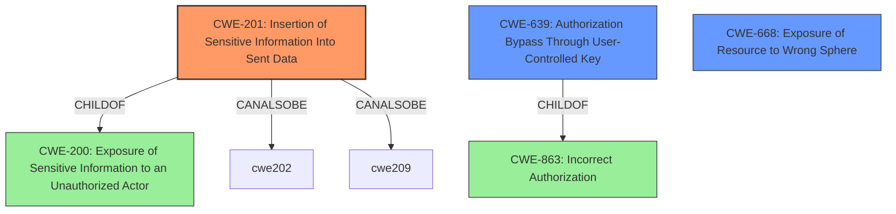

# Analysis Report for CVE-2021-41767

# Vulnerability Analysis Report: CVE-2021-41767

## Description


## Analysis (with Relationship Data)

# Summary
| CWE ID | CWE Name | Confidence | CWE Abstraction Level | CWE Vulnerability Mapping Label | CWE-Vulnerability Mapping Notes |
|---|---|---|---|---|---|
| CWE-201 | Insertion of Sensitive Information Into Sent Data | 0.9 | Base | Allowed | Primary CWE |
| CWE-639 | Authorization Bypass Through User-Controlled Key | 0.6 | Base | Allowed | Secondary Candidate |
| CWE-668 | Exposure of Resource to Wrong Sphere | 0.4 | Class | Discouraged | Secondary Candidate |

## Evidence and Confidence

*   **Confidence Score:** 0.75
*   **Evidence Strength:** HIGH

## Relationship Analysis
The primary CWE is CWE-201, which is a base level CWE. The retriever results suggest CWE-639 and CWE-668 as possible related CWEs. CWE-201 is a child of CWE-200 (Exposure of Sensitive Information to an Unauthorized Actor) which is a Class. CWE-668 is also a Class. CWE-639 is a child of CWE-863 (Incorrect Authorization). CWE-201's relationships show it CanAlsoBe CWE-209 (Generation of Error Message Containing Sensitive Information) or CWE-202 (Exposure of Sensitive Information Through Data Queries).



## Vulnerability Chain
The vulnerability chain starts with the **weakness** of the system incorrectly **including a private tunnel identifier in non-private details of REST responses**. This leads to the **impact** where an authenticated user can read or interact with another user's active connection.
- The root cause is the inclusion of sensitive information in the response (CWE-201).
- The impact is the potential for unauthorized access to another user's connection.

## Summary of Analysis
Initial Analysis:
The vulnerability involves Apache Guacamole exposing a private tunnel identifier in REST responses, potentially allowing an authenticated user to access another user's connection. The key phrase is "**include private tunnel identifier in non-private details of REST responses**". This points to a flaw in how sensitive information is handled in the response data.

Criticism and Conclusion:
The primary CWE selected is CWE-201 (Insertion of Sensitive Information Into Sent Data). This is based on the **weakness** of including the private tunnel identifier in the REST response. The "CVE Reference Links Content Summary" supports this, stating "The vulnerability stems from Apache Guacamole incorrectly including a private tunnel identifier in the non-private details of certain REST responses." CWE-201's description matches this scenario: "The code transmits data to another actor, but a portion of the data includes sensitive information that should not be accessible to that actor."

CWE-639 (Authorization Bypass Through User-Controlled Key) was considered because an authenticated user is able to access another user's connection. However, the primary issue is the exposure of the identifier, not the bypass of authorization, so it is a secondary candidate.

CWE-668 (Exposure of Resource to Wrong Sphere) is a high-level class that could apply, but CWE-201 provides a more specific description of the **weakness**. The mapping guidance for CWE-668 discourages its use when lower-level CWEs are applicable.

The selection of CWE-201 is at the optimal level of specificity, as it directly addresses the root cause of the vulnerability: the inclusion of sensitive information in the sent data.

Relevant CWE Information:

# Enhanced Context (25 CWEs)
The following CWEs were identified as potentially relevant to this vulnerability:

## CWE-639: Authorization Bypass Through User-Controlled Key
**Abstraction Level**: Base
**Similarity Score**: 0.77
**Source**: dense

**Description**:
The system's authorization functionality does not prevent one user from gaining access to another user's data or record by modifying the key value identifying the data.

**Mapping Guidance**:
- Usage: Allowed
- Rationale: This CWE entry is at the Base level of abstraction, which is a preferred level of abstraction for mapping to the root causes of vulnerabilities.

## CWE-668: Exposure of Resource to Wrong Sphere
**Abstraction Level**: Class
**Similarity Score**: 0.76
**Source**: dense

**Description**:
The product exposes a resource to the wrong control sphere, providing unintended actors with inappropriate access to the resource.

**Mapping Guidance**:
- Usage: Discouraged
- Rationale: CWE-668 is high-level and is often misused as a catch-all when lower-level CWE IDs might be applicable. It is sometimes used for low-information vulnerability reports [REF-1287]. It is a level-1 Class (i.e., a child of a Pillar). It is not useful for trend analysis.

## CWE-201: Insertion of Sensitive Information Into Sent Data
**Abstraction Level**: Base
**Similarity Score**: 6455.45
**Source**: sparse

**Description**:
The code transmits data to another actor, but a portion of the data includes sensitive information that should not be accessible to that actor.

**Mapping Guidance**:
- Usage: Allowed
- Rationale: This CWE entry is at the Base level of abstraction, which is a preferred level of abstraction for mapping to the root causes of vulnerabilities.

## CWE-201: Insertion of Sensitive Information Into Sent Data
**Abstraction Level**: base
**Similarity Score**: 5.03
**Source**: graph

**Description**:
CWE-201: Insertion of Sensitive Information Into Sent Data

**Mapping Guidance**:
- Usage: Allowed
- Rationale: This CWE entry is at the Base level of abstraction, which is a preferred level of abstraction for mapping to the root causes of vulnerabilities.

**Relationships**:
- PARENTOF -> CWE-598
- CANFOLLOW -> CWE-226
- CANFOLLOW -> CWE-212
- CANALSOBE -> CWE-202
- CANALSOBE -> CWE-209


## CWE Relationship Analysis

Current CWEs represent these abstraction levels: .


### Vulnerability Chain Analysis

**Chain starting from CWE-201:**
- 201 (Insertion of Sensitive Information Into Sent Data) - ROOT


**Chain starting from CWE-200:**
- 200 (Exposure of Sensitive Information to an Unauthorized Actor) - ROOT


### CWE Relationship Diagram

```mermaid
graph TD
    classDef primary fill:#f96,stroke:#333,stroke-width:2px
    classDef secondary fill:#69f,stroke:#333
    classDef tertiary fill:#9e9,stroke:#333
```


*Report generated on 2025-04-01 21:38:40*
