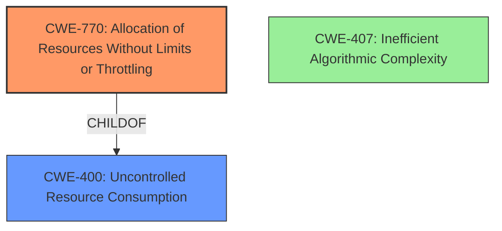

# Analysis Report for CVE-2021-41800

# Vulnerability Analysis Report: CVE-2021-41800

## Description


## Analysis (with Relationship Data)

# Summary
| CWE ID | CWE Name | Confidence | CWE Abstraction Level | CWE Vulnerability Mapping Label | CWE-Vulnerability Mapping Notes |
|---|---|---|---|---|---|
| CWE-770 | Allocation of Resources Without Limits or Throttling | 0.8 | Base | Allowed | Primary CWE. The vulnerability involves mishandling of resource protection, leading to excessive resource consumption. |
| CWE-400 | Uncontrolled Resource Consumption | 0.6 | Class | Discouraged | Secondary candidate. Although resource consumption is the impact, CWE-770 better represents the root cause. |
| CWE-407 | Inefficient Algorithmic Complexity | 0.5 | Class | Allowed-with-Review | Secondary candidate. The long-running SQL query suggests potential algorithmic inefficiency, but the evidence is insufficient to confirm this. |

## Evidence and Confidence

*   **Confidence Score:** 0.8
*   **Evidence Strength:** HIGH

## Relationship Analysis
The primary CWE, CWE-770 (Allocation of Resources Without Limits or Throttling), is a child of CWE-400 (Uncontrolled Resource Consumption). This hierarchical relationship suggests that while the vulnerability leads to uncontrolled resource consumption, the root cause lies in the lack of limits or throttling on resource allocation. CWE-407 (Inefficient Algorithmic Complexity) is also considered, as long-running SQL queries can be a symptom of inefficient algorithms. However, the evidence more strongly supports CWE-770.



## Vulnerability Chain
The vulnerability chain starts with **mishandled PoolCounter protection**, which leads to a long-running SQL query, ultimately resulting in denial of service (resource consumption).

*   **Root Cause:** Mishandled PoolCounter protection (CWE-770 - Allocation of Resources Without Limits or Throttling)
*   **Mechanism:** Long-running SQL query
*   **Impact:** Denial of Service (Resource Consumption)

## Summary of Analysis
The analysis indicates that the most appropriate CWE is CWE-770 (Allocation of Resources Without Limits or Throttling). This conclusion is based on the vulnerability description, which mentions "**mishandled PoolCounter protection**" leading to excessive resource consumption. The CVE Reference Links Content Summary further supports this by stating that "The vulnerability is due to a mishandling of PoolCounter protection... leading to a long-running SQL query in some cases."

CWE-770 aligns with the root cause of the vulnerability, where resources are allocated without proper limits or throttling. The fact that the database query was executed outside the callback function provided to PoolCounterWorkViaCallback points to a lack of control over resource allocation.

CWE-400 (Uncontrolled Resource Consumption) was considered, but it represents the impact rather than the root cause. While resource consumption is the ultimate result, CWE-770 more accurately describes the underlying weakness that enables the attack.

CWE-407 (Inefficient Algorithmic Complexity) was also considered because the long-running SQL query could be due to an inefficient algorithm. However, the evidence is insufficient to definitively conclude that algorithmic inefficiency is the primary cause. The issue seems to stem more directly from the **mishandling of PoolCounter protection**.

The selected CWE is at the Base level of abstraction, which is preferred for mapping the root causes of vulnerabilities. This provides a more specific and actionable classification compared to higher-level Class or Pillar CWEs.


## CWE Relationship Analysis

Current CWEs represent these abstraction levels: .


### Vulnerability Chain Analysis

**Chain starting from CWE-400:**
- 400 (Uncontrolled Resource Consumption) - ROOT


**Chain starting from CWE-770:**
- 770 (Allocation of Resources Without Limits or Throttling) - ROOT


### CWE Relationship Diagram

```mermaid
graph TD
    classDef primary fill:#f96,stroke:#333,stroke-width:2px
    classDef secondary fill:#69f,stroke:#333
    classDef tertiary fill:#9e9,stroke:#333
```


*Report generated on 2025-04-02 04:04:13*
