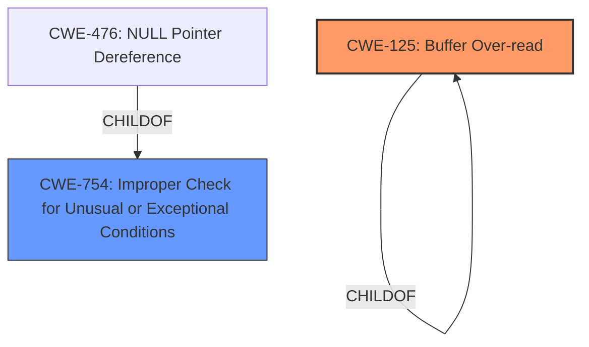

# Analysis for CVE-2021-4181

# Summary
| CWE ID | CWE Name | Confidence | CWE Abstraction Level | CWE Vulnerability Mapping Label | CWE-Vulnerability Mapping Notes |
|---|---|---|---|---|---|
| CWE-125 | Buffer Over-read | 0.75 | Variant | Primary CWE | Allowed |
| CWE-754 | Improper Check for Unusual or Exceptional Conditions | 0.60 | Class | Secondary Candidate CWE | Allowed-with-Review |

## Evidence and Confidence

*   **Confidence Score:** 0.70
*   **Evidence Strength:** MEDIUM

## Relationship Analysis
The primary CWE is CWE-125, a **Variant** of CWE-125 (Buffer Over-read). The secondary CWE is CWE-754, a **Class** and a parent of CWE-476. CWE-754 is included because the vulnerability involves an **insufficient check** on the number of parameters, suggesting a failure to adequately validate input.

## Vulnerability Chain
The vulnerability chain starts with malformed packets containing an unexpected number of parameters. The **insufficient check** on the number of parameters leads to a **buffer over-read** when the Sysdig event dissector attempts to access data beyond the buffer's boundaries. This ultimately causes a crash, resulting in a denial of service.

## Summary of Analysis
Initially, the **Vulnerability Description** indicates a denial-of-service vulnerability related to the Sysdig Event dissector in Wireshark. The **Vulnerability Description Key Phrases** highlight the attack vector as packet injection or a crafted capture file. The **CVE Reference Links Content Summary** provides more specific details, stating that the crash is due to an **insufficient check** on the number of parameters in a sysdig event, leading to **Improper Input Validation**.

The Retriever results suggest several potential CWEs, including CWE-476 (NULL Pointer Dereference), CWE-126 (Buffer Over-read), and CWE-754 (Improper Check for Unusual or Exceptional Conditions).

CWE-125 (Buffer Over-read) is selected as the primary CWE because the dissector attempts to process more parameters than expected, resulting in reading beyond the buffer's boundaries, causing a crash. This is supported by the vulnerability description "The Sysdig Event dissector could crash due to malformed packets with a number of params greater than expected."

CWE-754 (Improper Check for Unusual or Exceptional Conditions) is considered a secondary CWE because the root cause is the **insufficient check** on the number of parameters, which falls under the umbrella of failing to validate exceptional conditions. The **CVE Reference Links Content Summary** also highlights "Improper Input Validation."

CWE-476 (NULL Pointer Dereference) was considered because crashes can sometimes result from dereferencing null pointers. However, the more direct cause here is the **buffer over-read** due to the malformed packet. Thus, CWE-125 is a more precise mapping.

The selected CWEs are at the optimal level of specificity. CWE-125 is a Variant-level CWE, and CWE-754 is a Class-level CWE, providing a balanced representation of the weakness and its context.

Relevant CWE Information:

# Enhanced Context (25 CWEs)
The following CWEs were identified as potentially relevant to this vulnerability:

## CWE-405: Asymmetric Resource Consumption (Amplification)
**Abstraction Level**: Class
**Similarity Score**: 0.81
**Source**: dense

**Description**:
The product does not properly control situations in which an adversary can cause the product to consume or produce excessive resources without requiring the adversary to invest equivalent work or otherwise prove authorization, i.e., the adversary's influence is "asymmetric."

**Mapping Guidance**:
- Usage: Allowed-with-Review
- Rationale: This CWE entry is a Class and might have Base-level children that would be more appropriate

## CWE-404: Improper Resource Shutdown or Release
**Abstraction Level**: Class
**Similarity Score**: 0.79
**Source**: dense

**Description**:
The product does not release or incorrectly releases a resource before it is made available for re-use.

**Mapping Guidance**:
- Usage: Allowed-with-Review
- Rationale: This CWE entry is a Class and might have Base-level children that would be more appropriate

## CWE-1325: Improperly Controlled Sequential Memory Allocation
**Abstraction Level**: Base
**Similarity Score**: 0.78
**Source**: dense

**Description**:
The product manages a group of objects or resources and performs a separate memory allocation for each object, but it does not properly limit the total amount of memory that is consumed by all of the combined objects.

**Mapping Guidance**:
- Usage: Allowed
- Rationale: This CWE entry is at the Base level of abstraction, which is a preferred level of abstraction for mapping to the root causes of vulnerabilities.

## CWE-789: Memory Allocation with Excessive Size Value
**Abstraction Level**: Variant
**Similarity Score**: 0.78
**Source**: dense

**Description**:
The product allocates memory based on an untrusted, large size value, but it does not ensure that the size is within expected limits, allowing arbitrary amounts of memory to be allocated.

**Mapping Guidance**:
- Usage: Allowed
- Rationale: This CWE entry is at the Variant level of abstraction, which is a preferred level of abstraction for mapping to the root causes of vulnerabilities.

## CWE-664: Improper Control of a Resource Through its Lifetime
**Abstraction Level**: Pillar
**Similarity Score**: 0.78
**Source**: dense

**Description**:
The product does not maintain or incorrectly maintains control over a resource throughout its lifetime of creation, use, and release.

**Mapping Guidance**:
- Usage: Discouraged
- Rationale: This CWE entry is high-level when lower-level children are available.

## CWE-226: Sensitive Information in Resource Not Removed Before Reuse
**Abstraction Level**: Base
**Similarity Score**: 0.77
**Source**: dense

**Description**:
The product releases a resource such as memory or a file so that it can be made available for reuse, but it does not clear or "zeroize" the information contained in the resource before the product performs a critical state transition or makes the resource available for reuse by other entities.

**Mapping Guidance**:
- Usage: Allowed
- Rationale: This CWE entry is at the Base level of abstraction, which is a preferred level of abstraction for mapping to the root causes of vulnerabilities.

## CWE-799: Improper Control of Interaction Frequency
**Abstraction Level**: Class
**Similarity Score**: 0.76
**Source**: dense

**Description**:
The product does not properly limit the number or frequency of interactions that it has with an actor, such as the number of incoming requests.

**Mapping Guidance**:
- Usage: Allowed-with-Review
- Rationale: This CWE entry is a Class and might have Base-level children that would be more appropriate

## CWE-400: Uncontrolled Resource Consumption
**Abstraction Level**: Class
**Similarity Score**: 0.76
**Source**: dense

**Description**:
The product does not properly control the allocation and maintenance of a limited resource, thereby enabling an actor to influence the amount of resources consumed, eventually leading to the exhaustion of available resources.

**Mapping Guidance**:
- Usage: Discouraged
- Rationale: CWE-400 is intended for incorrect behaviors in which the product is expected to track and restrict how many resources it consumes, but CWE-400 is often misused because it is conflated with the "technical impact" of vulnerabilities in which resource consumption occurs. It is sometimes used for low-information vulnerability reports. It is a level-1 Class (i.e., a child of a Pillar).

## CWE-770: Allocation of Resources Without Limits or Throttling
**Abstraction Level**: Base
**Similarity Score**: 0.75
**Source**: dense

**Description**:
The product allocates a reusable resource or group of resources on behalf of an actor without imposing any restrictions on the size or number of resources that can be allocated, in violation of the intended security policy for that actor.

**Mapping Guidance**:
- Usage: Allowed
- Rationale: This CWE entry is at the Base level of abstraction, which is a preferred level of abstraction for mapping to the root causes of vulnerabilities.

## CWE-668: Exposure of Resource to Wrong Sphere
**Abstraction Level**: Class
**Similarity Score**: 0.75
**Source**: dense

**Description**:
The product exposes a resource to the wrong control sphere, providing unintended actors with inappropriate access