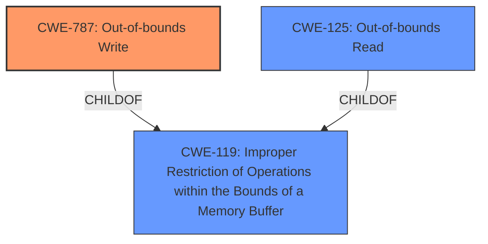

# Raw Analyzer Response for CVE-2021-4183

# Summary
| CWE ID | CWE Name | Confidence | CWE Abstraction Level | CWE Vulnerability Mapping Label | CWE-Vulnerability Mapping Notes |
|---|---|---|---|---|---|
| CWE-787 | Out-of-bounds Write | 1.0 | Base | Allowed | Primary CWE |
| CWE-125 | Out-of-bounds Read | 0.75 | Base | Allowed | Secondary Candidate |
| CWE-119 | Improper Restriction of Operations within the Bounds of a Memory Buffer | 0.5 | Class | Discouraged | Secondary Candidate |

## Evidence and Confidence

*   **Confidence Score:** 0.9
*   **Evidence Strength:** HIGH

## Relationship Analysis
The primary CWE is CWE-787, which describes an out-of-bounds write. CWE-119 is a broader category that encompasses both out-of-bounds reads and writes, so it is a parent of CWE-787 and CWE-125. CWE-125 is an out-of-bounds read.

## Vulnerability Chain
The chain of events is as follows:
1.  A malformed pcapng file is crafted.
2.  The `pcapng_process_options` function attempts to parse the file.
3.  Due to the malformed structure, a heap-buffer-overflow (CWE-787) occurs. This could also lead to an out-of-bounds read (CWE-125)
4.  Wireshark crashes, leading to a denial of service.

## Summary of Analysis
The analysis indicates a heap-buffer-overflow vulnerability in Wireshark's pcapng file parser. The crafted pcapng file triggers the overflow when parsed by the `pcapng_process_options` function. This leads to a crash and denial of service.

The primary CWE is CWE-787 (Out-of-bounds Write), which is at the Base level of abstraction. The evidence clearly states that the vulnerability is a heap-buffer-overflow, where data is written beyond the allocated buffer.

The evidence for CWE-787 is quoted here:
"The vulnerability is a **heap-buffer-overflow** in the `pcapng_process_options` function, specifically within the pcapng file parser of Wireshark."

CWE-125 (Out-of-bounds Read) is considered as a secondary candidate because the AddressSanitizer report mentions a read of size 2 at memory location 0x60c000001820 which is 32 bytes to the right of the allocated memory 0x60c000001780, allocated with a size of 128 bytes. This suggests a read outside the allocated bounds, although the primary issue is the overflow (write).

CWE-119 (Improper Restriction of Operations within the Bounds of a Memory Buffer) is a more general Class-level CWE that is discouraged when more specific Base or Variant level CWEs are available. Since CWE-787 and CWE-125 are more specific, CWE-119 is not the primary choice.

The selected CWEs are at the optimal level of specificity, with CWE-787 being the primary cause and CWE-125 as a possible secondary effect.

Relevant CWE Information:

# Enhanced Context (25 CWEs)

## CWE-787: Out-of-bounds Write
**Abstraction:** Base
**Description:** The product writes data past the end, or before the beginning, of the intended buffer.
**Mapping Guidance:** Usage: Allowed

**Explanation:** The primary weakness identified in the vulnerability description is a "heap-buffer-overflow," which directly corresponds to writing data beyond the allocated buffer. This is a clear instance of an out-of-bounds write.

## CWE-125: Out-of-bounds Read
**Abstraction:** Base
**Description:** The product reads data past the end, or before the beginning, of the intended buffer.
**Mapping Guidance:** Usage: Allowed

**Explanation:** The AddressSanitizer report indicates a read of size 2 outside the allocated memory. This may be a contributing factor or a consequence of the overflow.

## CWE-119: Improper Restriction of Operations within the Bounds of a Memory Buffer
**Abstraction:** Class
**Description:** The product performs operations on a memory buffer, but it reads from or writes to a memory location outside the buffer's intended boundary.
**Mapping Guidance:** Usage: Discouraged

**Explanation:** While this CWE broadly covers the issue, it is discouraged because more specific CWEs (CWE-787 and CWE-125) are available. It is a parent of CWE-787 and CWE-125, but not as precise in describing the vulnerability.