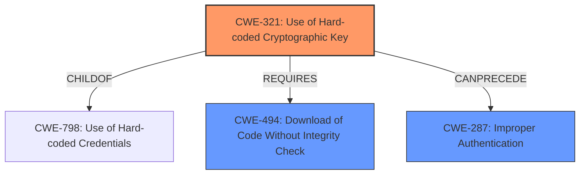

# Enhanced Analysis for CVE-2021-41848

# Summary
| CWE ID  | CWE Name                                                       | Confidence | CWE Abstraction Level | CWE Vulnerability Mapping Label | CWE-Vulnerability Mapping Notes |
| :-------- | :------------------------------------------------------------- | :--------- | :-------------------- | :------------------------------ | :------------------------------ |
| CWE-321 | Use of Hard-coded Cryptographic Key                            | 0.9        | Variant               | Primary                         | Allowed                       |
| CWE-494 | Download of Code Without Integrity Check                        | 0.7        | Base                  | Secondary                       | Allowed                       |
| CWE-287 | Improper Authentication                                       | 0.6        | Class                 | Secondary                       | Allowed-with-Review           |

## Evidence and Confidence

*   **Confidence Score:** 0.8
*   **Evidence Strength:** MEDIUM

## Relationship Analysis
The primary weakness is the use of a hard-coded cryptographic key (CWE-321). This allows attackers to bypass authentication checks. The system also lacks integrity checks on downloaded software updates (CWE-494), and there's a general lack of authentication (CWE-287). CWE-321 is a variant of CWE-798 (Use of Hard-coded Credentials), providing a more specific classification. CWE-494 (Download of Code Without Integrity Check) is related because the **mishandling of software updates** involves downloading potentially malicious code. CWE-287 (Improper Authentication) is a higher-level class that broadly describes the authentication failure.



## Vulnerability Chain
The vulnerability chain starts with the **mishandling of software updates**. This includes:
1.  Use of a hard-coded cryptographic key (CWE-321).
2.  Lack of integrity check for the update file (CWE-494).
3.  Resulting in the execution of arbitrary code as root.

## Summary of Analysis
The analysis is based on the provided vulnerability description, which highlights the **mishandling of software updates** through the use of a hard-coded encryption key.

> "...The vulnerable system binary (i.e., /system/bin/osi_bin) does not perform any authentication of the update file beyond ensuring that it is encrypted with an AES key (that is hard-coded in the vulnerable system binary)."

This clearly indicates CWE-321. The missing integrity check leads to CWE-494 and the overall authentication failure points to CWE-287 as a contributing factor.

The relationships in the graph show how the hard-coded key enables the subsequent weaknesses. CWE-321 is the root cause that leads to the lack of proper authentication.

The selected CWEs are at the optimal level of specificity because CWE-321 is a Variant that pinpoints the exact cryptographic flaw, while CWE-494 and CWE-287 describe the broader context of the **mishandling of software updates**.

Relevant CWE Information:

# Enhanced Context (25 CWEs)

## CWE-345: Insufficient Verification of Data Authenticity
**Abstraction Level**: Class
**Similarity Score**: 0.80
**Source**: dense

**Description**:
The product does not sufficiently verify the origin or authenticity of data, in a way that causes it to accept invalid data.

**Mapping Guidance**:
- Usage: Discouraged
- Rationale: This CWE entry is a level-1 Class (i.e., a child of a Pillar). It might have lower-level children that would be more appropriate

*Not Selected:* This is too broad. CWE-494 is more specific.

## CWE-295: Improper Certificate Validation
**Abstraction Level**: Base
**Similarity Score**: 0.79
**Source**: dense

**Description**:
The product does not validate, or incorrectly validates, a certificate.

**Mapping Guidance**:
- Usage: Allowed
- Rationale: This CWE entry is at the Base level of abstraction, which is a preferred level of abstraction for mapping to the root causes of vulnerabilities.

*Not Selected:* This is related to certificates, which is not the primary issue. The vulnerability description does not mention certificates.

## CWE-297: Improper Validation of Certificate with Host Mismatch
**Abstraction Level**: Variant
**Similarity Score**: 0.79
**Source**: dense

**Description**:
The product communicates with a host that provides a certificate, but the product does not properly ensure that the certificate is actually associated with that host.

**Mapping Guidance**:
- Usage: Allowed
- Rationale: This CWE entry is at the Variant level of abstraction, which is a preferred level of abstraction for mapping to the root causes of vulnerabilities.

*Not Selected:* This is related to certificates and host mismatch, which is not the primary issue. The vulnerability description does not mention certificates or host mismatches.

## CWE-1289: Improper Validation of Unsafe Equivalence in Input
**Abstraction Level**: Base
**Similarity Score**: 0.78
**Source**: dense

**Description**:
The product receives an input value that is used as a resource identifier or other type of reference, but it does not validate or incorrectly validates that the input is equivalent to a potentially-unsafe value.

**Mapping Guidance**:
- Usage: Allowed
- Rationale: This CWE entry is at the Base level of abstraction, which is a preferred level of abstraction for mapping to the root causes of vulnerabilities.

*Not Selected:* While input validation is missing, this CWE is too specific to resource identifiers and unsafe values, which is not the core issue.

## CWE-668: Exposure of Resource to Wrong Sphere
**Abstraction Level**: Class
**Similarity Score**: 0.78
**Source**: dense

**Description**:
The product exposes a resource to the wrong control sphere, providing unintended actors with inappropriate access to the resource.

**Mapping Guidance**:
- Usage: Discouraged
- Rationale: CWE-668 is high-level and is often misused as a catch-all when lower-level CWE IDs might be applicable. It is sometimes used for low-information vulnerability reports [REF-1287]. It is a level-1 Class (i.e., a child of a Pillar). It is not useful for trend analysis.

*Not Selected:* This is too broad and doesn't capture the specific vulnerability details.

## CWE-280: Improper Handling of Insufficient Permissions or Privileges
**Abstraction Level**: Base
**Similarity Score**: 0.78
**Source**: dense

**Description**:
The product does not handle or incorrectly handles when it has insufficient privileges to access resources or functionality as specified by their permissions. This may cause it to follow unexpected code paths that may leave the product in an invalid state.

**Mapping Guidance**:
- Usage: Allowed
- Rationale: This CWE entry is at the Base level of abstraction, which is a preferred level of abstraction for mapping to the root causes of vulnerabilities.

*Not Selected:* While privileges are escalated, the root cause is not about handling insufficient permissions, but about bypassing authentication and integrity checks.

## CWE-807: Reliance on Untrusted Inputs in a Security Decision
**Abstraction Level**: Base
**Similarity Score**: 0.78
**Source**: dense

**Description**:
The product uses a protection mechanism that relies on the existence or values of an input, but the input can be modified by an untrusted actor in a way that bypasses the protection mechanism.

**Mapping Guidance**:
- Usage: Allowed
- Rationale: This CWE entry is at the Base level of abstraction, which is a preferred level of abstraction for mapping to the root causes of vulnerabilities.

*Not Selected:* This is a potential contributing factor, but the hard-coded key is a more direct cause.

## CWE-319: Cleartext Transmission of Sensitive Information
**Abstraction Level**: Base
**Similarity Score**: 0.77
**Source**: dense

**Description**:
The product transmits sensitive or security-critical data in cleartext in a communication channel that can be sniffed by unauthorized actors.

**Mapping Guidance**:
- Usage: Allowed
- Rationale: This CWE entry is at the Base level of abstraction, which is a preferred level of abstraction for mapping to the root causes of vulnerabilities.

*Not Selected:* Not applicable, as the vulnerability does not involve cleartext transmission.

## CWE-303: Incorrect Implementation of Authentication Algorithm
**Abstraction Level**: Base
**Similarity Score**: 0.7


## CWE Relationship Analysis

Current CWEs represent these abstraction levels: .


### Vulnerability Chain Analysis

**Chain starting from CWE-494:**
- 494 (Download of Code Without Integrity Check) - ROOT


**Chain starting from CWE-303:**
- 303 (Incorrect Implementation of Authentication Algorithm) - ROOT


### CWE Relationship Diagram

```mermaid
graph TD
    classDef primary fill:#f96,stroke:#333,stroke-width:2px
    classDef secondary fill:#69f,stroke:#333
    classDef tertiary fill:#9e9,stroke:#333
```