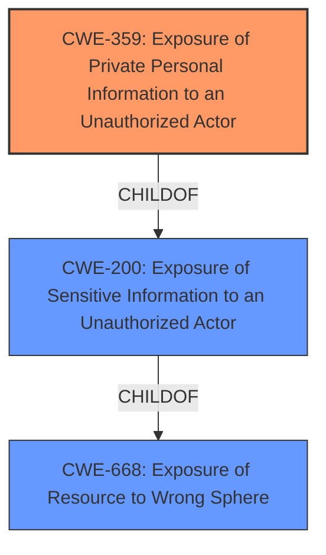

# Analysis Report for CVE-2021-41850

# Vulnerability Analysis Report: CVE-2021-41850

## Description


## Analysis (with Relationship Data)

# Summary
| CWE ID    | CWE Name                                                        | Confidence | CWE Abstraction Level | CWE Vulnerability Mapping Label | CWE-Vulnerability Mapping Notes |
| :-------- | :-------------------------------------------------------------- | :--------- | :-------------------- | :------------------------------ | :------------------------------ |
| CWE-359   | Exposure of Private Personal Information to an Unauthorized Actor | 0.9        | Base                  | Allowed                       | Primary CWE                     |
| CWE-668   | Exposure of Resource to Wrong Sphere                         | 0.6        | Class                 | Discouraged                   | Secondary Candidate             |
| CWE-200   | Exposure of Sensitive Information to an Unauthorized Actor                         | 0.5        | Class                 | Discouraged                   | Secondary Candidate             |

## Evidence and Confidence

*   **Confidence Score:** 0.9
*   **Evidence Strength:** HIGH

## Relationship Analysis
The primary CWE, CWE-359, is a child of CWE-200, indicating a more specific type of information exposure. CWE-668 is a higher-level class that describes exposing a resource to the wrong sphere. The relationship between these CWEs helps to refine the selection towards the most specific and relevant weakness. I have selected CWE-359 because it is a base-level CWE and a child of CWE-200 making it more specific. I have included CWE-200 and CWE-668 as secondary candidates because of their high retriever scores.



## Vulnerability Chain
The vulnerability chain starts with the **writing of three IMEI values to system properties at system startup** by the pre-installed app. This leads to the **exposure of IMEI values to processes without enforcing any access control**. The **root cause** is the **writing of IMEI values to system properties**, and the impact is the exposure of this sensitive information.

## Summary of Analysis
Initially, the vulnerability description highlights that a pre-installed app **writes three IMEI values to system properties at system startup**. This results in the exposure of IMEI values to all third-party applications without any access control.

The retriever results suggest several CWEs, including CWE-359 (Exposure of Private Personal Information to an Unauthorized Actor), CWE-200 (Exposure of Sensitive Information to an Unauthorized Actor), and CWE-668 (Exposure of Resource to Wrong Sphere).

CWE-359 is the most appropriate because the vulnerability involves the exposure of private personal information (IMEI values) to unauthorized actors. The description of CWE-359 aligns well with the vulnerability details, as it specifically addresses the improper prevention of accessing personal information by unauthorized entities. "The product does not properly prevent a person's private, personal information from being accessed by actors who either (1) are not explicitly authorized to access the information or (2) do not have the implicit consent of the person about whom the information is collected."

CWE-200 is a more general class of weakness, and while it is relevant, CWE-359 provides a more specific categorization. CWE-668 is a higher-level class and is discouraged for use when lower-level CWEs are available. "The product exposes a resource to the wrong control sphere, providing unintended actors with inappropriate access to the resource."

The final decision is based on the evidence that the IMEI values are personal information, and the vulnerability directly results in the exposure of this information to unauthorized apps. Therefore, CWE-359 is the most accurate and specific classification. I am overriding the discouraged rating of CWE-200 because it is a reasonable secondary classification given the focus on sensitive information exposure, even if it's a more general category.

Relevant CWE Information:

# Enhanced Context (25 CWEs)

## CWE-359: Exposure of Private Personal Information to an Unauthorized Actor
**Abstraction:** Base
**Status:** Incomplete

### Description
The product does not properly prevent a person's private, personal information from being accessed by actors who either (1) are not explicitly authorized to access the information or (2) do not have the implicit consent of the person about whom the information is collected.

### Extended Description
Not provided

### Alternative Terms
Privacy violation
Privacy leak
Privacy leakage

### Relationships
ChildOf -> CWE-200

### Mapping Guidance
**Usage:** Allowed
**Rationale:** This CWE entry is at the Base level of abstraction, which is a preferred level of abstraction for mapping to the root causes of vulnerabilities.
**Comments:** Carefully read both the name and description to ensure that this mapping is an appropriate fit. Do not try to 'force' a mapping to a lower-level Base/Variant simply to comply with this preferred level of abstraction.
**Reasons:**
- Acceptable-Use

### Additional Notes
**[Maintenance]** This entry overlaps many other entries that are not organized around the kind of sensitive information that is exposed. However, because privacy is treated with such importance due to regulations and other factors, and it may be useful for weakness-finding tools to highlight capabilities that detect personal private information instead of system information, it is not clear whether - and how - this entry should be deprecated.

**[Other]**

There are many types of sensitive information that products must protect from attackers, including system data, communications, configuration, business secrets, intellectual property, and an individual's personal (private) information. Private personal information may include a password, phone number, geographic location, personal messages, credit card number, etc. Private information is important to consider whether the person is a user of the product, or part of a data set that is processed by the product. An exposure of private information does not necessarily prevent the product from working properly, and in fact the exposure might be intended by the developer, e.g. as part of data sharing with other organizations. However, the exposure of personal private information can still be undesirable or explicitly prohibited by law or regulation.

Some types of private information include:

- Government identifiers, such as Social Security Numbers
- Contact information, such as home addresses and telephone numbers
- Geographic location - where the user is (or was)
- Employment history
- Financial data - such as credit card numbers, salary, bank accounts, and debts
- Pictures, video, or audio
- Behavioral patterns - such as web surfing history, when certain activities are performed, etc.
- Relationships (and types of relationships) with others - family, friends, contacts, etc.
- Communications - e-mail addresses, private messages, text messages, chat logs, etc.
- Health - medical conditions, insurance status, prescription records
- Account passwords and other credentials

Some of this information may be characterized as PII (Personally Identifiable Information), Protected Health Information (PHI), etc. Categories of private information may overlap or vary based on the intended usage or the policies and practices of a particular industry.

Sometimes data that is not labeled as private can have a privacy implication in a different context. For example, student identification numbers are usually not considered private because there is no explicit and publicly-available mapping to an individual student's personal information. However, if a school generates identification numbers based on student social security numbers, then the identification numbers should be considered private.

## CWE-668: Exposure of Resource to Wrong Sphere
**Abstraction:** Class
**Status:** Draft

### Description
The product exposes a resource to the wrong control sphere, providing unintended actors with inappropriate access to the resource.

### Extended Description
Resources such as files and directories may be inadvertently exposed through mechanisms such as insecure permissions, or when a program accidentally operates on the wrong object. For example, a program may intend that private files can only be provided to a specific user. This effectively defines a control sphere that is intended to prevent attackers from accessing these private files. If the file permissions are insecure, then parties other than the user will be able to access those files.

A separate control sphere might effectively require that the user can only access the private files, but not any other files on the system. If the program does not ensure that the user is only requesting private files, then the user might be able to access other files on the system.

In either case, the end result is that a resource has been exposed to the wrong party.

### Alternative Terms
None

### Relationships
ChildOf -> CWE-664

### Mapping Guidance
**Usage:** Discouraged
**Rationale:** CWE-668 is high-level and is often misused as a catch-all when lower-level CWE IDs might be applicable. It is sometimes used for low-information vulnerability reports [REF-1287]. It is a level-1 Class (i.e., a child of a Pillar). It is not useful for trend analysis.
**Comments:** Closely analyze the specific mistake that is


## CWE Relationship Analysis

Current CWEs represent these abstraction levels: .


### Vulnerability Chain Analysis

**Chain starting from CWE-359:**
- 359 (Exposure of Private Personal Information to an Unauthorized Actor) - ROOT


**Chain starting from CWE-200:**
- 200 (Exposure of Sensitive Information to an Unauthorized Actor) - ROOT


### CWE Relationship Diagram

```mermaid
graph TD
    classDef primary fill:#f96,stroke:#333,stroke-width:2px
    classDef secondary fill:#69f,stroke:#333
    classDef tertiary fill:#9e9,stroke:#333
```


*Report generated on 2025-04-02 10:27:49*
