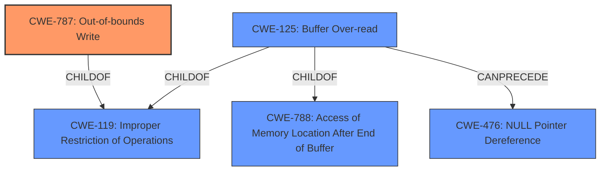

# Analysis for CVE-2021-4186

# Summary
| CWE ID  | CWE Name                                            | Confidence | CWE Abstraction Level | CWE Vulnerability Mapping Label | CWE-Vulnerability Mapping Notes |
| :-------- | :-------------------------------------------------- | :--------- | :---------------------- | :------------------------------ | :------------------------------ |
| CWE-787 | Out-of-bounds Write                               | 0.9        | Base                    | Primary                         | Allowed                       |
| CWE-125 | Buffer Over-read | 0.6        | Variant                    | Secondary                         | Allowed                       |

## Evidence and Confidence

*   **Confidence Score:** 0.8
*   **Evidence Strength:** HIGH

## Relationship Analysis
The primary CWE selected is CWE-787 (**Out-of-bounds Write**), which is a base-level CWE. CWE-787 is related to CWE-119 (**Improper Restriction of Operations within the Bounds of a Memory Buffer**) as it is a child of CWE-119. CWE-125 (**Buffer Over-read**) is a variant-level CWE and is a child of CWE-119 and CWE-788. CWE-125 can PRECEDE CWE-476 (**NULL Pointer Dereference**).

## Vulnerability Chain
The vulnerability chain starts with a malformed packet being processed by the Gryphon dissector. This leads to **improper handling** of the packet, which results in an **out-of-bounds write** (CWE-787) and a crash.

## Summary of Analysis
The initial assessment and resulting conclusion are based on the evidence provided in the "CVE Reference Links Content Summary" and "Vulnerability Description Key Phrases." The primary weakness identified is CWE-787 (**Out-of-bounds Write**), as the vulnerability leads to a crash due to **improper handling** of a malformed packet.

The "CVE Reference Links Content Summary" states: "The Gryphon dissector in Wireshark has a vulnerability that can lead to a crash due to a malformed packet." and "A crash vulnerability exists in the Gryphon dissector due to **improper handling** of malformed packets.".

The graph relationships influenced the final selection by showing the connections between potential CWEs, ensuring that the chosen CWEs are at the appropriate level of specificity. CWE-787 is a base-level CWE, which is preferred for mapping root causes.

CWE-787 is chosen as the primary CWE because it is a base-level CWE that accurately describes the **root cause** of the vulnerability, which is an **out-of-bounds write** due to **improper handling** of malformed packets.

Relevant CWE Information:

# Enhanced Context (25 CWEs)

## CWE-476: NULL Pointer Dereference
**Abstraction:** Base
**Similarity Score**: 0.060
**Source**: sparse

**Description**:
The product dereferences a pointer that it expects to be valid but is NULL.

**Mapping Guidance**:
- Usage: Allowed
- Rationale: This CWE entry is at the Base level of abstraction, which is a preferred level of abstraction for mapping to the root causes of vulnerabilities.

## CWE-834: Excessive Iteration
**Abstraction:** Class
**Similarity Score**: 0.054
**Source**: sparse

**Description**:
The product performs an iteration or loop without sufficiently limiting the number of times that the loop is executed.

**Mapping Guidance**:
- Usage: Discouraged
- Rationale: This CWE entry is a level-1 Class (i.e., a child of a Pillar). It might have lower-level children that would be more appropriate

## CWE-835: Loop with Unreachable Exit Condition ('Infinite Loop')
**Abstraction:** Base
**Similarity Score**: 0.053
**Source**: sparse

**Description**:
The product contains an iteration or loop with an exit condition that cannot be reached, i.e., an infinite loop.

**Mapping Guidance**:
- Usage: Allowed
- Rationale: This CWE entry is at the Base level of abstraction, which is a preferred level of abstraction for mapping to the root causes of vulnerabilities.

## CWE-134: Use of Externally-Controlled Format String
**Abstraction:** Base
**Similarity Score**: 0.051
**Source**: sparse

**Description**:
The product uses a function that accepts a format string as an argument, but the format string originates from an external source.

**Mapping Guidance**:
- Usage: Allowed
- Rationale: This CWE entry is at the Base level of abstraction, which is a preferred level of abstraction for mapping to the root causes of vulnerabilities.

## CWE-126: Buffer Over-read
**Abstraction:** Variant
**Similarity Score**: 0.050
**Source**: sparse

**Description**:
The product reads from a buffer using buffer access mechanisms such as indexes or pointers that reference memory locations after the targeted buffer.

**Mapping Guidance**:
- Usage: Allowed
- Rationale: This CWE entry is at the Variant level of abstraction, which is a preferred level of abstraction for mapping to the root causes of vulnerabilities.

## CWE-406: Insufficient Control of Network Message Volume (Network Amplification)
**Abstraction:** Class
**Similarity Score**: 0.489
**Source**: dense

**Description**:
The product does not sufficiently monitor or control transmitted network traffic volume, so that an actor can cause the product to transmit more traffic than should be allowed for that actor.

**Mapping Guidance**:
- Usage: Allowed-with-Review
- Rationale: This CWE entry is a Class and might have Base-level children that would be more appropriate

## CWE-1322: Use of Blocking Code in Single-threaded, Non-blocking Context
**Abstraction:** Base
**Similarity Score**: 0.003
**Source**: graph

**Description**:
The product uses a non-blocking model that relies on a single threaded process
			for features such as scalability, but it contains code that can block when it is invoked.

**Mapping Guidance**:
- Usage: Allowed
- Rationale: This CWE entry is at the Base level of abstraction, which is a preferred level of abstraction for mapping to the root causes of vulnerabilities.

## CWE-770: Allocation of Resources Without Limits or Throttling
**Abstraction:** Base
**Similarity Score**: 0.048
**Source**: sparse

**Description**:
The product allocates a reusable resource or group of resources on behalf of an actor without imposing any restrictions on the size or number of resources that can be allocated, in violation of the intended security policy for that actor.

**Mapping Guidance**:
- Usage: Allowed
- Rationale: This CWE entry is at the Base level of abstraction, which is a preferred level of abstraction for mapping to the root causes of vulnerabilities.

## CWE-754: Improper Check for Unusual or Exceptional Conditions
**Abstraction:** Class
**Similarity Score**: 0.045
**Source**: sparse

**Description**:
The product does not check or incorrectly checks for unusual or exceptional conditions that are not expected to occur frequently during day to day operation of the product.

**Mapping Guidance**:
- Usage: Allowed-with-Review
- Rationale: This CWE entry is a Class and might have Base-level children that would be more appropriate

## CWE-20: Improper Input Validation
**Abstraction:** Class
**Similarity Score**: 0.044
**Source**: sparse

**Description**:
The product receives input or data, but it does
        not validate or incorrectly validates that the input has the
        properties that are required to process the data safely and
        correctly.

**Mapping Guidance**:
- Usage: Discouraged
- Rationale: CWE-20 is commonly misused in low-information vulnerability reports when lower-level CWEs could be used instead, or when more details about the vulnerability are available [REF-1287]. It is not useful for trend analysis. It is also a level-1 Class (i.e., a child of a Pillar).