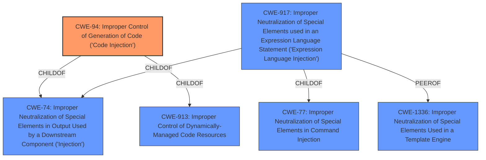

# Analysis for CVE-2021-41862

# Summary
| CWE ID | CWE Name | Confidence | CWE Abstraction Level | CWE Vulnerability Mapping Label | CWE-Vulnerability Mapping Notes |
|---|---|---|---|---|---|
| CWE-94 | Improper Control of Generation of Code ('Code Injection') | 1.0 | Base | Allowed-with-Review | Primary CWE |
| CWE-917 | Improper Neutralization of Special Elements used in an Expression Language Statement ('Expression Language Injection') | 0.8 | Base | Allowed | Secondary Candidate |

## Evidence and Confidence

*   **Confidence Score:** 0.9
*   **Evidence Strength:** HIGH

## Relationship Analysis
The primary CWE is CWE-94, which is a **Base** level CWE. CWE-94's relationships include being a child of CWE-74 (Improper Neutralization of Special Elements in Output Used by a Downstream Component ('Injection')) and CWE-913 (Improper Control of Dynamically-Managed Code Resources). CWE-917 (Improper Neutralization of Special Elements used in an Expression Language Statement ('Expression Language Injection')) is a peer of CWE-1336, and a child of CWE-74 and CWE-77. These relationships suggest that the vulnerability could be viewed as a type of injection, but the code injection aspect of CWE-94 is the most fitting based on the description.

## Vulnerability Chain
The chain of events leading to the vulnerability is as follows:
1.  **Root Cause:** The AviatorScript engine **allows code execution via an expression that is encoded with Byte Code Engineering Library (BCEL)**. This is due to the engine's ability to instantiate arbitrary objects and call methods.
2.  The **lack of input sanitization** allows injection of malicious expressions.
3.  The engine **does not restrict which classes can be instantiated**, allowing for the creation of dangerous objects like `BCELClassLoader`.
4.  **Impact:** An attacker can execute arbitrary code on the server where the AviatorScript engine is running, potentially leading to full system compromise and data breach.

## Summary of Analysis
The initial assessment, based on the vulnerability description and the retriever results, pointed towards several CWEs related to injection and improper handling of special elements. The primary concern is that the AviatorScript engine **allows code execution via an expression that is encoded with Byte Code Engineering Library (BCEL)**, indicating **improper control of code generation**. The vulnerability description key phrases highlight the root cause as "allows code execution via an expression," and the CVE Reference Links Content Summary confirms the root cause, detailing how the engine allows instantiation of arbitrary objects and calls to methods that, combined with `BCELClassLoader`, leads to arbitrary code execution.

The selected CWE, CWE-94, is at the optimal level of specificity because it directly addresses the **improper control of code generation**. While CWE-917, which relates to expression language injection, is also relevant, CWE-94 is more encompassing as it describes the broader issue of generating code from external input.

*   **CWE-94: Improper Control of Generation of Code ('Code Injection')**: This CWE is selected as the primary weakness because the vulnerability involves constructing and executing code based on external input without proper sanitization. The CVE Reference Links Content Summary explicitly states that the AviatorScript engine interprets user-provided input as code, which can be exploited. This aligns directly with the description of CWE-94. The evidence is strong and directly supports this classification.
*   **CWE-917: Improper Neutralization of Special Elements used in an Expression Language Statement ('Expression Language Injection')**: This is a secondary CWE because the vulnerability is triggered by injecting malicious expressions, which are then interpreted by the AviatorScript engine. The "Expression Injection" is listed as a Weakness/Vulnerability in the CVE Reference Links Content Summary. This aligns with the description of CWE-917, which focuses on the improper neutralization of special elements in an expression language statement.

Other CWEs Considered but Not Used:

*   CWE-158 and CWE-626 (related to null byte injection): These were considered due to the term "injection," but the core issue is not about null byte handling.
*   CWE-1333 (Inefficient Regular Expression Complexity): This is not applicable as the vulnerability does not involve regular expressions.
*   CWE-95: The root cause is not directly related to the `eval` function. The ability to call BCEL is the rootcause.