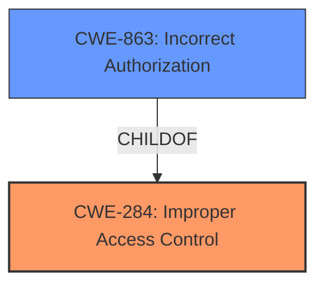

# Enhanced Analysis for CVE-2021-4194

# Summary
| CWE ID | CWE Name | Confidence | CWE Abstraction Level | CWE Vulnerability Mapping Label | CWE-Vulnerability Mapping Notes |
|---|---|---|---|---|---|
| CWE-284 | Improper Access Control | 0.75 | Pillar | Primary | Discouraged |
| CWE-863 | Incorrect Authorization | 0.60 | Class | Secondary | Allowed-with-Review |

## Evidence and Confidence

*   **Confidence Score:** 0.70
*   **Evidence Strength:** MEDIUM

## Relationship Analysis
The primary CWE selected is CWE-284, Improper Access Control, which is a Pillar-level CWE. While very broad, it aligns with the high-level description of the vulnerability. However, due to its generality, CWE-863, Incorrect Authorization, a child of CWE-284, was also considered as a secondary candidate, providing a more specific categorization within the realm of authorization issues. The relationship between CWE-284 and its child CWE-863 helped in refining the classification.



## Vulnerability Chain
The vulnerability chain starts with the **Improper Access Control**/**Incorrect Authorization**, leading to unauthorized access to resources. This is a direct mapping from the initial flaw to its impact. The provided information does not specify additional steps in the chain.

## Summary of Analysis
The initial analysis indicated **Improper Access Control** as the root cause, based on the vulnerability description. The evidence provided states: "bookstack is vulnerable to **Improper Access Control**".

The choice of CWE-284 is supported by the direct mention of "Improper Access Control" in the vulnerability description. However, CWE-284 is a very high-level "Pillar" that is often misused. Therefore, I considered CWE-863 "Incorrect Authorization" which is a child of CWE-284 and provides more specific categorization. The retriever results listed CWE-863, which supports considering it as a candidate.

Given that the description does not provide more details, and that the root cause from "Vulnerability Description Key Phrases" is **Improper Access Control**, I select CWE-284 as the primary CWE with a confidence of 0.75, and CWE-863 as a secondary CWE. The selection is based on the provided evidence, and both CWEs are related hierarchically. The MITRE mapping guidance discourages the use of CWE-284 due to its high level of abstraction. However, without more specific information about how access control is improperly implemented, selecting a more specific CWE would be speculative.

Relevant CWE Information:

# Enhanced Context (25 CWEs)
The following CWEs were identified as potentially relevant to this vulnerability:

## CWE-639: Authorization Bypass Through User-Controlled Key
**Abstraction Level**: Base
**Similarity Score**: 0.76
**Source**: dense

**Description**:
The system's authorization functionality does not prevent one user from gaining access to another user's data or record by modifying the key value identifying the data.

**Mapping Guidance**:
- Usage: Allowed
- Rationale: This CWE entry is at the Base level of abstraction, which is a preferred level of abstraction for mapping to the root causes of vulnerabilities.


## CWE Relationship Analysis

Current CWEs represent these abstraction levels: .


### Vulnerability Chain Analysis

**Chain starting from CWE-639:**
- 639 (Authorization Bypass Through User-Controlled Key) - ROOT


**Chain starting from CWE-863:**
- 863 (Incorrect Authorization) - ROOT


### CWE Relationship Diagram

```mermaid
graph TD
    classDef primary fill:#f96,stroke:#333,stroke-width:2px
    classDef secondary fill:#69f,stroke:#333
    classDef tertiary fill:#9e9,stroke:#333
```