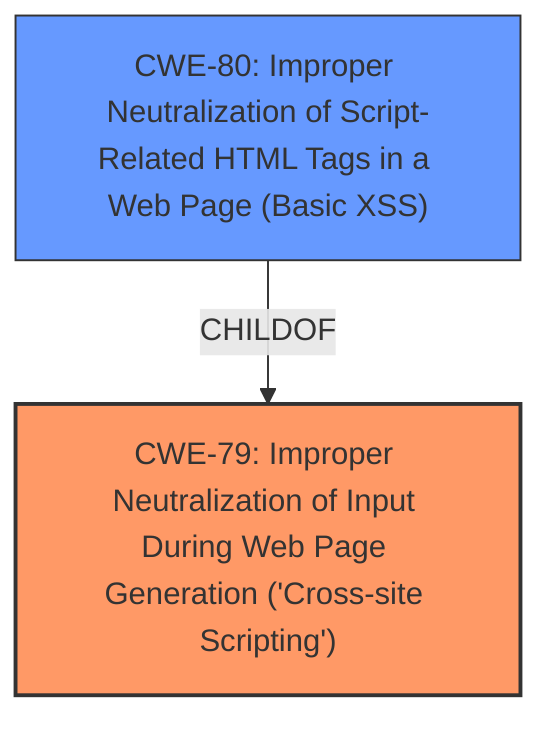

# Analysis Report for CVE-2021-41948

# Vulnerability Analysis Report: CVE-2021-41948

## Description


## Analysis (with Relationship Data)

# Summary
| CWE ID | CWE Name | Confidence | CWE Abstraction Level | CWE Vulnerability Mapping Label | CWE-Vulnerability Mapping Notes |
|---|---|---|---|---|---|
| CWE-79 | Improper Neutralization of Input During Web Page Generation ('Cross-site Scripting') | 1.0 | Base | Allowed | Primary CWE |
| CWE-80 | Improper Neutralization of Script-Related HTML Tags in a Web Page (Basic XSS) | 0.75 | Variant | Allowed | Secondary Candidate |

## Evidence and Confidence

*   **Confidence Score:** 0.9
*   **Evidence Strength:** HIGH

## Relationship Analysis
The primary relationship that influenced the CWE selection is the parent-child relationship between CWE-79 and CWE-80. CWE-80 is a variant of CWE-79, representing a more specific case of XSS where the **improper neutralization** involves script-related HTML tags. Since the vulnerability description mentions **cross-site scripting** and the injection of arbitrary JavaScript code via the "List of subjects" field, both CWE-79 and CWE-80 are relevant. However, the description doesn't explicitly state that the vulnerability is limited to script-related HTML tags, so CWE-79 is the more appropriate primary mapping.



## Vulnerability Chain
The vulnerability chain starts with the **lack of sanitization/validation** of user-supplied input in the "List of subjects" field. This leads to a stored XSS vulnerability where malicious JavaScript code is stored in the database. When a user views the contact form, the stored JavaScript code is executed in their browser, leading to potential account takeover or website defacement.

## Summary of Analysis
The initial analysis focused on identifying the root cause and the type of vulnerability based on the provided description. The description clearly states the presence of a **cross-site scripting** vulnerability due to the **lack of sanitization** of user-supplied input. The Retriever results also strongly suggest CWE-79 as the primary candidate. The relationship analysis further refined the selection by considering the parent-child relationship between CWE-79 and CWE-80.

The evidence from the vulnerability description and the CVE reference links content summary supports the selection of CWE-79 as the primary CWE.

Vulnerability Description Key Phrases:
- **weakness:** **cross-site scripting**

CVE Reference Links Content Summary:
- **Root cause of vulnerability:** The vulnerability lies in the **lack of sanitization** of user-supplied input when handling contact form subjects. Specifically, the "List of subjects" field in the admin panel allows users to insert arbitrary JavaScript code.
- **Weaknesses/vulnerabilities present:**
    - Stored XSS vulnerability: Malicious JavaScript code is stored in the database and executed when a user views the contact form on the frontend.
    - **Lack of input sanitization/validation:** The plugin **fails to sanitize or validate** the "List of subjects" input, allowing the injection of JavaScript.

The selection of CWE-79 is at the optimal level of specificity because it directly addresses the **improper neutralization** of input during web page generation, which is the root cause of the vulnerability.

Relevant CWE Information:

# Enhanced Context (25 CWEs)
The following CWEs were identified as potentially relevant to this vulnerability:

## CWE-80: Improper Neutralization of Script-Related HTML Tags in a Web Page (Basic XSS)
**Abstraction Level**: Variant
**Similarity Score**: 0.79
**Source**: dense

**Description**:
The product receives input from an upstream component, but it does not neutralize or incorrectly neutralizes special characters such as "<", ">", and "&" that could be interpreted as web-scripting elements when they are sent to a downstream component that processes web pages.

**Mapping Guidance**:
- Usage: Allowed
- Rationale: This CWE entry is at the Variant level of abstraction, which is a preferred level of abstraction for mapping to the root causes of vulnerabilities.

## CWE-79: Improper Neutralization of Input During Web Page Generation ('Cross-site Scripting')
**Abstraction Level**: Base
**Similarity Score**: 9012.21
**Source**: sparse

**Description**:
The product does not neutralize or incorrectly neutralizes user-controllable input before it is placed in output that is used as a web page that is served to other users.

**Mapping Guidance**:
- Usage: Allowed
- Rationale: This CWE entry is at the Base level of abstraction, which is a preferred level of abstraction for mapping to the root causes of vulnerabilities.

### CWE-79: Improper Neutralization of Input During Web Page Generation ('Cross-site Scripting')
**Technical Explanation:**
CWE-79 describes the vulnerability where a product does not properly neutralize user-controllable input before placing it in the output used as a web page. This allows an attacker to inject malicious scripts that are executed in the victim's browser. In this case, the "contact us" plugin for Subrion CMS fails to neutralize the "List of subjects" input, allowing the injection of arbitrary JavaScript code.

**Security Implications:**
The security implication of CWE-79 is that an attacker can execute arbitrary JavaScript code in the victim's browser. This can lead to various malicious activities, such as stealing cookies, redirecting the user to a phishing website, or defacing the website.

**Relationship Analysis:**
CWE-79 is a base-level CWE. It has child CWEs like CWE-80, which is a more specific case of XSS.

**Mapping Guidance Influence:**
The MITRE mapping guidance recommends using the base level of abstraction, which is why CWE-79 is chosen as the primary CWE.

### CWE-80: Improper Neutralization of Script-Related HTML Tags in a Web Page (Basic XSS)
**Technical Explanation:**
CWE-80 describes a variant of XSS where the improper neutralization involves script-related HTML tags. While the vulnerability description mentions the injection of arbitrary JavaScript code, it doesn't explicitly state that the vulnerability is limited to script-related HTML tags.

**Security Implications:**
The security implications of CWE-80 are similar to CWE-79, but it is more specific to the injection of script-related HTML tags.

**Relationship Analysis:**
CWE-80 is a variant of CWE-79.

**Mapping Guidance Influence:**
The MITRE mapping guidance suggests using the most specific CWE that accurately represents the vulnerability. While CWE-80 is relevant, it is not as general as CWE-79, and the description doesn't explicitly limit the vulnerability to script-related HTML tags. Therefore, it is a secondary candidate.

### Considered but not used:
CWE-352: Cross-Site Request Forgery (CSRF) was considered but not used because the vulnerability description focuses on XSS, not CSRF.
CWE-116: Improper Encoding or Escaping of Output was considered but not used because the primary issue is the **lack of neutralization**, not the encoding or escaping of output.
CWE-434: Unrestricted Upload of File with Dangerous Type was considered but not used because the vulnerability doesn't involve file uploads.
CWE-359: Exposure of Private Personal Information to an Unauthorized Actor was considered but not used because the vulnerability doesn't directly lead to the exposure of private information.
CWE-73: External Control of File Name or Path was considered but not used because the vulnerability doesn't involve external control of file names or paths.
CWE-942: Permissive Cross-domain Policy with Untrusted Domains was considered but not used because the vulnerability doesn't involve cross-domain policies.
CWE-1004: Sensitive Cookie Without 'HttpOnly' Flag was considered but not used because the vulnerability doesn't involve sensitive cookies.
CWE-89: Improper Neutralization of Special Elements used in an SQL Command ('SQL Injection') was considered but not used because the vulnerability doesn't involve SQL injection.


## CWE Relationship Analysis

Current CWEs represent these abstraction levels: .


### Vulnerability Chain Analysis

**Chain starting from CWE-79:**
- 79 (Improper Neutralization of Input During Web Page Generation ('Cross-site Scripting')) - ROOT


**Chain starting from CWE-80:**
- 80 (Improper Neutralization of Script-Related HTML Tags in a Web Page (Basic XSS)) - ROOT


### CWE Relationship Diagram

```mermaid
graph TD
    classDef primary fill:#f96,stroke:#333,stroke-width:2px
    classDef secondary fill:#69f,stroke:#333
    classDef tertiary fill:#9e9,stroke:#333
```


*Report generated on 2025-04-01 23:51:26*
