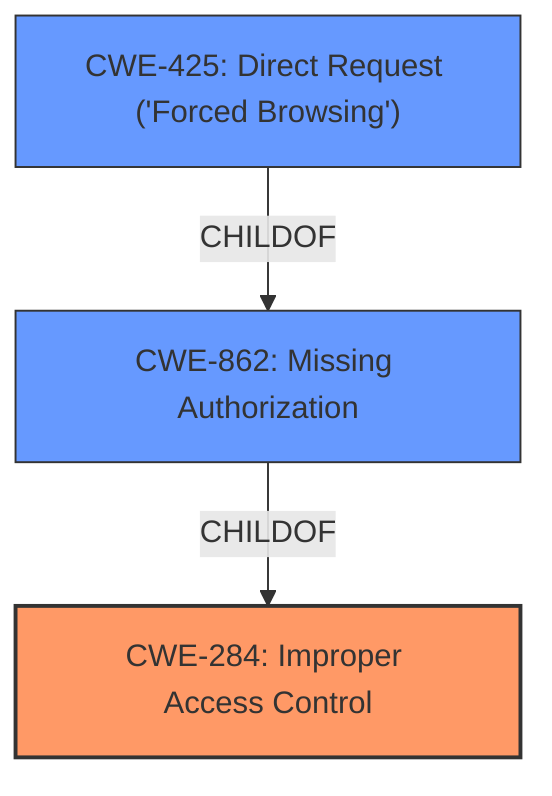

# Raw Analyzer Response for CVE-2021-41976

# Summary
| CWE ID | CWE Name | Confidence | CWE Abstraction Level | CWE Vulnerability Mapping Label | CWE-Vulnerability Mapping Notes |
|---|---|---|---|---|---|
| CWE-284 | Improper Access Control | 0.8 | Pillar | Primary CWE | Discouraged |
| CWE-862 | Missing Authorization | 0.7 | Class | Secondary Candidate | Allowed-with-Review |
| CWE-425 | Direct Request ('Forced Browsing') | 0.6 | Base | Secondary Candidate | Allowed |

## Evidence and Confidence

*   **Confidence Score:** 0.8
*   **Evidence Strength:** MEDIUM

## Relationship Analysis
The primary relationship considered was the parent-child relationship between CWE-284, CWE-862 and CWE-425. CWE-284 is a high-level Pillar, while CWE-862 is a Class and CWE-425 is a Base. Given the provided description, the vulnerability involves an **authorization bypass**, which falls under the umbrella of improper access control. While the description doesn't provide enough detail to pinpoint the exact mechanism of the bypass, the high-level category of CWE-284 is initially appropriate. CWE-862 and CWE-425 offer more specific classifications, but require more evidence to ensure accurate mapping.

## Vulnerability Chain
The vulnerability chain starts with an **authorization bypass**, which allows remote attackers to amend folder names in the book list without logging in.
  - Root Cause: **authorization bypass**
  - Impact: amend folder names in book list without logging in

## Summary of Analysis
Initially, CWE-284 "Improper Access Control" was considered as the primary CWE due to the **authorization bypass** vulnerability. However, CWE-284 is a Pillar, which is discouraged.
The vulnerability description states: "Tad Uploader edit book list function is vulnerable to **authorization bypass**, thus remote attackers can use the function to amend the folder names in the book list without logging in."
The presence of **authorization bypass** indicates a problem with access control, making CWE-284 a reasonable starting point. However, the mapping guidance for CWE-284 discourages its use due to its high-level nature, suggesting more specific descendants.

CWE-862 "Missing Authorization" and CWE-425 "Direct Request ('Forced Browsing')" are potential candidates because they are children of CWE-285 which is a child of CWE-284, and the vulnerability allows attackers to "amend the folder names in the book list without logging in", which might be due to missing authorization checks or direct requests to restricted resources. Since the vulnerability is that remote attackers can use the function to amend the folder names in the book list without logging in, so that is missing authorization (CWE-862) or direct request ('Forced Browsing') (CWE-425).

The final decision is to map to CWE-284 as the Primary CWE, with CWE-862 and CWE-425 as secondary candidates. The justification for using CWE-284 is that the vulnerability is an **authorization bypass**, which falls under the umbrella of improper access control. The decision to use CWE-284 is also influenced by the lack of more specific information in the description, which prevents a more precise mapping. CWE-862 and CWE-425 are included as secondary candidates because they represent potential underlying causes of the **authorization bypass**.

Relevant CWE Information:

# Enhanced Context (25 CWEs)
The following CWEs were identified as potentially relevant to this vulnerability:

## CWE-639: Authorization Bypass Through User-Controlled Key
**Abstraction Level**: Base
**Similarity Score**: 0.75
**Source**: dense

**Description**:
The system's authorization functionality does not prevent one user from gaining access to another user's data or record by modifying the key value identifying the data.

**Mapping Guidance**:
- Usage: Allowed
- Rationale: This CWE entry is at the Base level of abstraction, which is a preferred level of abstraction for mapping to the root causes of vulnerabilities.

## CWE-183: Permissive List of Allowed Inputs
**Abstraction Level**: Base
**Similarity Score**: 0.74
**Source**: dense

**Description**:
The product implements a protection mechanism that relies on a list of inputs (or properties of inputs) that are explicitly allowed by policy because the inputs are assumed to be safe, but the list is too permissive - that is, it allows an input that is unsafe, leading to resultant weaknesses.

**Mapping Guidance**:
- Usage: Allowed
- Rationale: This CWE entry is at the Base level of abstraction, which is a preferred level of abstraction for mapping to the root causes of vulnerabilities.

## CWE-807: Reliance on Untrusted Inputs in a Security Decision
**Abstraction Level**: Base
**Similarity Score**: 0.74
**Source**: dense

**Description**:
The product uses a protection mechanism that relies on the existence or values of an input, but the input can be modified by an untrusted actor in a way that bypasses the protection mechanism.

**Mapping Guidance**:
- Usage: Allowed
- Rationale: This CWE entry is at the Base level of abstraction, which is a preferred level of abstraction for mapping to the root causes of vulnerabilities.

## CWE-552: Files or Directories Accessible to External Parties
**Abstraction Level**: Base
**Similarity Score**: 0.74
**Source**: dense

**Description**:
The product makes files or directories accessible to unauthorized actors, even though they should not be.

**Mapping Guidance**:
- Usage: Allowed
- Rationale: This CWE entry is at the Base level of abstraction, which is a preferred level of abstraction for mapping to the root causes of vulnerabilities.

## CWE-472: External Control of Assumed-Immutable Web Parameter
**Abstraction Level**: Base
**Similarity Score**: 0.74
**Source**: dense

**Description**:
The web application does not sufficiently verify inputs that are assumed to be immutable but are actually externally controllable, such as hidden form fields.

**Mapping Guidance**:
- Usage: Allowed
- Rationale: This CWE entry is at the Base level of abstraction, which is a preferred level of abstraction for mapping to the root causes of vulnerabilities.

## CWE-41: Improper Resolution of Path Equivalence
**Abstraction Level**: Base
**Similarity Score**: 0.74
**Source**: dense

**Description**:
The product is vulnerable to file system contents disclosure through path equivalence. Path equivalence involves the use of special characters in file and directory names. The associated manipulations are intended to generate multiple names for the same object.

**Mapping Guidance**:
- Usage: Allowed
- Rationale: This CWE entry is at the Base level of abstraction, which is a preferred level of abstraction for mapping to the root causes of vulnerabilities.

## CWE-1220: Insufficient Granularity of Access Control
**Abstraction Level**: Base
**Similarity Score**: 0.73
**Source**: dense

**Description**:
The product implements access controls via a policy or other feature with the intention to disable or restrict accesses (reads and/or writes) to assets in a system from untrusted agents. However, implemented access controls lack required granularity, which renders the control policy too broad because it allows accesses from unauthorized agents to the security-sensitive assets.

**Mapping Guidance**:
- Usage: Allowed
- Rationale: This CWE entry is at the Base level of abstraction, which is a preferred level of abstraction for mapping to the root causes of vulnerabilities.

## CWE-668: Exposure of Resource to Wrong Sphere
**Abstraction Level**: Class
**Similarity Score**: 0.73
**Source**: dense

**Description**:
The product exposes a resource to the wrong control sphere, providing unintended actors with inappropriate access to the resource.

**Mapping Guidance**:
- Usage: Discouraged
- Rationale: CWE-668 is high-level and is often misused as a catch-all when lower-level CWE IDs might be applicable. It is sometimes used for low-information vulnerability reports [REF-1287]. It is a level-1 Class (i.e., a child of a Pillar). It is not useful for trend analysis.

## CWE-274: Improper Handling of Insufficient Privileges
**Abstraction Level**: Base
**Similarity Score**: 0.73
**Source**: dense

**Description**:
The product does not handle or incorrectly handles when it has insufficient privileges to perform an operation, leading to resultant weaknesses.

**Mapping Guidance**:
- Usage: Disc