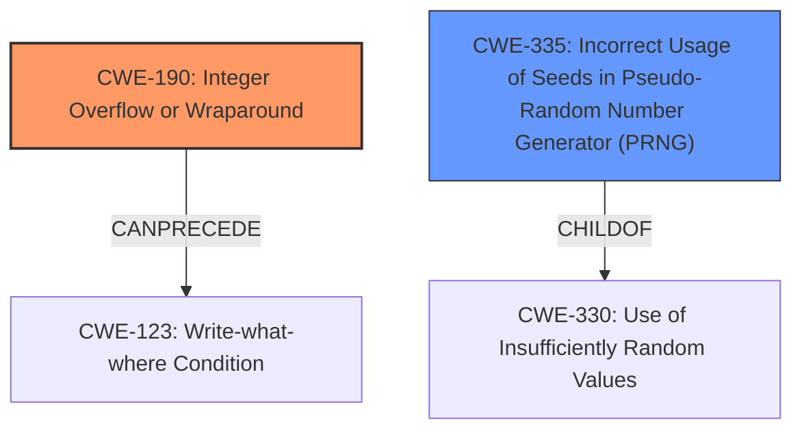

# Analysis for CVE-2021-41991

# Summary
| CWE ID | CWE Name | Confidence | CWE Abstraction Level | CWE Vulnerability Mapping Label | CWE-Vulnerability Mapping Notes |
|---|---|---|---|---|---|
| CWE-190 | Integer Overflow or Wraparound | 0.9 | Base | Primary | Allowed |
| CWE-335 | Incorrect Usage of Seeds in Pseudo-Random Number Generator (PRNG) | 0.7 | Base | Secondary | Allowed |

## Evidence and Confidence

*   **Confidence Score:** 0.8
*   **Evidence Strength:** HIGH

## Relationship Analysis
The primary CWE is CWE-190, representing the **integer overflow** directly mentioned in the vulnerability description and CVE details. It's a Base-level CWE, providing a good level of specificity. CWE-335 is a secondary consideration because the vulnerability involves using a random number generator, and this CWE addresses issues with seed management in PRNGs. CWE-335 is a child of CWE-330 (Use of Insufficiently Random Values), which is a more general class. The relationship between CWE-190 and potential consequences like CWE-123 (Write-what-where Condition) is also considered.

## Vulnerability Chain
The vulnerability chain starts with the **improper random number generation** which leads to an **integer overflow**. This overflow results in out-of-bounds memory access and a crash. The potential impact could be remote code execution.
  - **Root Cause:** **Improper random number generation**, leading to CWE-335.
  - **Weakness:** **Integer overflow**, represented by CWE-190.
  - **Impact:** Out-of-bounds memory access, potentially leading to denial of service or remote code execution.

## Summary of Analysis
The analysis concludes that the primary weakness is CWE-190 (**Integer Overflow**). The vulnerability description explicitly mentions an **integer overflow**, and the CVE reference summary confirms that the `random()` function's output can lead to an **integer overflow** and a negative array index. The supporting evidence is "The in-memory certificate cache in strongSwan before 5.9.4 has a remote **integer overflow** upon receiving many requests" and "The `random()` function's output, when used to calculate an offset within the certificate cache array, can lead to an integer overflow due to `RAND_MAX` potentially being a very large number such as `INT_MAX` (2^31-1)."

CWE-335 (**Incorrect Usage of Seeds in Pseudo-Random Number Generator (PRNG)**) is considered as a secondary CWE because the issue involves a random number generator, but the core problem isn't necessarily with the seed itself, but rather with how the generated random number is used, leading to the overflow.

The selected CWEs are at the Base level of abstraction, providing appropriate specificity. While remote code execution is mentioned as a possibility, the primary impact is denial of service due to the crash caused by the out-of-bounds access, which is a consequence of the **integer overflow**.

Other CWEs Considered But Not Used:

*   CWE-330 (Use of Insufficiently Random Values): This is a Class-level CWE and is too general. The issue isn't simply about using insufficiently random values, but specifically an **integer overflow** occurring due to how the random number is used.
*   CWE-331 (Insufficient Entropy): This is a more specific type of insufficient randomness. While related, the core issue is the **integer overflow**, not necessarily a lack of entropy in the random number generator.
*   CWE-337 (Predictable Seed in Pseudo-Random Number Generator (PRNG)): The description doesn't indicate a predictable seed is the root cause, but rather that the random number generated is used improperly.
*   CWE-123 (Write-what-where Condition): This is a potential consequence of the **integer overflow**, but the root cause is the overflow itself.
*   CWE-131 (Incorrect Calculation of Buffer Size): While the **integer overflow** leads to memory access issues, the immediate cause is not an incorrect buffer size calculation.