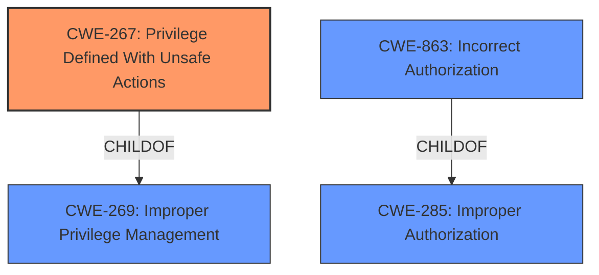

# Raw Analyzer Response for CVE-2021-4200

# Summary

| CWE ID  | CWE Name                                                   | Confidence | CWE Abstraction Level | CWE Vulnerability Mapping Label | CWE-Vulnerability Mapping Notes |
| :------- | :--------------------------------------------------------- | :--------- | :-------------------- | :------------------------------ | :------------------------------ |
| CWE-267 | Privilege Defined With Unsafe Actions                 | 0.95       | Base                  | Allowed                       | Primary CWE                   |
| CWE-269 | Improper Privilege Management                            | 0.75       | Class                  | Discouraged                   | Secondary Candidate           |
| CWE-863 | Incorrect Authorization                                    | 0.60       | Class                  | Allowed-with-Review           | Secondary Candidate           |
| CWE-285 | Improper Authorization                                    | 0.50       | Class                  | Discouraged                   | Secondary Candidate           |

## Evidence and Confidence

*   **Confidence Score:** 0.85
*   **Evidence Strength:** HIGH

## Relationship Analysis

The primary CWE selected is CWE-267, a **Base** level CWE, which is a child of CWE-269. CWE-269 is a **Class** level CWE. CWE-863 is a **Class** level CWE and child of CWE-285 which is also a **Class** level CWE. These hierarchical relationships help to properly categorize the nature of the vulnerability. CWE-269 is too high-level and discouraged.

## Vulnerability Chain

The chain of root cause and weaknesses for the Vulnerability Description:
1.  **Root Cause**: The `global-data` role was overly permissive, granting write access to resources that should have been restricted, indicating an **Improper Privilege Management**.
2.  **Weakness**: Any user with any catalog access was granted unintended write access to catalog templates and template versions (**Privilege Defined With Unsafe Actions**).
3.  **Impact**: A malicious user can modify application visibility, spoof application icons, misrepresent chart trust, and swap template versions.

## Summary of Analysis

The initial assessment focused on the **Improper Privilege Management** described in the vulnerability, along with the **root cause** and impact detailed in the CVE Reference Links Content Summary. The key evidence supporting the selection of CWE-267 is:

*   The `global-data` role in the `cattle-global-data` namespace grants write access to Catalogs.
*   Each user with any level of catalog access was inadvertently bound to the `global-data` role.
*   This grants write access to `CatalogTemplates` and `CatalogTemplateVersions` for all users with any level of catalog access, even if they are not supposed to have it.

This highlights that certain privileges could be used to perform actions that were not intended, aligning with CWE-267.

The **Retriever Results** also supported this selection, with CWE-267 being a top candidate. The hierarchical relationships, with CWE-267 being a child of CWE-269, helped refine the classification to the most specific **Base** level. While CWE-269 (**Improper Privilege Management**) initially seemed applicable, it is a more general **Class** level CWE and is often misused, as noted in its mapping guidance. The final decision was to select CWE-267 as the primary CWE because it precisely captures the essence of the vulnerability: a specific privilege allows unintended, unsafe actions.

Relevant CWE Information:

# Enhanced Context (25 CWEs)

## CWE-267: Privilege Defined With Unsafe Actions

**Technical Explanation:**

The vulnerability in SUSE Rancher arises because a specific privilege, namely the `global-data` role, grants unintended write access to Catalogs. Any user with catalog access is inadvertently bound to this role, allowing them to modify `CatalogTemplates` and `CatalogTemplateVersions` even if they should not have such permissions. This aligns directly with CWE-267, where a privilege can be used to perform unsafe actions that were not intended.

**Security Implications:**

The implications of this vulnerability are significant. A malicious user can:

1.  Modify application visibility: Make applications or individual versions visible or hidden in the UI.
2.  Spoof application icons: Change the logo of an application or template.
3.  Misrepresent chart trust: Make less trusted charts appear more legitimate.
4.  Swap template versions: Swap files between different charts or versions within the same catalog.

These actions can lead to users deploying modified versions of charts when they expect the original ones, creating a significant security risk.

**Parent-Child Relationships and Chain Patterns:**

CWE-267 is a child of CWE-269 (**Improper Privilege Management**), indicating a broader category of privilege-related issues. However, CWE-267 is more specific, focusing on the scenario where a particular privilege allows unintended actions.

**Primary or Secondary Weakness:**

This is the primary weakness, as the vulnerability hinges on the fact that the `global-data` role is overly permissive, leading to the unintended granting of write access.

**MITRE Mapping Guidance:**

The MITRE mapping guidance for CWE-267 states that it is at the Base level of abstraction, which is a preferred level for mapping root causes. The guidance also advises careful reading of the name and description to ensure an appropriate fit, which is the case here.

## CWE-269: Improper Privilege Management

**Explanation for Not Using:**

While the vulnerability involves privilege management, CWE-269 is a Class-level CWE that is often misused and too general. The MITRE mapping guidance discourages its use when more specific CWEs are applicable. In this case, CWE-267 provides a more precise description of the vulnerability.

## CWE-863: Incorrect Authorization

**Explanation for Not Using:**

CWE-863 (**Incorrect Authorization**) describes a scenario where an authorization check is performed but is not done correctly. While authorization is related to this vulnerability, the root cause is more about the definition of the privileges themselves, rather than an error in the authorization check. Therefore, CWE-863 is not as accurate as CWE-267.

## CWE-285: Improper Authorization

**Explanation for Not Using:**

CWE-285 (**Improper Authorization**) is a Class-level CWE that describes a scenario where the product does not perform or incorrectly performs an authorization check. This is too high level, and the root cause is the overly permissive `global-data` role and the unintended granting of write access, which is more accurately described by CWE-267.