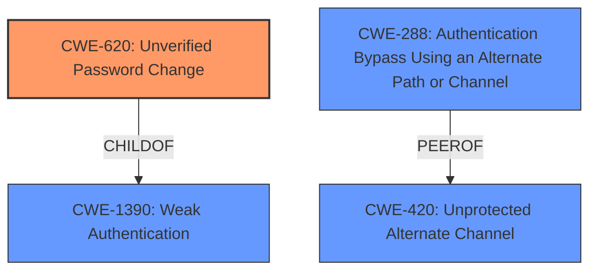

# Enhanced Analysis for CVE-2021-42000

# Summary
| CWE ID | CWE Name | Confidence | CWE Abstraction Level | CWE Vulnerability Mapping Label | CWE-Vulnerability Mapping Notes |
|---|---|---|---|---|---|
| CWE-620 | Unverified Password Change | 0.8 | Base | Primary | Allowed |
| CWE-288 | Authentication Bypass Using an Alternate Path or Channel | 0.6 | Base | Secondary | Allowed |
| CWE-1390 | Weak Authentication | 0.5 | Class | Secondary | Allowed-with-Review |

## Evidence and Confidence

*   **Confidence Score:** 0.8
*   **Evidence Strength:** MEDIUM

## Relationship Analysis
The primary CWE is CWE-620, which is a Base level CWE. It has a parent of CWE-1390 (Weak Authentication), which is a Class level CWE. CWE-288 (Authentication Bypass Using an Alternate Path or Channel) is also a Base level CWE, and it is a peer of CWE-420 (Unprotected Alternate Channel). Choosing CWE-620 as the primary weakness provides the most specific classification of the vulnerability.



## Vulnerability Chain
The vulnerability chain starts with a **weakness** in the password reset/change flow due to the adapter supporting multiple parallel reset flows. This leads to the **impact** of an existing user being able to reset another user's password. The chain can be described as follows:

1.  **Weakness:** Parallel reset flows are supported by the adapter.
2.  **Vulnerability:** **Unverified Password Change** (CWE-620) allows changing another user's password.
3.  **Impact:** An existing user can reset another existing user's password.

## Summary of Analysis
The initial analysis considered several CWEs, primarily focusing on authentication and authorization issues. The retriever results highlighted CWE-620 (Unverified Password Change), CWE-288 (Authentication Bypass Using an Alternate Path or Channel), and CWE-1390 (Weak Authentication) as potential candidates.

The vulnerability description states: "When a password reset or password change flow with an authentication policy is configured and the adapter in the reset or change policy supports multiple parallel reset flows, an existing user can **reset another existing users password**." This directly relates to the **impact** of the vulnerability, where one user can change the password of another.

CWE-620 (Unverified Password Change) is the most appropriate primary CWE because it specifically addresses the scenario where a product allows changing a user's password without verifying the original password or using another form of authentication. The description of CWE-620 states: "When setting a new password for a user, the product does not require knowledge of the original password, or using another form of authentication." This aligns perfectly with the vulnerability, where one user can reset another user's password without proper verification.

CWE-288 (Authentication Bypass Using an Alternate Path or Channel) is considered as a secondary CWE because the vulnerability can be seen as bypassing the intended authentication process by exploiting the parallel reset flows.

CWE-1390 (Weak Authentication) is a more general Class-level CWE, and while relevant, CWE-620 provides a more specific and accurate representation of the vulnerability.

The final selection of CWE-620 is based on the evidence that the vulnerability allows changing passwords without proper verification, which directly matches the definition of CWE-620. This ensures that the selected CWE is at the optimal level of specificity.

Relevant CWE Information:


## CWE Relationship Analysis

Current CWEs represent these abstraction levels: .


### Vulnerability Chain Analysis

**Chain starting from CWE-288:**
- 288 (Authentication Bypass Using an Alternate Path or Channel) - ROOT


**Chain starting from CWE-620:**
- 620 (Unverified Password Change) - ROOT


### CWE Relationship Diagram

```mermaid
graph TD
    classDef primary fill:#f96,stroke:#333,stroke-width:2px
    classDef secondary fill:#69f,stroke:#333
    classDef tertiary fill:#9e9,stroke:#333
```