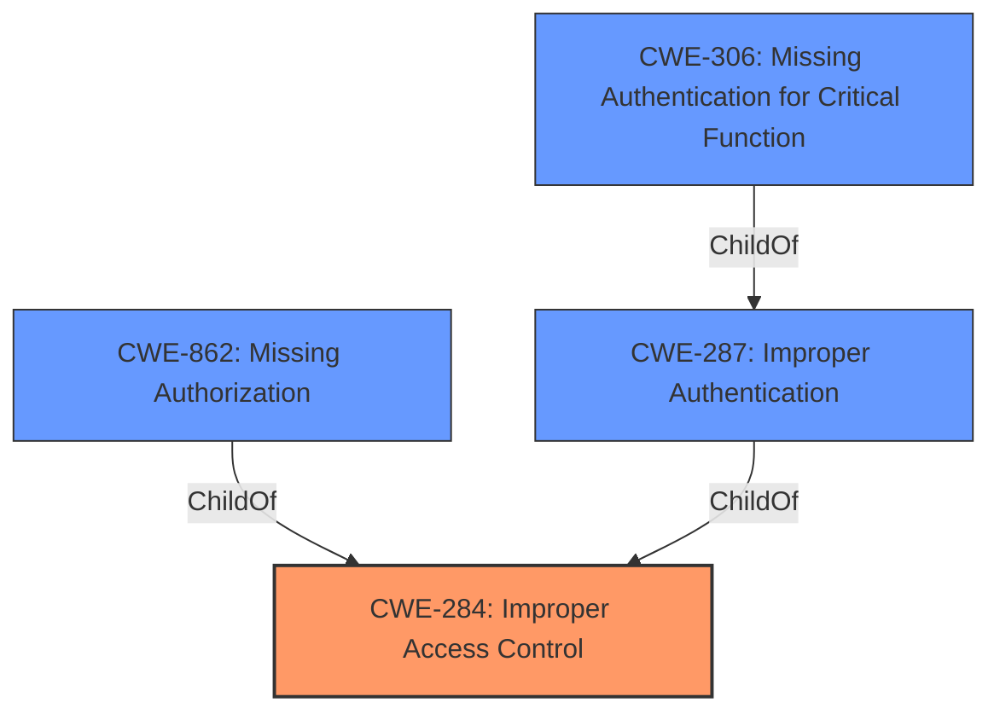

# Enhanced Analysis for CVE-2021-4201

# Summary
| CWE ID | CWE Name | Confidence | CWE Abstraction Level | CWE Vulnerability Mapping Label | CWE-Vulnerability Mapping Notes |
|---|---|---|---|---|---|
| CWE-284 | Improper Access Control | 0.75 | Pillar | Discouraged | The description indicates a **missing access control** issue which aligns with the description of CWE-284. However, CWE-284 is a Pillar level CWE and is discouraged, so more specific CWEs should be considered. |
| CWE-862 | Missing Authorization | 0.65 | Class | Allowed-with-Review | The vulnerability description mentions "**Missing access control**" which implies a **missing authorization** check when accessing resources. |
| CWE-306 | Missing Authentication for Critical Function | 0.5 | Base | Allowed | Another possible root cause could be a complete **lack of authentication** for critical functions that then leads to session hijacking. |

## Evidence and Confidence

*   **Confidence Score:** 0.7
*   **Evidence Strength:** MEDIUM

## Relationship Analysis
The relationships between the CWEs considered are as follows:

*   CWE-284 is a Pillar, making it a very high-level categorization. It is the parent of CWE-862 and CWE-287.
*   CWE-862 (Missing Authorization) is a Class, and a child of CWE-284. It represents a more specific type of access control issue where authorization checks are missing.
*   CWE-306 (Missing Authentication for Critical Function) is a Base and is a child of CWE-287 (Improper Authentication), and thus a grandchild of CWE-284. It addresses scenarios where authentication is completely missing for critical functions.



## Vulnerability Chain
The vulnerability chain starts with a **missing access control** mechanism, which can manifest as either **missing authorization** or **missing authentication**. This leads to the impact of session hijacking, potentially including admin-level sessions.

## Summary of Analysis
Initially, the presence of "**Missing access control**" in the **Vulnerability Description Key Phrases** suggests CWE-284 (Improper Access Control). However, CWE-284 is a high-level Pillar, and the mapping guidance discourages its use when more specific CWEs are available.

The analysis then considered CWE-862 (Missing Authorization) and CWE-306 (Missing Authentication for Critical Function) as more specific alternatives. The phrase "**Missing access control**" strongly suggests CWE-862, where authorization checks are not performed when an actor attempts to access a resource. The fact that sessions, including admin-level sessions, could be hijacked supports this. However, it is also possible that the root cause is a complete **lack of authentication**, so CWE-306 was also considered.

Ultimately, due to the lack of specific detail, it is difficult to determine whether the root cause is the **missing of authentication** or **missing authorization**. So, both CWE-862 and CWE-306 are candidate CWEs.

Relevant CWE Information:

*   **CWE-284: Improper Access Control**
    *   **Description:** The product does not restrict or incorrectly restricts access to a resource from an unauthorized actor.
    *   **Mapping Guidance:** Discouraged because it is too high-level.
*   **CWE-862: Missing Authorization**
    *   **Description:** The product does not perform an authorization check when an actor attempts to access a resource or perform an action.
    *   **Mapping Guidance:** Allowed-with-Review because it is a Class and might have Base-level children that would be more appropriate.
*   **CWE-306: Missing Authentication for Critical Function**
    *   **Description:** The product does not perform any authentication for functionality that requires a provable user identity or consumes a significant amount of resources.
    *   **Mapping Guidance:** Allowed because it is at the Base level of abstraction.


## CWE Relationship Analysis

Current CWEs represent these abstraction levels: .


### Vulnerability Chain Analysis

**Chain starting from CWE-287:**
- 287 (Improper Authentication) - ROOT


**Chain starting from CWE-306:**
- 306 (Missing Authentication for Critical Function) - ROOT


### CWE Relationship Diagram

```mermaid
graph TD
    classDef primary fill:#f96,stroke:#333,stroke-width:2px
    classDef secondary fill:#69f,stroke:#333
    classDef tertiary fill:#9e9,stroke:#333
```