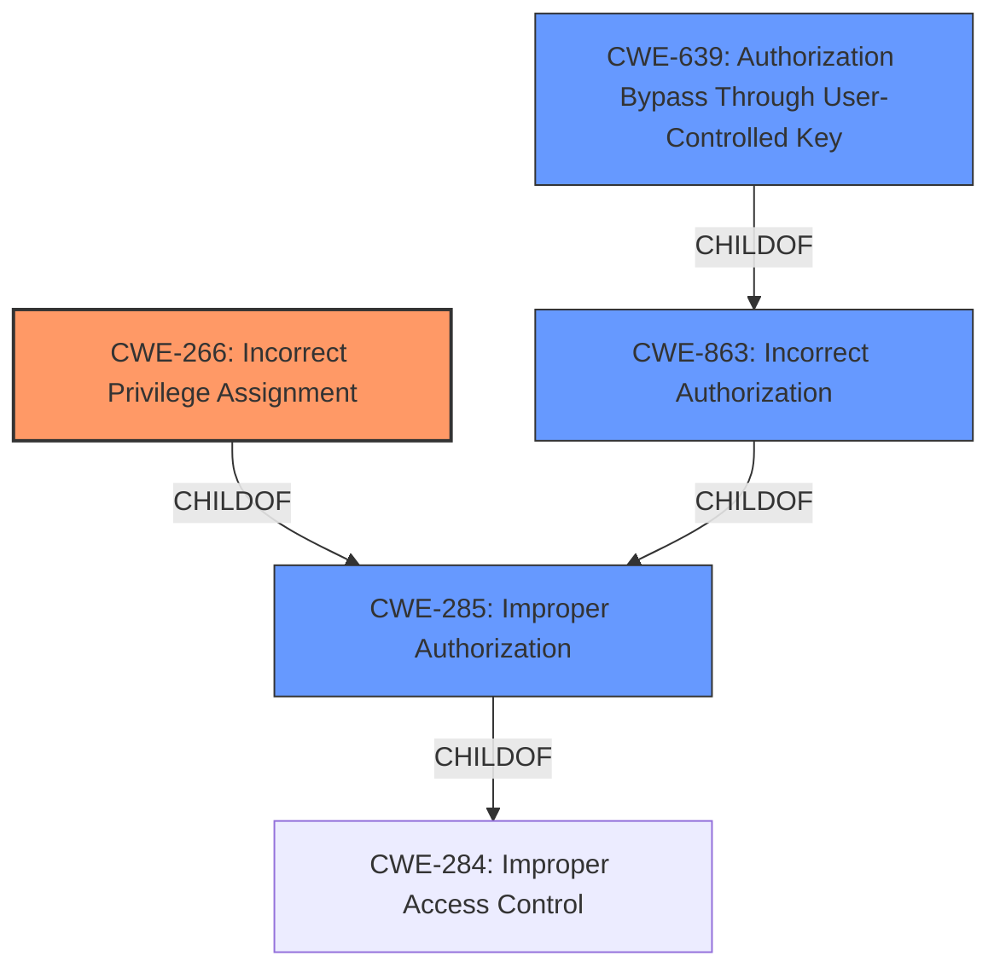

# Raw Analyzer Response for CVE-2021-42025

# Summary
| CWE ID | CWE Name | Confidence | CWE Abstraction Level | CWE Vulnerability Mapping Label | CWE-Vulnerability Mapping Notes |
|---|---|---|---|---|---|
| CWE-266 | Incorrect Privilege Assignment | 0.9 | Base | Primary | Allowed |
| CWE-639 | Authorization Bypass Through User-Controlled Key | 0.7 | Base | Secondary | Allowed |
| CWE-863 | Incorrect Authorization | 0.6 | Class | Secondary | Allowed-with-Review |
| CWE-285 | Improper Authorization | 0.5 | Class | Secondary | Discouraged |

## Evidence and Confidence

*   **Confidence Score:** 0.8
*   **Evidence Strength:** HIGH

## Relationship Analysis
The primary CWE is CWE-266 which is a Base level CWE. It is related to CWE-285 (Improper Authorization) and CWE-284 (Improper Access Control) through parent-child relationships. The vulnerability description mentions that the application "**does not properly control write access**," indicating an issue with assigning the correct privileges. CWE-639 represents a specific type of authorization bypass, which could be a consequence of the **incorrect privilege assignment**. CWE-863 represents a more generalized form of authorization issues. The abstraction levels influenced the decision to select CWE-266 as the primary CWE due to its base level specificity.

## Vulnerability Chain
The vulnerability chain starts with **incorrect privilege assignment** (CWE-266). This leads to **improper control of write access**, enabling authenticated attackers to manipulate `System.FileDocument` objects. A potential secondary weakness could be authorization bypass (CWE-639) if attackers can directly modify keys to access unauthorized resources.

## Summary of Analysis
The initial analysis focused on the **weakness** "not properly control write access" and the impact of manipulating `System.FileDocument` objects. Based on the retriever results, CWE-269, CWE-917, and CWE-863 were considered. However, the vulnerability description and CVE summary clearly indicate an issue with how write access is assigned, making CWE-266 (Incorrect Privilege Assignment) the most appropriate primary CWE.

The evidence is: "Applications built with affected versions of Mendix Studio Pro do **not properly control write access** for certain client actions." From "CVE Reference Links Content Summary" section, the root cause is "Incorrect authorization in Mendix Studio Pro applications. Specifically, the application does not properly control write access for certain client actions."

The graph relationships influenced the decision by providing context on how privilege assignment relates to broader authorization and access control concepts. CWE-266, being a base-level CWE, offers the most specific representation of the vulnerability.

Other CWEs Considered but Not Used:
*   CWE-269: Improper Privilege Management - While related, this is a class-level CWE and less specific than CWE-266. Also, the mapping guidance discourages its use.
*   CWE-917: Improper Neutralization of Special Elements used in an Expression Language Statement ('Expression Language Injection') - This CWE is not relevant as the vulnerability does not involve expression language injection.
*   CWE-863: Incorrect Authorization - While related to the overall authorization issue, it's less specific than CWE-266, which focuses on the assignment aspect. The mapping guidance suggests examining its children for a better fit.
*   CWE-284: Improper Access Control - This is a pillar-level CWE and too general.
*   CWE-200: Exposure of Sensitive Information to an Unauthorized Actor - This is an impact rather than a root cause.
*   CWE-639: Authorization Bypass Through User-Controlled Key - This CWE might be a secondary concern, but the primary issue is incorrect privilege assignment.
*   CWE-1272: Sensitive Information Uncleared Before Debug/Power State Transition - Not relevant to this vulnerability.
*   CWE-340: Generation of Predictable Numbers or Identifiers - Not relevant to this vulnerability.
*   CWE-285: Improper Authorization - This is a class-level CWE and less specific than CWE-266. The mapping guidance discourages its use.
*   CWE-732: Incorrect Permission Assignment for Critical Resource - Could be considered, but "Privilege" and "Permission" have different meanings. "Privilege" is the right to perform an action, while "Permission" is the right to access a resource. The vulnerability is focused on actions, hence "Privilege" is the right term.

# Enhanced Context (25 CWEs)
The following CWEs were identified as potentially relevant to this vulnerability:

## CWE-274: Improper Handling of Insufficient Privileges
**Abstraction Level**: Base
**Similarity Score**: 0.77
**Source**: dense

**Description**:
The product does not handle or incorrectly handles when it has insufficient privileges to perform an operation, leading to resultant weaknesses.

**Mapping Guidance**:
- Usage: Discouraged
- Rationale: This CWE entry could be deprecated in a future version of CWE.

## CWE-280: Improper Handling of Insufficient Permissions or Privileges 
**Abstraction Level**: Base
**Similarity Score**: 0.77
**Source**: dense

**Description**:
The product does not handle or incorrectly handles when it has insufficient privileges to access resources or functionality as specified by their permissions. This may cause it to follow unexpected code paths that may leave the product in an invalid state.

**Mapping Guidance**:
- Usage: Allowed
- Rationale: This CWE entry is at the Base level of abstraction, which is a preferred level of abstraction for mapping to the root causes of vulnerabilities.

## CWE-668: Exposure of Resource to Wrong Sphere
**Abstraction Level**: Class
**Similarity Score**: 0.76
**Source**: dense

**Description**:
The product exposes a resource to the wrong control sphere, providing unintended actors with inappropriate access to the resource.

**Mapping Guidance**:
- Usage: Discouraged
- Rationale: CWE-668 is high-level and is often misused as a catch-all when lower-level CWE IDs might be applicable. It is sometimes used for low-information vulnerability reports [REF-1287]. It is a level-1 Class (i.e., a child of a Pillar). It is not useful for trend analysis.

## CWE-266: Incorrect Privilege Assignment
**Abstraction Level**: Base
**Similarity Score**: 0.76
**Source**: dense

**Description**:
A product incorrectly assigns a privilege to a particular actor, creating an unintended sphere of control for that actor.

**Mapping Guidance**:
- Usage: Allowed
- Rationale: This CWE entry is at the Base level of abstraction, which is a preferred level of abstraction for mapping to the root causes of vulnerabilities.

## CWE-639: Authorization Bypass Through User-Controlled Key
**Abstraction Level**: Base
**Similarity Score**: 0.76
**Source**: dense

**Description**:
The system's authorization functionality does not prevent one user from gaining access to another user's data or record by modifying the key value identifying the data.

**Mapping Guidance**:
- Usage: Allowed
- Rationale: This CWE entry is at the Base level of abstraction, which is a preferred level of abstraction for mapping to the root causes of vulnerabilities.

## CWE-267: Privilege Defined With Unsafe Actions
**Abstraction Level**: Base
**Similarity Score**: 0.76
**Source**: dense

**Description**:
A particular privilege, role, capability, or right can be used to perform unsafe actions that were not intended, even when it is assigned to the correct entity.

**Mapping Guidance**:
- Usage: Allowed
- Rationale: This CWE entry is at the Base level of abstraction, which is a preferred level of abstraction for mapping to the root causes of vulnerabilities.

## CWE-404: Improper Resource Shutdown or Release
**Abstraction Level**: Class
**Similarity Score**: 0.76
**Source**: dense

**Description**:
The product does not release or incorrectly releases a resource before it is made available for re-use.

**Mapping Guidance**:
- Usage: