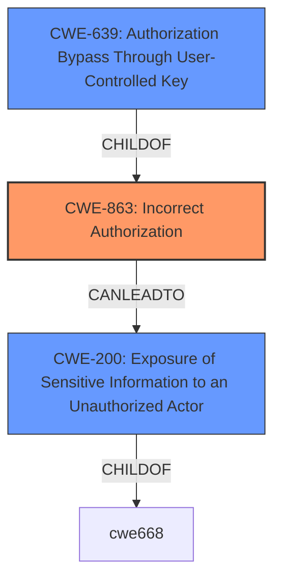

# Analysis for CVE-2021-42026

# Summary
| CWE ID  | CWE Name                                                                                            | Confidence | CWE Abstraction Level | CWE Vulnerability Mapping Label | CWE-Vulnerability Mapping Notes |
| :-------- | :-------------------------------------------------------------------------------------------------- | :--------- | :---------------------- | :------------------------------ | :------------------------------ |
| CWE-863   | Incorrect Authorization                                                                           | 0.9        | Class                   | Primary CWE                     | Allowed-with-Review           |
| CWE-200   | Exposure of Sensitive Information to an Unauthorized Actor                                        | 0.7        | Class                   | Secondary Candidate             | Discouraged                   |
| CWE-639   | Authorization Bypass Through User-Controlled Key                                                  | 0.6        | Base                    | Secondary Candidate             | Allowed                       |

## Evidence and Confidence

*   **Confidence Score:** 0.8
*   **Evidence Strength:** HIGH

## Relationship Analysis
The primary relationship influencing my decision is the hierarchical relationship where CWE-863 (Incorrect Authorization) can be a parent to CWE-639 (Authorization Bypass Through User-Controlled Key). However, CWE-639 is more specific, dealing with user-controlled keys, which isn't explicitly mentioned but could be implied. The relationship between CWE-863 and CWE-200 (Exposure of Sensitive Information to an Unauthorized Actor) is also important, as incorrect authorization often leads to the exposure of sensitive information.

## Vulnerability Chain
The vulnerability chain starts with **incorrect authorization** (CWE-863). Because of the **incorrect authorization**, an authenticated attacker can retrieve the `changedDate` attribute of arbitrary objects, leading to **exposure of sensitive information** (CWE-200). While the description doesn't explicitly state user-controlled keys, the possibility exists, which could include CWE-639 (Authorization Bypass Through User-Controlled Key).

## Summary of Analysis
Initially, the description points towards an authorization issue where read access is not properly controlled. The core issue is that the application **does not properly control read access** for certain client actions. This allows an authenticated attacker to retrieve the `changedDate` attribute of arbitrary objects, even without read access.

Based on the "CVE Reference Links Content Summary", the **root cause of the vulnerability** is **incorrect authorization**. This aligns well with CWE-863 (Incorrect Authorization). The **weakness** leads to **improper access control** resulting in **information disclosure**. An authenticated attacker can retrieve sensitive information (`changedDate` attribute).

CWE-863 is a Class-level CWE, and the mapping guidance suggests examining its children for a better fit. One child is CWE-639 (Authorization Bypass Through User-Controlled Key). While not explicitly stated, the possibility of user-controlled keys being involved exists. However, there is no direct evidence for this, so this remains a secondary consideration.

CWE-200 (Exposure of Sensitive Information to an Unauthorized Actor) is also considered because the attacker retrieves the `changedDate` attribute. However, CWE-200 is discouraged as it represents the technical impact rather than the root cause. The root cause is still the authorization bypass.

The final decision is to assign CWE-863 (Incorrect Authorization) as the primary CWE, with CWE-200 (Exposure of Sensitive Information to an Unauthorized Actor) and CWE-639 (Authorization Bypass Through User-Controlled Key) as secondary considerations. This is because the primary issue stems from how the application incorrectly handles authorization checks, leading to unintended information exposure.

Relevant CWE Information:

# Enhanced Context (25 CWEs)
The following CWEs were identified as potentially relevant to this vulnerability:

## CWE-668: Exposure of Resource to Wrong Sphere
**Abstraction Level**: Class
**Similarity Score**: 0.76
**Source**: dense

**Description**:
The product exposes a resource to the wrong control sphere, providing unintended actors with inappropriate access to the resource.

**Mapping Guidance**:
- Usage: Discouraged
- Rationale: CWE-668 is high-level and is often misused as a catch-all when lower-level CWE IDs might be applicable. It is sometimes used for low-information vulnerability reports [REF-1287]. It is a level-1 Class (i.e., a child of a Pillar). It is not useful for trend analysis.

## CWE-664: Improper Control of a Resource Through its Lifetime
**Abstraction Level**: Pillar
**Similarity Score**: 0.75
**Source**: dense

**Description**:
The product does not maintain or incorrectly maintains control over a resource throughout its lifetime of creation, use, and release.

**Mapping Guidance**:
- Usage: Discouraged
- Rationale: This CWE entry is high-level when lower-level children are available.

## CWE-653: Improper Isolation or Compartmentalization
**Abstraction Level**: Class
**Similarity Score**: 0.74
**Source**: dense

**Description**:
The product does not properly compartmentalize or isolate functionality, processes, or resources that require different privilege levels, rights, or permissions.

**Mapping Guidance**:
- Usage: Allowed
- Rationale: This CWE entry is at the Base level of abstraction, which is a preferred level of abstraction for mapping to the root causes of vulnerabilities.

## CWE-610: Externally Controlled Reference to a Resource in Another Sphere
**Abstraction Level**: Class
**Similarity Score**: 0.74
**Source**: dense

**Description**:
The product uses an externally controlled name or reference that resolves to a resource that is outside of the intended control sphere.

**Mapping Guidance**:
- Usage: Discouraged
- Rationale: This CWE entry is a level-1 Class (i.e., a child of a Pillar). It might have lower-level children that would be more appropriate

## CWE-552: Files or Directories Accessible to External Parties
**Abstraction Level**: Base
**Similarity Score**: 0.74
**Source**: dense

**Description**:
The product makes files or directories accessible to unauthorized actors, even though they should not be.

**Mapping Guidance**:
- Usage: Allowed
- Rationale: This CWE entry is at the Base level of abstraction, which is a preferred level of abstraction for mapping to the root causes of vulnerabilities.

## CWE-1220: Insufficient Granularity of Access Control
**Abstraction Level**: Base
**Similarity Score**: 0.74
**Source**: dense

**Description**:
The product implements access controls via a policy or other feature with the intention to disable or restrict accesses (reads and/or writes) to assets in a system from untrusted agents. However, implemented access controls lack required granularity, which renders the control policy too broad because it allows accesses from unauthorized agents to the security-sensitive assets.

**Mapping Guidance**:
- Usage: Allowed
- Rationale: This CWE entry is at the Base level of abstraction, which is a preferred level of abstraction for mapping to the root causes of vulnerabilities.

## CWE-807: Reliance on Untrusted Inputs in a Security Decision
**Abstraction Level**: Base
**Similarity Score**: 0.73
**Source**: dense

**Description**:
The product uses a protection mechanism that relies on the existence or values of an input, but the input can be modified by an untrusted actor in a way that bypasses the protection mechanism.

**Mapping Guidance**:
- Usage: Allowed
- Rationale: This CWE entry is at the Base level of abstraction, which is a preferred level of abstraction for mapping to the root causes of vulnerabilities.

## CWE-538: Insertion of Sensitive Information into Externally-Accessible File or Directory
**Abstraction Level**: Base
**Similarity Score**: 0.73
**Source**: dense

**Description**:
The product places sensitive information into files or directories that are accessible to actors who are allowed to have access to the files, but not to the sensitive information.

**Mapping Guidance**:
- Usage: Allowed
- Rationale: This CWE entry is at the Base level of abstraction, which is a preferred level of abstraction for mapping to the root causes of vulnerabilities.

## CWE-404: Improper Resource Shutdown or Release
**Abstraction Level**: Class
**Similarity Score**: 0.73
**Source**: dense

**Description**:
The product does not release or incorrectly releases a resource before it is made available for re-use.

**Mapping Guidance**:
- Usage: Allowed-with-Review
- Rationale: This CWE entry is a Class and might have Base-level children