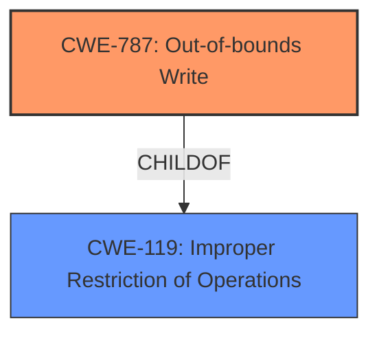

# Analysis Report for CVE-2021-42068

# Vulnerability Analysis Report: CVE-2021-42068

## Description


## Analysis (with Relationship Data)

# Summary
| CWE ID | CWE Name | Confidence | CWE Abstraction Level | CWE Vulnerability Mapping Label | CWE-Vulnerability Mapping Notes |
|---|---|---|---|---|---|
| CWE-787 | Out-of-bounds Write | 0.7 | Base | Primary | Allowed |
| CWE-119 | Improper Restriction of Operations within the Bounds of a Memory Buffer | 0.5 | Class | Secondary | Discouraged |

## Evidence and Confidence

*   **Confidence Score:** 0.7
*   **Evidence Strength:** MEDIUM

## Relationship Analysis
The primary CWE is CWE-787, which is a child of CWE-119. The relationship indicates that CWE-787 is a specific type of memory buffer issue. CWE-119 is more general. I am choosing CWE-787 as the root cause because it specifically states that the write is happening out of bounds.



## Vulnerability Chain
The vulnerability chain is as follows:
1.  A manipulated GIF file is opened.
2.  The application attempts to process the malformed GIF data.
3.  Due to **improper** or **insufficient** bounds checking when processing the GIF data, the application writes data past the end of the intended buffer (CWE-787).
4.  The application crashes due to the memory corruption.

## Summary of Analysis
The initial assessment was to use CWE-787 as the primary CWE because the application crashes due to writing past the end of the intended buffer.

The evidence is based on the vulnerability description, which states that the application crashes when opening a manipulated GIF file. The **root cause** is likely due to **improper** handling of the malformed GIF data, leading to an out-of-bounds write. The description states "When a user opens a manipulated GIF (.gif) file received from untrusted sources in SAP 3D Visual Enterprise Viewer - version 9.0, the application crashes".

The graph relationships influenced the final selection by providing a clear hierarchy where CWE-787 is a specific type of CWE-119.

The selected CWEs are at the optimal level of specificity because CWE-787 accurately describes the **root cause** of the vulnerability, while CWE-119 provides a broader context.

Relevant CWE Information:

# Enhanced Context (25 CWEs)

## CWE-131: Incorrect Calculation of Buffer Size
**Abstraction Level**: Base
**Similarity Score**: 0.78
This CWE was not selected because there is no evidence that buffer calculation is the **root cause** or even an issue.

## CWE-805: Buffer Access with Incorrect Length Value
**Abstraction Level**: Base
**Similarity Score**: 0.78
This CWE was not selected because there is no evidence that buffer length value is the **root cause** or even an issue.

## CWE-125: Out-of-bounds Read
**Abstraction Level**: Base
**Similarity Score**: 0.77
This CWE was not selected because the crash is from a write and not a read.

## CWE-789: Memory Allocation with Excessive Size Value
**Abstraction Level**: Variant
**Similarity Score**: 0.77
This CWE was not selected because there is no evidence of excessive memory allocation.

## CWE-404: Improper Resource Shutdown or Release
**Abstraction Level**: Class
**Similarity Score**: 0.76
This CWE was not selected because the crash is from writing out of bounds, and not from releasing resources.

## CWE-191: Integer Underflow (Wrap or Wraparound)
**Abstraction Level**: Base
**Similarity Score**: 0.76
This CWE was not selected because there is no evidence of integer underflow.

## CWE-126: Buffer Over-read
**Abstraction Level**: Variant
**Similarity Score**: 0.76
This CWE was not selected because the crash is from writing out of bounds, and not from reading.

## CWE-197: Numeric Truncation Error
**Abstraction Level**: Base
**Similarity Score**: 0.76
This CWE was not selected because there is no evidence of numeric truncation.

## CWE-667: Improper Locking
**Abstraction Level**: Class
**Similarity Score**: 0.76
This CWE was not selected because there is no evidence of improper locking.

## CWE-681: Incorrect Conversion between Numeric Types
**Abstraction Level**: Base
**Similarity Score**: 0.76
This CWE was not selected because there is no evidence of incorrect conversion between numeric types.

## CWE-125: Out-of-bounds Read
**Abstraction Level**: Base
**Similarity Score**: 6317.84
This CWE was not selected because the crash is from writing out of bounds, and not from reading.

## CWE-190: Integer Overflow or Wraparound
**Abstraction Level**: Base
**Similarity Score**: 6273.16
This CWE was not selected because there is no evidence of integer overflow.

## CWE-1284: Improper Validation of Specified Quantity in Input
**Abstraction Level**: Base
**Similarity Score**: 6215.54
This CWE was not selected because there is no evidence of improper validation.

## CWE-119: Improper Restriction of Operations within the Bounds of a Memory Buffer
**Abstraction Level**: Class
**Similarity Score**: 6208.48
This CWE was considered as a secondary CWE because it is a parent of CWE-787.

## CWE-789: Memory Allocation with Excessive Size Value
**Abstraction Level**: Variant
**Similarity Score**: 6106.50
This CWE was not selected because there is no evidence of excessive memory allocation.

## CWE-41: Improper Resolution of Path Equivalence
**Abstraction Level**: base
**Similarity Score**: 5.03
This CWE was not selected because there is no evidence of path equivalence issues.

## CWE-170: Improper Null Termination
**Abstraction Level**: base
**Similarity Score**: 5.03
This CWE was not selected because there is no evidence of null termination issues.

## CWE-1325: Improperly Controlled Sequential Memory Allocation
**Abstraction Level**: base
**Similarity Score**: 5.03
This CWE was not selected because there is no evidence of memory allocation issues.

## CWE-22: Improper Limitation of a Pathname to a Restricted Directory ('Path Traversal')
**Abstraction Level**: base
**Similarity Score**: 4.33
This CWE was not selected because there is no evidence of path traversal issues.

## CWE-770: Allocation of Resources Without Limits or Throttling
**Abstraction Level**: base
**Similarity Score**: 4.33
This CWE was not selected because there is no evidence of resource allocation issues.

## CWE-73: External Control of File Name or Path
**Abstraction Level**: base
**Similarity Score**: 4.33
This CWE was not selected because there is no evidence of file name or path issues.

## CWE-190: Integer Overflow or Wraparound
**Abstraction Level**: base
**Similarity Score**: 4.33
This CWE was not selected because there is no evidence of integer overflow.

## CWE-1284: Improper Validation of Specified Quantity in Input
**Abstraction Level**: base
**Similarity Score**: 4.33
This CWE was not selected because there is no evidence of quantity input issues.

## CWE-120: Buffer Copy without Checking Size of Input ('Classic Buffer Overflow')
**Abstraction Level**: base
**Similarity Score**: 4.33
This CWE was not selected because there is no evidence of a buffer copy operation.

## CWE-476: NULL Pointer Dereference
**Abstraction Level**: base
**Similarity Score**: 4.33
This CWE was not selected because there is no evidence of null pointer dereference.


## CWE Relationship Analysis

Current CWEs represent these abstraction levels: .


### Vulnerability Chain Analysis

**Chain starting from CWE-787:**
- 787 (Out-of-bounds Write) - ROOT


**Chain starting from CWE-404:**
- 404 (Improper Resource Shutdown or Release) - ROOT


### CWE Relationship Diagram

```mermaid
graph TD
    classDef primary fill:#f96,stroke:#333,stroke-width:2px
    classDef secondary fill:#69f,stroke:#333
    classDef tertiary fill:#9e9,stroke:#333
```


*Report generated on 2025-04-02 05:21:09*
