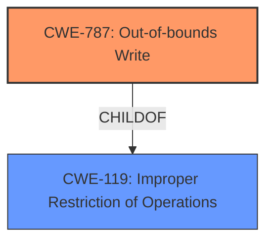

# Analysis for CVE-2021-42070

# Summary
| CWE ID | CWE Name | Confidence | CWE Abstraction Level | CWE Vulnerability Mapping Label | CWE-Vulnerability Mapping Notes |
|---|---|---|---|---|---|
| CWE-787 | Out-of-bounds Write | 0.7 | Base | Allowed | Primary CWE. The application crashes due to writing data past the end or before the beginning of the intended buffer, caused by opening a manipulated .jt file. |
| CWE-119 | Improper Restriction of Operations within the Bounds of a Memory Buffer | 0.4 | Class | Discouraged | Secondary CWE candidate. The product performs operations on a memory buffer, but it reads from or writes to a memory location outside the buffer's intended boundary. However, CWE-787 is a more specific child of CWE-119 and is a better fit. |

## Evidence and Confidence

*   **Confidence Score:** 0.7
*   **Evidence Strength:** MEDIUM

## Relationship Analysis
The primary CWE is CWE-787, which is a child of CWE-119. CWE-119 is a more general class of weakness, while CWE-787 specifically describes writing outside the bounds of a buffer. The vulnerability description indicates a crash due to a manipulated file, suggesting an out-of-bounds write, thus justifying the selection of CWE-787.

## Vulnerability Chain
The vulnerability chain starts with a manipulated Jupiter Tessellation (.jt) file, which leads to an **out-of-bounds write** (CWE-787), ultimately causing the application to crash and become temporarily unavailable.

## Summary of Analysis
The initial analysis pointed towards potential memory corruption issues due to a manipulated file. The retriever results suggested CWE-119, CWE-121, and CWE-787 as possible candidates. However, given the crash as a direct impact, CWE-787, **Out-of-bounds Write**, was chosen as the primary CWE because it aligns most closely with the vulnerability description. CWE-119 was considered, but it is discouraged and too general. The evidence explicitly states that a manipulated file causes the application to crash, which suggests a write operation outside the intended buffer boundaries. This reasoning is based on the evidence in the vulnerability description: "When a user opens manipulated Jupiter Tessellation (.jt) file received from untrusted sources in SAP 3D Visual Enterprise Viewer - version 9.0, the application crashes."

CWE-787 is at the Base level of abstraction, which is preferred.

Relevant CWE Information:

# Enhanced Context (25 CWEs)
The following CWEs were identified as potentially relevant to this vulnerability:

## CWE-789: Memory Allocation with Excessive Size Value
CWE-789 was considered because a manipulated file could potentially trigger excessive memory allocation. However, the primary symptom is a crash, not necessarily memory exhaustion. Therefore, CWE-789 is less likely.

## CWE-131: Incorrect Calculation of Buffer Size
CWE-131 was considered because the root cause could be related to how the application calculates buffer sizes when processing the manipulated file. However, without more information, it's hard to determine if an incorrect calculation is the specific cause of the crash, making CWE-787 a better fit.

## CWE-1325: Improperly Controlled Sequential Memory Allocation
CWE-1325 was considered because the application might allocate memory for each object in the .jt file without proper limits. However, this is speculative and the immediate effect is a crash, which is more directly linked to an out-of-bounds write.

## CWE-404: Improper Resource Shutdown or Release
CWE-404 was considered but is not directly related to the crash caused by the manipulated file.

## CWE-125: Out-of-bounds Read
CWE-125 was considered as reading out of bounds could also cause crashes. However, the description suggests a manipulated file leads to a crash, which is more likely caused by writing to an unexpected memory location.

## CWE-667: Improper Locking
CWE-667 was considered, but there's no evidence to suggest that locking issues are involved.

## CWE-805: Buffer Access with Incorrect Length Value
CWE-805 was considered, as using an incorrect length value during buffer access could lead to out-of-bounds writes. However, CWE-787 is a more direct representation of the vulnerability.

## CWE-681: Incorrect Conversion between Numeric Types
CWE-681 was considered, but there's no evidence to suggest that type conversion errors are involved.

## CWE-252: Unchecked Return Value
CWE-252 was considered, but there's no evidence to suggest that the crash is caused by not checking return values.

## CWE-119: Improper Restriction of Operations within the Bounds of a Memory Buffer
CWE-119 was considered. While it is a parent of CWE-787, it's discouraged to use CWE-119 when a more specific CWE is available.

## CWE-190: Integer Overflow or Wraparound
CWE-190 was considered, but there is no information to suggest the crash is due to an integer overflow.

## CWE-1284: Improper Validation of Specified Quantity in Input
CWE-1284 was considered as the size or length of data could be manipulated in the .jt file. However, this is speculative, and the direct symptom is still a crash caused by writing out of bounds.

## CWE-41, CWE-22, CWE-770, CWE-73, CWE-822, CWE-476, CWE-617, CWE-781
These CWEs were considered but are not relevant to the vulnerability description.