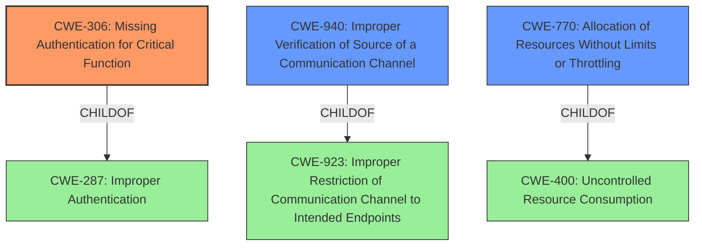

# Raw Analyzer Response for CVE-2021-42072

# Summary

| CWE ID  | CWE Name                                                       | Confidence | CWE Abstraction Level | CWE Vulnerability Mapping Label | CWE-Vulnerability Mapping Notes |
| :-------- | :------------------------------------------------------------- | :--------- | :---------------------- | :------------------------------ | :------------------------------ |
| CWE-306 | Missing Authentication for Critical Function | 0.95       | Base                    | Primary                       | Allowed                       |
| CWE-940 | Improper Verification of Source of a Communication Channel | 0.75       | Base                    | Secondary                       | Allowed                       |
| CWE-770 | Allocation of Resources Without Limits or Throttling         | 0.60       | Base                    | Secondary                       | Allowed                       |

## Evidence and Confidence

*   **Confidence Score:** 0.85
*   **Evidence Strength:** HIGH

## Relationship Analysis

The primary relationship influencing the CWE selection is the hierarchical one. CWE-306 is a child of CWE-284 and CWE-287, providing a more specific classification for missing authentication. CWE-940 (Improper Verification of Source of Communication Channel) is related to CWE-923 (Improper Restriction of Communication Channel), representing a slightly different aspect of the authentication failure. CWE-770 (Allocation of Resources Without Limits or Throttling) is related to the Denial of Service impact, stemming from missing authentication.

## Vulnerability Chain

The vulnerability chain starts with the **root cause**: a lack of authentication, leading to several weaknesses and impacts.

1.  **Root Cause:** **Missing authentication** (CWE-306) on the server side.
2.  **Weakness:** Improper verification of the source of a communication channel (CWE-940), leading to the acceptance of connections from untrusted clients.
3.  **Weakness:** Unrestricted allocation of resources (CWE-770), allowing an attacker to exhaust server resources.
4.  **Impact:** Denial of Service (DoS) and potential for information leaks and integrity corruption.

## Summary of Analysis

The initial assessment identified **insufficient verification of the identity of connecting clients** as the root cause, which aligns with the broader category of Improper Authentication (CWE-287). However, the more specific CWE-306 (Missing Authentication for Critical Function) is a better fit because the Barrier component completely lacks authentication.

The CVE Reference Links Content Summary confirms this, stating: "The most significant weakness is the absence of proper client authentication on the server side." This lack of authentication allows attackers to exploit protocol weaknesses for DoS attacks and potentially leak information.

CWE-940 (Improper Verification of Source of a Communication Channel) is also relevant because the server **does not properly verify** that the incoming requests are coming from the expected origin. This is a direct consequence of the missing authentication.

CWE-770 (Allocation of Resources Without Limits or Throttling) is included because the lack of authentication allows attackers to allocate resources without limits, leading to a denial-of-service condition.

The selected CWEs are at the optimal level of specificity. CWE-306 is a Base CWE, providing more detail than the Class CWE-287. CWE-940 and CWE-770 capture secondary weaknesses contributing to the vulnerability.

**CWEs Considered but Not Used:**

*   CWE-287: Improper Authentication - While this is a valid high-level classification, CWE-306 (Missing Authentication for Critical Function) provides a more accurate and specific description of the vulnerability. The MITRE mapping guidance for CWE-287 suggests considering children like CWE-306.
*   CWE-295: Improper Certificate Validation - While SSL/TLS certificates are relevant to the fix, the core issue is not incorrect validation but rather the **absence of mandatory client certificate verification**. Therefore, CWE-306 is a more accurate fit.
*   CWE-322: Key Exchange without Entity Authentication - Similar to CWE-295, this is related to cryptographic protocols but the primary issue is the **complete lack of authentication**, not a flawed key exchange process.
*   CWE-775: Missing Release of File Descriptor or Handle after Effective Lifetime - This is not the main issue, though it could be a contributing factor to a DoS. The primary problem is the lack of authentication allowing for resource exhaustion.
*   CWE-1284: Improper Validation of Specified Quantity in Input - While input validation issues may exist, the root cause is the lack of authentication, making this CWE less relevant.
*   CWE-327: Use of a Broken or Risky Cryptographic Algorithm - While weak cryptography might exist, the primary weakness is the missing authentication.
*   CWE-923: Improper Restriction of Communication Channel to Intended Endpoints - While related, CWE-940 more specifically identifies the lack of verification of the communication channel's source.

Relevant CWE Information:

# Enhanced Context (25 CWEs)
The following CWEs were identified as potentially relevant to this vulnerability:

## CWE-404: Improper Resource Shutdown or Release
**Abstraction Level**: Class
**Similarity Score**: 0.78
**Source**: dense

**Description**:
The product does not release or incorrectly releases a resource before it is made available for re-use.

**Mapping Guidance**:
- Usage: Allowed-with-Review
- Rationale: This CWE entry is a Class and might have Base-level children that would be more appropriate

## CWE-668: Exposure of Resource to Wrong Sphere
**Abstraction Level**: Class
**Similarity Score**: 0.77
**Source**: dense

**Description**:
The product exposes a resource to the wrong control sphere, providing unintended actors with inappropriate access to the resource.

**Mapping Guidance**:
- Usage: Discouraged
- Rationale: CWE-668 is high-level and is often misused as a catch-all when lower-level CWE IDs might be applicable. It is sometimes used for low-information vulnerability reports [REF-1287]. It is a level-1 Class (i.e., a child of a Pillar). It is not useful for trend analysis.

## CWE-226: Sensitive Information in Resource Not Removed Before Reuse
**Abstraction Level**: Base
**Similarity Score**: 0.77
**Source**: dense

**Description**:
The product releases a resource such as memory or a file so that it can be made available for reuse, but it does not clear or "zeroize" the information contained in the resource before the product performs a critical state transition or makes the resource available for reuse by other entities.

**Mapping Guidance**:
- Usage: Allowed
- Rationale: This CWE entry is at the Base level of abstraction, which is a preferred level of abstraction for mapping to the root causes of vulnerabilities.

## CWE-405: Asymmetric Resource Consumption (Amplification)
**Abstraction Level**: Class
**Similarity Score**: 0.77
**Source**: dense

**Description**:
The product does not properly control situations in which an adversary can cause the product to consume or produce excessive resources without requiring the adversary to invest equivalent work or otherwise prove authorization, i.e., the adversary's influence is "asymmetric."

**Mapping Guidance**:
- Usage: Allowed-with-Review
- Rationale: This CWE entry is a Class and might have Base-level children that would be more appropriate

## CWE-407: Inefficient Algorithmic Complexity
**Abstraction Level**: Class
**Similarity Score**: 0.77
**Source**: dense

**Description**:
An algorithm in a product has an inefficient worst-case computational complexity that may be detrimental to system performance and can be triggered by an attacker, typically using crafted manipulations that ensure that the worst case is being reached.

**Mapping Guidance**:
- Usage: Allowed-with-Review
- Rationale: This CWE entry is a Class and might have Base-level children that would be more appropriate

## CWE-664: Improper Control of a Resource Through its Lifetime
**Abstraction Level**: Pillar
**Similarity Score