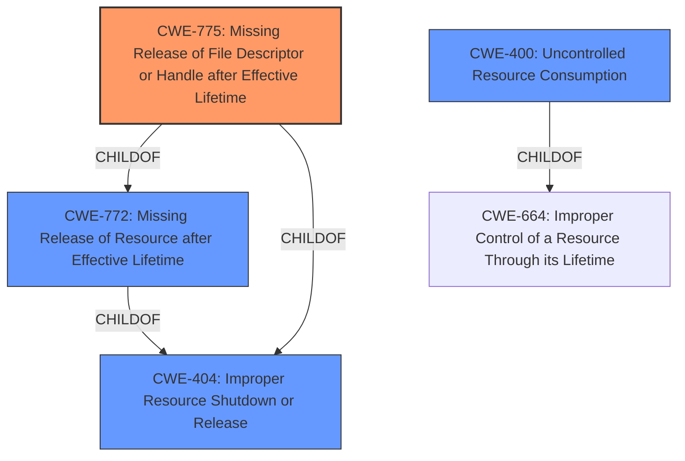

# Raw Analyzer Response for CVE-2021-42075

# Summary
| CWE ID | CWE Name | Confidence | CWE Abstraction Level | CWE Vulnerability Mapping Label | CWE-Vulnerability Mapping Notes |
|---|---|---|---|---|---|
| CWE-775 | Missing Release of File Descriptor or Handle after Effective Lifetime | 1.0 | Variant | Allowed | Primary CWE |
| CWE-400 | Uncontrolled Resource Consumption | 0.7 | Class | Discouraged | Secondary Candidate |

## Evidence and Confidence

*   **Confidence Score:** 0.9
*   **Evidence Strength:** HIGH

## Relationship Analysis
The primary relationship influencing the choice of CWE-775 [CWE-775: Missing Release of File Descriptor or Handle after Effective Lifetime] is its hierarchical position as a Variant of CWE-772 [CWE-772: Missing Release of Resource after Effective Lifetime] and CWE-404 [CWE-404: Improper Resource Shutdown or Release]. While CWE-772 [CWE-772: Missing Release of Resource after Effective Lifetime] is a Base CWE and CWE-404 [CWE-404: Improper Resource Shutdown or Release] is a Class CWE, CWE-775 [CWE-775: Missing Release of File Descriptor or Handle after Effective Lifetime] is more specific to the described vulnerability of missing file descriptor releases. There isn't a CANPRECEDE or CANFOLLOW in this case.

## Vulnerability Chain
The vulnerability chain starts with the **failure to correctly close file descriptors**, which leads to file descriptor exhaustion, and ultimately results in a denial-of-service condition.

## Summary of Analysis
The initial analysis strongly suggests CWE-775 [CWE-775: Missing Release of File Descriptor or Handle after Effective Lifetime] as the primary weakness due to the vulnerability description's focus on the **failure to close file descriptors**. The CVE Reference Links Content Summary supports this by stating, "The Barrier server component **does not correctly close file descriptors** for established TCP connections." This directly aligns with the description of CWE-775 [CWE-775: Missing Release of File Descriptor or Handle after Effective Lifetime], which is "The product **does not release a file descriptor or handle after its effective lifetime** has ended, i.e., after the file descriptor/handle is no longer needed." The retriever results also list CWE-775 [CWE-775: Missing Release of File Descriptor or Handle after Effective Lifetime] as the top result.

CWE-400 [CWE-400: Uncontrolled Resource Consumption] was also considered, as the file descriptor exhaustion leads to denial of service. However, CWE-400 [CWE-400: Uncontrolled Resource Consumption] is more of a consequence than the root cause. The mapping guidance for CWE-400 [CWE-400: Uncontrolled Resource Consumption] even says it is discouraged because it is often misused and conflated with the technical impact of the vulnerability.

Therefore, the selection of CWE-775 [CWE-775: Missing Release of File Descriptor or Handle after Effective Lifetime] is at the optimal level of specificity, accurately representing the **root cause** of the vulnerability.

Relevant CWE Information:

# Enhanced Context (25 CWEs)

## CWE-404: Improper Resource Shutdown or Release
**Abstraction Level**: Class
**Similarity Score**: 0.78
**Source**: dense

**Description**:
The product does not release or incorrectly releases a resource before it is made available for re-use.

**Mapping Guidance**:
- Usage: Allowed-with-Review
- Rationale: This CWE entry is a Class and might have Base-level children that would be more appropriate

## CWE-667: Improper Locking
**Abstraction Level**: Class
**Similarity Score**: 0.76
**Source**: dense

**Description**:
The product does not properly acquire or release a lock on a resource, leading to unexpected resource state changes and behaviors.

**Mapping Guidance**:
- Usage: Allowed-with-Review
- Rationale: This CWE entry is a Class and might have Base-level children that would be more appropriate

## CWE-664: Improper Control of a Resource Through its Lifetime
**Abstraction Level**: Pillar
**Similarity Score**: 0.75
**Source**: dense

**Description**:
The product does not maintain or incorrectly maintains control over a resource throughout its lifetime of creation, use, and release.

**Mapping Guidance**:
- Usage: Discouraged
- Rationale: This CWE entry is high-level when lower-level children are available.

## CWE-226: Sensitive Information in Resource Not Removed Before Reuse
**Abstraction Level**: Base
**Similarity Score**: 0.74
**Source**: dense

**Description**:
The product releases a resource such as memory or a file so that it can be made available for reuse, but it does not clear or "zeroize" the information contained in the resource before the product performs a critical state transition or makes the resource available for reuse by other entities.

**Mapping Guidance**:
- Usage: Allowed
- Rationale: This CWE entry is at the Base level of abstraction, which is a preferred level of abstraction for mapping to the root causes of vulnerabilities.

## CWE-833: Deadlock
**Abstraction Level**: Base
**Similarity Score**: 0.73
**Source**: dense

**Description**:
The product contains multiple threads or executable segments that are waiting for each other to release a necessary lock, resulting in deadlock.

**Mapping Guidance**:
- Usage: Allowed
- Rationale: This CWE entry is at the Base level of abstraction, which is a preferred level of abstraction for mapping to the root causes of vulnerabilities.

## CWE-772: Missing Release of Resource after Effective Lifetime
**Abstraction Level**: Base
**Similarity Score**: 0.73
**Source**: dense

**Description**:
The product does not release a resource after its effective lifetime has ended, i.e., after the resource is no longer needed.

**Mapping Guidance**:
- Usage: Allowed
- Rationale: This CWE entry is at the Base level of abstraction, which is a preferred level of abstraction for mapping to the root causes of vulnerabilities.

## CWE-775: Missing Release of File Descriptor or Handle after Effective Lifetime
**Abstraction Level**: Variant
**Similarity Score**: 0.73
**Source**: dense

**Description**:
The product does not release a file descriptor or handle after its effective lifetime has ended, i.e., after the file descriptor/handle is no longer needed.

**Mapping Guidance**:
- Usage: Allowed
- Rationale: This CWE entry is at the Variant level of abstraction, which is a preferred level of abstraction for mapping to the root causes of vulnerabilities.

## CWE-413: Improper Resource Locking
**Abstraction Level**: Base
**Similarity Score**: 0.73
**Source**: dense

**Description**:
The product does not lock or does not correctly lock a resource when the product must have exclusive access to the resource.

**Mapping Guidance**:
- Usage: Allowed
- Rationale: This CWE entry is at the Base level of abstraction, which is a preferred level of abstraction for mapping to the root causes of vulnerabilities.

## CWE-405: Asymmetric Resource Consumption (Amplification)
**Abstraction Level**: Class
**Similarity Score**: 0.72
**Source**: dense

**Description**:
The product does not properly control situations in which an adversary can cause the product to consume or produce excessive resources without requiring the adversary to invest equivalent work or otherwise prove authorization, i.e., the adversary's influence is "asymmetric."

**Mapping Guidance**:
- Usage: Allowed-with-Review
- Rationale: This CWE entry is a Class and might have Base-level children that would be more appropriate

## CWE-668: Exposure of Resource to Wrong Sphere
**Abstraction Level**: Class
**Similarity Score**: 0.72
**Source**: dense

**Description**:
The product exposes a resource to the wrong control sphere, providing unintended actors with inappropriate access to the resource.

**Mapping Guidance**:
- Usage: Discouraged
- Rationale: CWE