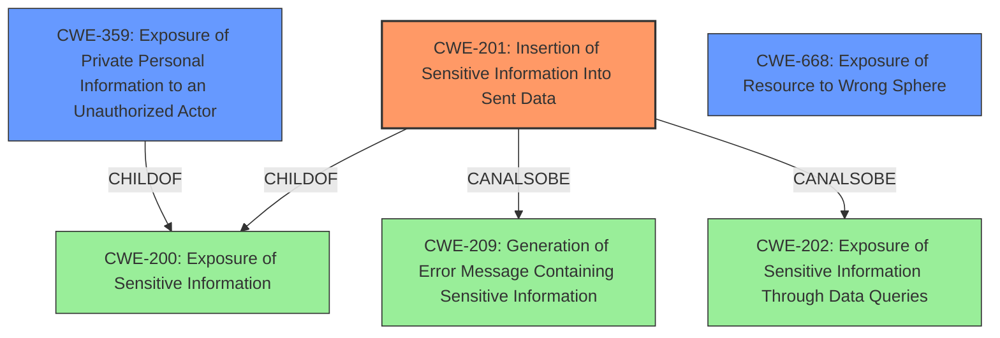

# Enhanced Analysis for CVE-2021-42089

# Summary
| CWE ID | CWE Name | Confidence | CWE Abstraction Level | CWE Vulnerability Mapping Label | CWE-Vulnerability Mapping Notes |
|---|---|---|---|---|---|
| CWE-201 | Insertion of Sensitive Information Into Sent Data | 0.9 | Base | Allowed | Primary CWE |
| CWE-359 | Exposure of Private Personal Information to an Unauthorized Actor | 0.7 | Base | Allowed | Secondary Candidate |
| CWE-668 | Exposure of Resource to Wrong Sphere | 0.5 | Class | Discouraged | Secondary Candidate |

## Evidence and Confidence

*   **Confidence Score:** 0.9
*   **Evidence Strength:** HIGH

## Relationship Analysis
The primary CWE is CWE-201 (**Insertion of Sensitive Information Into Sent Data**), which is a Base level CWE. It is a child of CWE-200 (**Exposure of Sensitive Information**). CWE-201 can also be related to CWE-209 (**Generation of Error Message Containing Sensitive Information**) and CWE-202 (**Exposure of Sensitive Information Through Data Queries**).

CWE-359 (**Exposure of Private Personal Information to an Unauthorized Actor**) is also a base level CWE and is a child of CWE-200.

CWE-668 (**Exposure of Resource to Wrong Sphere**) is a Class level CWE.

The choice of CWE-201 as the primary CWE is influenced by its direct relevance to the **impact** of the vulnerability, where sensitive information is sent in data.



## Vulnerability Chain
The vulnerability chain starts with the application fetching data from a REST API. The **weakness** lies in the fact that the API responses contain data that should not be visible to the requester, leading to an **impact** of **information leak**. Thus:
1.  **Root Cause**: Inadequate filtering of sensitive data in API responses.
2.  **Weakness**: **Insertion of Sensitive Information Into Sent Data** (CWE-201).
3.  **Impact**: Disclosure of sensitive information.

## Summary of Analysis
The initial assessment identified the **impact** as a disclosure of sensitive information through the REST API in Zammad before version 4.1.1. The analysis focused on identifying the root cause of this vulnerability and selecting the most appropriate CWE.

The evidence from the "CVE Reference Links Content Summary" clearly states that the API responses contain data that should not be visible, leading to an **information leak**. This aligns strongly with the description of CWE-201 (**Insertion of Sensitive Information Into Sent Data**), which states: "The code transmits data to another actor, but a portion of the data includes sensitive information that should not be accessible to that actor." The **impact** matches the vulnerability description "The REST API discloses sensitive information."

CWE-359 (**Exposure of Private Personal Information to an Unauthorized Actor**) was considered because the leaked information could include personal details. However, CWE-201 is more specific to the mechanism of **information leak** through sent data, making it the primary choice.

CWE-668 (**Exposure of Resource to Wrong Sphere**) was also considered, but it's a high-level class and less specific than CWE-201. The mapping guidance for CWE-668 discourages its use when lower-level CWEs are applicable.

The selection of CWE-201 is at the optimal level of specificity because it directly addresses the core issue of sensitive information being included in API responses. The mapping guidance for CWE-201 allows its usage and rationale states that it is at the Base level of abstraction, which is preferred. The confidence in this mapping is high (0.9) due to the direct match between the vulnerability description and the CWE definition.

Relevant CWE Information:
# Enhanced Context (25 CWEs)
The following CWEs were identified as potentially relevant to this vulnerability:

## CWE-201: Insertion of Sensitive Information Into Sent Data
**Abstraction:** Base
**Similarity Score**: 0.032 (sparse), 5.03 (graph)
**Description**:
The code transmits data to another actor, but a portion of the data includes sensitive information that should not be accessible to that actor.
**Mapping Guidance**:
- Usage: Allowed

## CWE-359: Exposure of Private Personal Information to an Unauthorized Actor
**Abstraction:** Base
**Similarity Score**: 0.521
**Description**:
The product does not properly prevent a person's private, personal information from being accessed by actors who either (1) are not explicitly authorized to access the information or (2) do not have the implicit consent of the person about whom the information is collected.
**Mapping Guidance**:
- Usage: Allowed

## CWE-668: Exposure of Resource to Wrong Sphere
**Abstraction:** Class
**Similarity Score**: 0.76
**Description**:
The product exposes a resource to the wrong control sphere, providing unintended actors with inappropriate access to the resource.
**Mapping Guidance**:
- Usage: Discouraged


## CWE Relationship Analysis

Current CWEs represent these abstraction levels: .


### Vulnerability Chain Analysis

**Chain starting from CWE-201:**
- 201 (Insertion of Sensitive Information Into Sent Data) - ROOT


**Chain starting from CWE-359:**
- 359 (Exposure of Private Personal Information to an Unauthorized Actor) - ROOT


### CWE Relationship Diagram

```mermaid
graph TD
    classDef primary fill:#f96,stroke:#333,stroke-width:2px
    classDef secondary fill:#69f,stroke:#333
    classDef tertiary fill:#9e9,stroke:#333
```