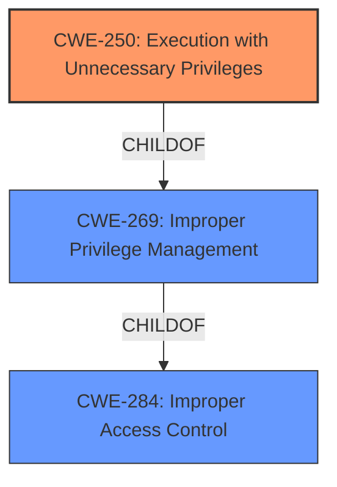

# Analysis for CVE-2021-42104

# Summary
| CWE ID  | CWE Name   | Confidence | CWE Abstraction Level | CWE Vulnerability Mapping Label | CWE-Vulnerability Mapping Notes |
|-----------------|----------------------------------------------|----------------|-------------------------|-----------------------------------|-----------------------------------|
| CWE-250 | Execution with Unnecessary Privileges | 0.85 | Base  | Allowed | Primary CWE |
| CWE-269 | Improper Privilege Management | 0.7 | Class | Discouraged | Secondary Candidate |

## Evidence and Confidence

*   **Confidence Score:** 0.8
*   **Evidence Strength:** HIGH

## Relationship Analysis
The primary relationship influencing the CWE selection is the hierarchical relationship between CWE-269 (Improper Privilege Management) and its child, CWE-250 (Execution with Unnecessary Privileges). Given the vulnerability description's focus on **unnecessary privileges** being a key factor, and the CVE reference link content highlighting improper handling of process impersonation leading to privilege escalation, CWE-250 is favored as a more specific and appropriate classification. CWE-250 is a Base level CWE, which is preferred.

## Vulnerability Chain
The vulnerability chain starts with the **unnecessary privileges**, leading to the **improper process impersonation**, which ultimately results in local privilege escalation.

## Summary of Analysis
Initially, CWE-269 (Improper Privilege Management) seemed like a potential match, particularly given its prevalence in similar CVE descriptions. However, the vulnerability description and CVE reference content summary provide more specific details about the root cause. The **unnecessary privileges** granted to the process, combined with the ability to impersonate clients, directly aligns with CWE-250 (Execution with Unnecessary Privileges). This CWE is at the Base level of abstraction, making it a more precise classification than the Class-level CWE-269. The evidence supporting this decision includes:

*   **Vulnerability Description Key Phrases:** "**Unnecessary privilege vulnerabilities** ... could allow a local attacker to escalate privileges"
*   **CVE Reference Links Content Summary:** "The vulnerability stems from allowing an untrusted process to impersonate the client of a pipe within the Trend Micro Apex One Security Agent."
*   **CVE Reference Links Content Summary:** "Local Privilege Escalation: Successful exploitation allows a local attacker to escalate privileges to SYSTEM level."

The relationship analysis also played a key role. CWE-250 is a child of CWE-269, providing a more granular view of the weakness. While CWE-269 is a broader category, CWE-250 pinpoints the specific issue of unnecessary privileges.

The final decision to classify this vulnerability as CWE-250 is based on the specific evidence provided, the hierarchical relationship between CWEs, and the preferred abstraction level for CWE mapping. This approach ensures that the classification is both accurate and informative.

Relevant CWE Information:

# Enhanced Context (25 CWEs)

## CWE-250: Execution with Unnecessary Privileges
**Abstraction:** Base
**Status:** Draft

### Description
The product performs an operation at a privilege level that is higher than the minimum level required, which creates new weaknesses or amplifies the consequences of other weaknesses.

## CWE-269: Improper Privilege Management
**Abstraction:** Class
**Status:** Draft

### Description
The product does not properly assign, modify, track, or check privileges for an actor, creating an unintended sphere of control for that actor.