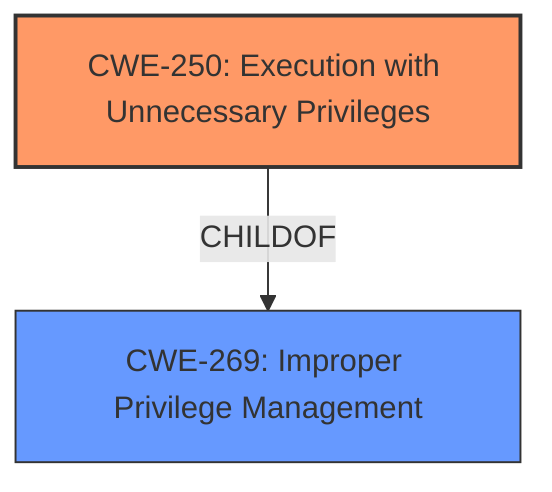

# Analysis for CVE-2021-42106

# Summary
| CWE ID | CWE Name | Confidence | CWE Abstraction Level | CWE Vulnerability Mapping Label | CWE-Vulnerability Mapping Notes |
|---|---|---|---|---|---|
| CWE-250 | Execution with Unnecessary Privileges | 0.9 | Base | Allowed | Primary CWE |
| CWE-269 | Improper Privilege Management | 0.6 | Class | Discouraged | Secondary Candidate |

## Evidence and Confidence

*   **Confidence Score:** 0.75
*   **Evidence Strength:** MEDIUM

## Relationship Analysis
The primary CWE selected is CWE-250, Execution with Unnecessary Privileges, which is a base-level CWE. It is a child of CWE-269, Improper Privilege Management, a class-level CWE. The relationship indicates that unnecessary privileges are a specific type of improper privilege management. While CWE-269 is a broader category, CWE-250 more precisely describes the root cause of the vulnerability, which is the execution of operations with higher privileges than necessary. This is further supported by the CVE Reference Links Content Summary, which mentioned **unnecessary privileges** granted to the Security Agent.

## Vulnerability Chain
The vulnerability chain begins with the **unnecessary privileges** assigned to the Trend Micro Apex One Security Agent. This leads to a local attacker being able to escalate privileges on affected installations. The attacker exploits the **improper handling of pipe client impersonation** to gain SYSTEM level privileges and execute arbitrary code.

Root Cause: CWE-250 Execution with Unnecessary Privileges
Impact: Privilege Escalation

## Summary of Analysis
The initial analysis focused on identifying the root cause of the vulnerability. The vulnerability description mentions **"unnecessary privilege vulnerabilities"**, which immediately points to issues related to privilege management. The Retriever Results further supported this by listing CWE-250 (Execution with Unnecessary Privileges) and CWE-269 (Improper Privilege Management) as potential candidates.

The decision to choose CWE-250 as the primary CWE is based on its specificity and the provided evidence. The phrase **"unnecessary privileges granted to the Security Agent"** from the CVE Reference Links Content Summary aligns well with the description of CWE-250, which states: **"The product performs an operation at a privilege level that is higher than the minimum level required."**

CWE-269 was considered but deemed less specific. While it is a parent of CWE-250, it is a more general classification of improper privilege handling. Given that the vulnerability description explicitly mentions **unnecessary privileges**, CWE-250 is a more accurate representation of the root cause. The MITRE mapping guidance discourages the use of CWE-269 when more specific CWEs are available.

The selected CWE is at the optimal level of specificity because it directly addresses the weakness described in the vulnerability, which is the **unnecessary granting of privileges**. This unnecessary elevation allows an attacker to escalate privileges, but the root cause is the initial **improper privilege assignment**.