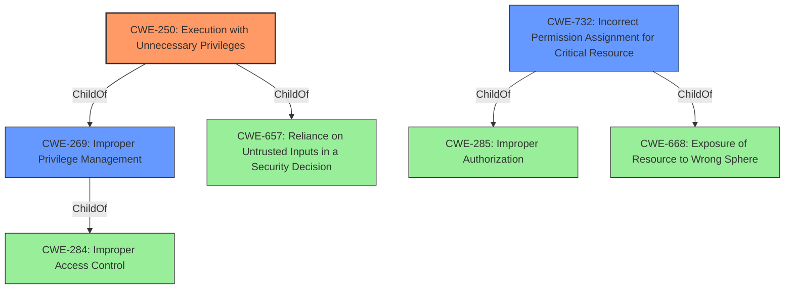

# Analysis Report for CVE-2021-42108

# Vulnerability Analysis Report: CVE-2021-42108

## Description


## Analysis (with Relationship Data)

# Summary
| CWE ID | CWE Name | Confidence | CWE Abstraction Level | CWE Vulnerability Mapping Label | CWE-Vulnerability Mapping Notes |
|---|---|---|---|---|---|
| CWE-250 | Execution with Unnecessary Privileges | 0.9 | Base | Allowed | Primary CWE |
| CWE-732 | Incorrect Permission Assignment for Critical Resource | 0.7 | Class | Allowed-with-Review | Secondary Candidate |
| CWE-269 | Improper Privilege Management | 0.6 | Class | Discouraged | Secondary Candidate |

## Evidence and Confidence

*   **Confidence Score:** 0.8
*   **Evidence Strength:** HIGH

## Relationship Analysis
The primary CWE, CWE-250, is a child of CWE-269 (Improper Privilege Management) and CWE-657 (Reliance on Untrusted Inputs in a Security Decision). The relationship between CWE-250 and CWE-269 is that CWE-250 is a specific instance of improper privilege management. CWE-732 (Incorrect Permission Assignment for Critical Resource) is related to CWE-285 (Improper Authorization) and CWE-668 (Exposure of Resource to Wrong Sphere). The abstraction levels influenced the selection by favoring the more specific Base level CWE-250 over the Class level CWEs like CWE-732 and CWE-269.



## Vulnerability Chain
The vulnerability chain involves the granting of **unnecessary privileges** to a process, which then allows a local attacker to escalate privileges. The chain is:
1.  **Root Cause:** **Unnecessary privileges** granted to a process (CWE-250).
2.  Impact: Local attacker escalates privileges.

## Summary of Analysis
The initial analysis focused on identifying the root cause of the vulnerability, which is the **unnecessary privilege** being granted. The analysis considered the retriever results, particularly CWE-250, CWE-732, and CWE-269.

The evidence for CWE-250 is based on these quotes:
*   "**Vulnerability Description Key Phrases**: **rootcause:** **unnecessary privilege**"
*   "**CVE Reference Links Content Summary**: **Weaknesses/Vulnerabilities Present**: Unnecessary privileges were granted"

CWE-250 (Execution with Unnecessary Privileges) was selected as the primary CWE because it directly addresses the root cause of the vulnerability, where the product performs an operation at a higher privilege level than required. This aligns with the description "allowing an untrusted process to impersonate the client of a pipe" because the impersonation would not be possible without those **unnecessary privileges**.

CWE-732 (Incorrect Permission Assignment for Critical Resource) and CWE-269 (Improper Privilege Management) were considered but deemed less specific. While they are related to privilege issues, CWE-250 directly addresses the **unnecessary privilege** aspect.

The selection is based on the provided evidence and the CWE descriptions. CWE-250 is at the optimal level of specificity, being a Base level CWE that accurately reflects the weakness. Other CWEs considered were either too general or did not directly address the root cause as effectively.
Relevant CWE Information:


## CWE Relationship Analysis

Current CWEs represent these abstraction levels: .


### Vulnerability Chain Analysis

**Chain starting from CWE-732:**
- 732 (Incorrect Permission Assignment for Critical Resource) - ROOT


**Chain starting from CWE-657:**
- 657 (Violation of Secure Design Principles) - ROOT


### CWE Relationship Diagram

```mermaid
graph TD
    classDef primary fill:#f96,stroke:#333,stroke-width:2px
    classDef secondary fill:#69f,stroke:#333
    classDef tertiary fill:#9e9,stroke:#333
```


*Report generated on 2025-04-01 17:45:02*
