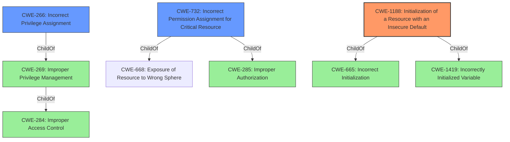

# Analysis Report for CVE-2021-42109

# Vulnerability Analysis Report: CVE-2021-42109

## Description


## Analysis (with Relationship Data)

# Summary
| CWE ID | CWE Name | Confidence | CWE Abstraction Level | CWE Vulnerability Mapping Label | CWE-Vulnerability Mapping Notes |
|---|---|---|---|---|---|
| CWE-1188 | Initialization of a Resource with an Insecure Default | 0.8 | Base | Allowed | Primary CWE |
| CWE-266 | Incorrect Privilege Assignment | 0.7 | Base | Allowed | Secondary Candidate |
| CWE-732 | Incorrect Permission Assignment for Critical Resource | 0.6 | Class | Allowed-with-Review | Secondary Candidate |

## Evidence and Confidence

*   **Confidence Score:** 0.8
*   **Evidence Strength:** HIGH

## Relationship Analysis
The primary relationship that influenced the decision was the hierarchical structure, favoring CWE-1188 as a base-level weakness dealing with insecure defaults. CWE-266 and CWE-732 were considered as potential secondary weaknesses regarding privilege management, but were deemed less directly applicable to the root cause. The decision was driven by the need to identify the precise coding error, prioritizing base-level CWEs where possible.



## Vulnerability Chain
The vulnerability chain begins with **insecure default configurations** (CWE-1188), leading to potential **privilege escalation** (impact). Default credentials and unsecured network services allow unauthorized access and control, ultimately resulting in a full system compromise and remote command execution.

## Summary of Analysis
The initial assessment focused on identifying the root cause of the vulnerability. The evidence clearly points to the use of **default credentials** and **insecure configurations** as the primary weakness. The "**Vendor Privilege Escalation Vulnerabilities**" reinforces the privilege escalation impact.

The retriever results suggested several relevant CWEs, including CWE-1188 (Initialization of a Resource with an Insecure Default), CWE-250 (Execution with Unnecessary Privileges), CWE-269 (Improper Privilege Management), CWE-266 (Incorrect Privilege Assignment), and CWE-732 (Incorrect Permission Assignment for Critical Resource).

CWE-1188 was chosen as the primary CWE because the vulnerability description explicitly mentions the use of **default credentials**, which aligns with the concept of an insecure default configuration. "The product initializes or sets a resource with a default that is intended to be changed by the administrator, but the default is not secure." This is a direct match for the described vulnerability.

CWE-266 and CWE-732 were considered as secondary CWEs because the ultimate impact of the vulnerability is privilege escalation. However, these CWEs are less specific to the root cause of the vulnerability, which is the use of insecure defaults.

The chosen CWE is at the optimal level of specificity because it directly addresses the root cause of the vulnerability. While privilege escalation is a consequence of the vulnerability, it is not the primary weakness. CWE-1188 accurately captures the **insecure default configuration** that allows attackers to gain unauthorized access and escalate privileges.

Relevant CWE Information:

# Enhanced Context (25 CWEs)
The following CWEs were identified as potentially relevant to this vulnerability:

## CWE-1188: Initialization of a Resource with an Insecure Default
**Abstraction Level**: Base
**Similarity Score**: 0.039
**Source**: sparse

**Description**:
The product initializes or sets a resource with a default that is intended to be changed by the administrator, but the default is not secure.

**Mapping Guidance**:
- Usage: Allowed
- Rationale: This CWE entry is at the Base level of abstraction, which is a preferred level of abstraction for mapping to the root causes of vulnerabilities.

## CWE-266: Incorrect Privilege Assignment
**Abstraction Level**: base
**Similarity Score**: 3.64
**Source**: graph

**Description**:
CWE-266: Incorrect Privilege Assignment

**Mapping Guidance**:
- Usage: Allowed
- Rationale: This CWE entry is at the Base level of abstraction, which is a preferred level of abstraction for mapping to the root causes of vulnerabilities.

## CWE-732: Incorrect Permission Assignment for Critical Resource
**Abstraction Level**: Class
**Similarity Score**: 7466.14
**Source**: sparse

**Description**:
The product specifies permissions for a security-critical resource in a way that allows that resource to be read or modified by unintended actors.

**Mapping Guidance**:
- Usage: Allowed-with-Review
- Rationale: While the name itself indicates an assignment of permissions for resources, this is often misused for vulnerabilities in which "permissions" are not checked, which is an "authorization" weakness (CWE-285 or descendants) within CWE's model [REF-1287].

## CWE-250: Execution with Unnecessary Privileges
**Abstraction Level**: Base
**Similarity Score**: 0.024
**Source**: sparse

**Description**:
The product performs an operation at a privilege level that is higher than the minimum level required, which creates new weaknesses or amplifies the consequences of other weaknesses.

**Mapping Guidance**:
- Usage: Allowed
- Rationale: This CWE entry is at the Base level of abstraction, which is a preferred level of abstraction for mapping to the root causes of vulnerabilities.

## CWE-269: Improper Privilege Management
**Abstraction Level**: Class
**Similarity Score**: 0.021
**Source**: sparse

**Description**:
The product does not properly assign, modify, track, or check privileges for an actor, creating an unintended sphere of control for that actor.

**Mapping Guidance**:
- Usage: Discouraged
- Rationale: CWE-269 is commonly misused. It can be conflated with "privilege escalation," which is a technical impact that is listed in many low-information vulnerability reports [REF-1287].

## Other CWEs Considered but Not Used:
*   CWE-250 (Execution with Unnecessary Privileges): This was considered because the vulnerability allows privilege escalation. However, the root cause is not directly related to the product running with unnecessary privileges. Instead, it's due to **insecure defaults**.
*   CWE-269 (Improper Privilege Management): This was considered as a broader category encompassing privilege-related issues. However, CWE-1188 provides a more specific and accurate representation of the vulnerability's root cause.
*   CWE-78 (Improper Neutralization of Special Elements used in an OS Command ('OS Command Injection')): This was considered due to the "Remote Command Execution" reported. However, the root cause is due to the **insecure defaults** and **insecure configuration** that permits remote command execution.
*   CWE-20 (Improper Input Validation): This was considered, but the analysis determined that this vulnerability is not directly caused by improper input validation. The problem stems from the use of **insecure default credentials**.

The analysis and resulting conclusion were heavily based on the evidence provided in the "**CVE Reference Links Content Summary**" and "**Vulnerability Description Key Phrases**". The evidence clearly indicates that the use of **default credentials** is the primary **weakness**, making CWE-1188 the most appropriate mapping.


## CWE Relationship Analysis

Current CWEs represent these abstraction levels: .


### Vulnerability Chain Analysis

**Chain starting from CWE-732:**
- 732 (Incorrect Permission Assignment for Critical Resource) - ROOT


**Chain starting from CWE-284:**
- 284 (Improper Access Control) - ROOT


### CWE Relationship Diagram

```mermaid
graph TD
    classDef primary fill:#f96,stroke:#333,stroke-width:2px
    classDef secondary fill:#69f,stroke:#333
    classDef tertiary fill:#9e9,stroke:#333
```


*Report generated on 2025-04-02 16:46:21*
