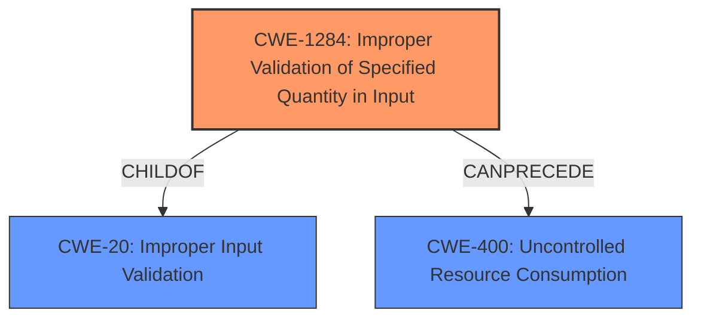

# Analysis for CVE-2021-42120

# Summary
| CWE ID | CWE Name | Confidence | CWE Abstraction Level | CWE Vulnerability Mapping Label | CWE-Vulnerability Mapping Notes |
|---|---|---|---|---|---|
| CWE-1284 | Improper Validation of Specified Quantity in Input | 0.9 | Base | Allowed | Primary CWE |
| CWE-400 | Uncontrolled Resource Consumption | 0.7 | Class | Discouraged | Secondary Candidate |
| CWE-20 | Improper Input Validation | 0.6 | Class | Discouraged | Secondary Candidate |

## Evidence and Confidence

*   **Confidence Score:** 0.9
*   **Evidence Strength:** HIGH

## Relationship Analysis
The primary weakness is **CWE-1284: Improper Validation of Specified Quantity in Input**, which is a Base level CWE and a child of **CWE-20: Improper Input Validation**. The excessive resource consumption (exhaustion) is a consequence of the **improper validation** of the length of the input string. **CWE-400: Uncontrolled Resource Consumption** describes the impact of the vulnerability.

## Vulnerability Chain
The vulnerability chain starts with the **insufficient input validation** (**CWE-1284**) of the length of the input string, which leads to the ability to insert arbitrarily long strings. This, in turn, leads to the exhaustion of the underlying resource (**CWE-400**).

## Summary of Analysis
The initial assessment identified **CWE-1284: Improper Validation of Specified Quantity in Input** as the primary weakness, supported by the description's emphasis on the **insufficient input validation** of the length of the strings. This aligns with the CWE's focus on the failure to validate that a specified quantity has the required properties. The vulnerability description highlights the ability to "insert arbitrarily long strings", which directly relates to the quantity (length) of the input.

The retriever results also suggested **CWE-20: Improper Input Validation**, but per the mapping guidance, this is a Class level CWE that is often misused and a more specific CWE should be selected.

**CWE-400: Uncontrolled Resource Consumption** was considered due to the statement that the vulnerability leads to "exhaustion of the underlying resource", however this is the result of the rootcause **insufficient input validation**.

The final decision was to select **CWE-1284** because it is at the Base level of abstraction and directly describes the **improper validation** of the length of the input string, which is the root cause of the vulnerability. The evidence for this decision comes directly from the vulnerability description: "**Insufficient Input Validation** in Web Applications... on all object attributes allows an authenticated remote attacker... to insert arbitrarily long strings, eventually leading to exhaustion of the underlying resource."

Relevant CWE Information:

# Enhanced Context (25 CWEs)

## CWE-80: Improper Neutralization of Script-Related HTML Tags in a Web Page (Basic XSS)
**Abstraction Level**: Variant
**Similarity Score**: 0.79
**Source**: dense

**Description**:
The product receives input from an upstream component, but it does not neutralize or incorrectly neutralizes special characters such as "<", ">", and "&" that could be interpreted as web-scripting elements when they are sent to a downstream component that processes web pages.

**Mapping Guidance**:
- Usage: Allowed
- Rationale: This CWE entry is at the Variant level of abstraction, which is a preferred level of abstraction for mapping to the root causes of vulnerabilities.

*This CWE was not selected as it is not related to the vulnerability description which is about length of strings, not script related HTML tags.*

## CWE-1289: Improper Validation of Unsafe Equivalence in Input
**Abstraction Level**: Base
**Similarity Score**: 0.78
**Source**: dense

**Description**:
The product receives an input value that is used as a resource identifier or other type of reference, but it does not validate or incorrectly validates that the input is equivalent to a potentially-unsafe value.

**Mapping Guidance**:
- Usage: Allowed
- Rationale: This CWE entry is at the Base level of abstraction, which is a preferred level of abstraction for mapping to the root causes of vulnerabilities.

*This CWE was not selected as it is not related to the vulnerability description which is about length of strings, not equivalence of inputs.*

## CWE-74: Improper Neutralization of Special Elements in Output Used by a Downstream Component ('Injection')
**Abstraction Level**: Class
**Similarity Score**: 0.77
**Source**: dense

**Description**:
The product constructs all or part of a command, data structure, or record using externally-influenced input from an upstream component, but it does not neutralize or incorrectly neutralizes special elements that could modify how it is parsed or interpreted when it is sent to a downstream component.

**Mapping Guidance**:
- Usage: Discouraged
- Rationale: CWE-74 is high-level and often misused when lower-level weaknesses are more appropriate.

*This CWE was not selected as it is not related to the vulnerability description which is about length of strings, not neutralization of special elements.*

## CWE-184: Incomplete List of Disallowed Inputs
**Abstraction Level**: Base
**Similarity Score**: 0.77
**Source**: dense

**Description**:
The product implements a protection mechanism that relies on a list of inputs (or properties of inputs) that are not allowed by policy or otherwise require other action to neutralize before additional processing takes place, but the list is incomplete.

**Mapping Guidance**:
- Usage: Allowed
- Rationale: This CWE entry is at the Base level of abstraction, which is a preferred level of abstraction for mapping to the root causes of vulnerabilities.

*This CWE was not selected as it is not related to the vulnerability description which is about length of strings, not a list of disallowed inputs.*

## CWE-807: Reliance on Untrusted Inputs in a Security Decision
**Abstraction Level**: Base
**Similarity Score**: 0.77
**Source**: dense

**Description**:
The product uses a protection mechanism that relies on the existence or values of an input, but the input can be modified by an untrusted actor in a way that bypasses the protection mechanism.

**Mapping Guidance**:
- Usage: Allowed
- Rationale: This CWE entry is at the Base level of abstraction, which is a preferred level of abstraction for mapping to the root causes of vulnerabilities.

*This CWE was not selected as it is not related to the vulnerability description which is about length of strings, not reliance on untrusted inputs.*

## CWE-116: Improper Encoding or Escaping of Output
**Abstraction Level**: Class
**Similarity Score**: 0.76
**Source**: dense

**Description**:
The product prepares a structured message for communication with another component, but encoding or escaping of the data is either missing or done incorrectly. As a result, the intended structure of the message is not preserved.

**Mapping Guidance**:
- Usage: Allowed-with-Review
- Rationale: This CWE entry is a Class and might have Base-level children that would be more appropriate

*This CWE was not selected as it is not related to the vulnerability description which is about length of strings, not encoding or escaping of output.*

## CWE-138: Improper Neutralization of Special Elements
**Abstraction Level**: Class
**Similarity Score**: 0.76
**Source**: dense

**Description**:
The product receives input from an upstream component, but it does not neutralize or incorrectly neutralizes special elements that could be interpreted as control elements or syntactic markers when they are sent to a downstream component.

**Mapping Guidance**:
- Usage: Discouraged
- Rationale: This CWE entry is a level-1 Class (i.e., a child of a Pillar). It might have lower-level children that would be more appropriate

*This CWE was not selected as it is not related to the vulnerability description which is about length of strings, not neutralization of special elements.*

## CWE-472: External Control of Assumed-Immutable Web Parameter
**Abstraction Level**: Base
**Similarity Score**: 0.76
**Source**: dense

**Description**:
The web application does not sufficiently verify inputs that are assumed to be immutable but are actually externally controllable, such as hidden form fields.

**Mapping Guidance**:
- Usage: Allowed
- Rationale: This CWE entry is at the Base level of abstraction, which is a preferred level of abstraction for mapping to the root causes of vulnerabilities.

*This CWE was not selected as it is not related to the vulnerability description which is about length of strings, not external control of assumed-immutable web