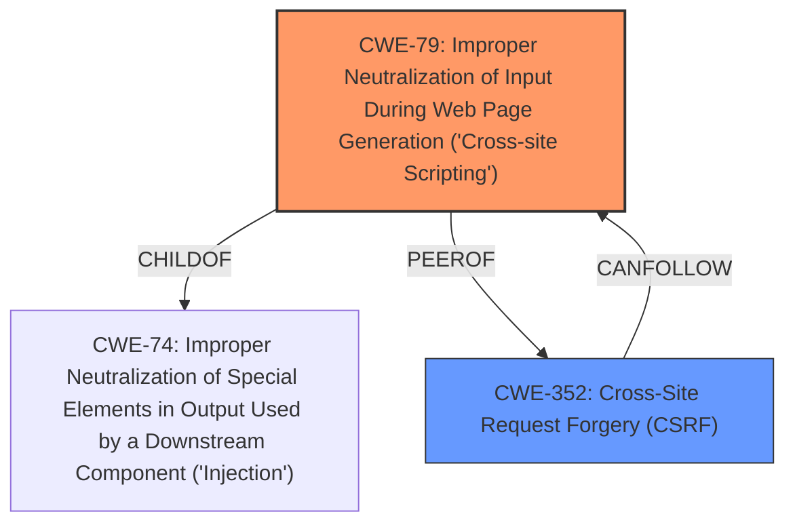

# Raw Analyzer Response for CVE-2021-42136

# Summary
| CWE ID | CWE Name | Confidence | CWE Abstraction Level | CWE Vulnerability Mapping Label | CWE-Vulnerability Mapping Notes |
|---|---|---|---|---|---|
| CWE-79 | Improper Neutralization of Input During Web Page Generation ('Cross-site Scripting') | 1.0 | Base | Allowed | Primary CWE |
| CWE-352 | Cross-Site Request Forgery (CSRF) | 0.7 | Compound | Allowed | Secondary CWE |

## Evidence and Confidence

*   **Confidence Score:** 0.9
*   **Evidence Strength:** HIGH

## Relationship Analysis
The primary weakness is CWE-79, which describes the core issue of **improper input sanitization** leading to XSS. CWE-352 (CSRF) is a secondary weakness, as the XSS vulnerability can be leveraged to perform CSRF attacks. The relationship between XSS and CSRF is documented in the "Additional Notes" sections of both CWE-79 and CWE-352. CWE-79 is a base CWE, while CWE-352 is a compound CWE representing a combination of multiple weaknesses.

## Vulnerability Chain
The vulnerability chain starts with **improper input sanitization** (CWE-79), which allows an attacker to inject malicious JavaScript code. This code is then stored and executed in the context of other users, leading to XSS. The XSS vulnerability can be leveraged to perform a CSRF attack (CWE-352), potentially escalating privileges to administrator.

## Summary of Analysis
The analysis is based on the provided vulnerability description, which explicitly states that a stored XSS vulnerability exists due to **improper input sanitization** and that this can be leveraged to perform a CSRF attack. The vulnerability description key phrases highlight the **rootcause** as **improper input sanitization** and the **weakness** as **cross-site scripting**. The Retriever Results also list CWE-79 as the top candidate.

The description explicitly mentions that the stored XSS vulnerability can then be leveraged to execute a Cross-Site Request Forgery attack to escalate privileges to administrator. This indicates a chain of events where the XSS vulnerability is a prerequisite for the CSRF attack.

CWE-79 is selected as the primary CWE because it directly addresses the **improper input sanitization** that leads to the XSS vulnerability. CWE-352 is selected as a secondary CWE because the XSS vulnerability can be leveraged to perform a CSRF attack. The relationship between XSS and CSRF is well-documented, further supporting this classification. The selection is made in accordance with MITRE's mapping guidance.

Other CWEs considered but not used:

*   CWE-80: Improper Neutralization of Script-Related HTML Tags in a Web Page (Basic XSS): This is a more specific variant of CWE-79, but the description does not provide enough detail to determine whether the vulnerability specifically involves script-related HTML tags. Therefore, CWE-79 is a more appropriate choice.
*   CWE-116: Improper Encoding or Escaping of Output: This CWE is related to output encoding, but the primary issue is **improper input sanitization**. CWE-79 is a more direct representation of the vulnerability.
*   CWE-96: Improper Neutralization of Directives in Statically Saved Code ('Static Code Injection'): This CWE is not applicable because the code is not injected into statically saved code but is stored as data and later executed as code.
*   CWE-184: Incomplete List of Disallowed Inputs: This CWE could be a contributing factor, but the primary issue is the **improper sanitization** itself rather than an incomplete list of disallowed inputs. The description provides sufficient detail to select the more precise CWE-79.
*   CWE-138: Improper Neutralization of Special Elements: This CWE is a more general class, and CWE-79 provides a more specific description of the vulnerability.
*   CWE-89: Improper Neutralization of Special Elements used in an SQL Command ('SQL Injection'): This CWE is not applicable because the vulnerability involves JavaScript code injection, not SQL injection.
*   CWE-918: Server-Side Request Forgery (SSRF): While CSRF is mentioned, the root cause and enabler here is XSS.

The selected CWEs are at the optimal level of specificity because they directly address the root cause and the potential impact of the vulnerability, as described in the vulnerability description.