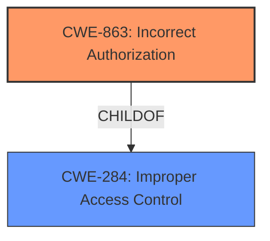

# Enhanced Analysis for CVE-2021-42137

# Summary
| CWE ID | CWE Name | Confidence | CWE Abstraction Level | CWE Vulnerability Mapping Label | CWE-Vulnerability Mapping Notes |
|---|---|---|---|---|---|
| CWE-863 | Incorrect Authorization | 1.0 | Class | Allowed-with-Review | Primary CWE |
| CWE-284 | Improper Access Control | 0.7 | Pillar | Discouraged | Secondary Candidate |

## Evidence and Confidence

*   **Confidence Score:** 0.9
*   **Evidence Strength:** HIGH

## Relationship Analysis
The primary CWE is CWE-863, which is a child of CWE-284, which makes sense. Because the description is about an **improper enforcement of privilege requirement**, the general case of CWE-284 is less appropriate than the specific case of CWE-863.



## Vulnerability Chain
The chain of weaknesses starts with the **improper enforcement of privilege requirement**, leading to users viewing ticket meta-information (title, state, etc.) without proper permissions.
  - Root Cause: **Improper enforcement of privilege requirement** (CWE-863)
  - Impact: Users can see meta-information (title, state, etc.) of tickets belonging to their organization even if they lack the necessary permissions to access them.

## Summary of Analysis
The initial analysis pointed to CWE-863 as the primary weakness, which aligns with the description of **improper enforcement of privilege requirement**. The relationship analysis confirmed that CWE-863 is a more specific case of CWE-284, making it a better fit.

The evidence from the "Vulnerability Description Key Phrases" and "CVE Reference Links Content Summary" sections clearly supports this conclusion:
- "**rootcause:** **improper enforcement of privilege requirement**"
- "The system was showing tickets to users that did not have direct permission to view them."

The graph relationships influenced the final selection by highlighting the parent-child relationship between CWE-284 and CWE-863, guiding the choice towards the more specific CWE-863.

CWE-863 is at the optimal level of specificity because it directly addresses the **incorrect authorization** mechanism, which is the core issue described in the vulnerability.

Relevant CWE Information:

# Enhanced Context (25 CWEs)
The following CWEs were identified as potentially relevant to this vulnerability:

## CWE-404: Improper Resource Shutdown or Release
**Abstraction Level**: Class
**Similarity Score**: 0.77
**Source**: dense
Not Selected: This CWE deals with resource leaks, which is not the primary concern here.

## CWE-226: Sensitive Information in Resource Not Removed Before Reuse
**Abstraction Level**: Base
**Similarity Score**: 0.76
**Source**: dense
Not Selected: This CWE focuses on failing to clear sensitive data before reuse, which is not applicable.

## CWE-667: Improper Locking
**Abstraction Level**: Class
**Similarity Score**: 0.75
**Source**: dense
Not Selected: This CWE is relevant to concurrency issues which is not relevant in the current vulnerability description.

## CWE-274: Improper Handling of Insufficient Privileges
**Abstraction Level**: Base
**Similarity Score**: 0.75
**Source**: dense
Not Selected: This is about how the system handles insufficient privileges rather than incorrectly granting privileges.

## CWE-664: Improper Control of a Resource Through its Lifetime
**Abstraction Level**: Pillar
**Similarity Score**: 0.75
**Source**: dense
Not Selected: This is a very general CWE and does not fit the specific **incorrect authorization** issue.

## CWE-665: Improper Initialization
**Abstraction Level**: Class
**Similarity Score**: 0.75
**Source**: dense
Not Selected: This CWE focuses on initialization issues, which is not the root cause here.

## CWE-653: Improper Isolation or Compartmentalization
**Abstraction Level**: Class
**Similarity Score**: 0.75
**Source**: dense
Not Selected: This CWE addresses compartmentalization problems and is not directly related to the described vulnerability.

## CWE-668: Exposure of Resource to Wrong Sphere
**Abstraction Level**: Class
**Similarity Score**: 0.74
**Source**: dense
Not Selected: This is a high-level CWE, and the problem is more specifically related to authorization.

## CWE-280: Improper Handling of Insufficient Permissions or Privileges
**Abstraction Level**: Base
**Similarity Score**: 0.74
**Source**: dense
Not Selected: Similar to CWE-274, this focuses on handling insufficient privileges rather than incorrect authorization.

## CWE-807: Reliance on Untrusted Inputs in a Security Decision
**Abstraction Level**: Base
**Similarity Score**: 0.74
**Source**: dense
Not Selected: The authorization decision isn't based on untrusted inputs.

## CWE-451: User Interface (UI) Misrepresentation of Critical Information
**Abstraction Level**: Class
**Similarity Score**: 6381.56
**Source**: sparse
Not Selected: Although the vulnerability does involve displaying information, the root cause is not a UI misrepresentation, but an authorization issue.

## CWE-863: Incorrect Authorization
**Abstraction Level**: Class
**Similarity Score**: 6097.31
**Source**: sparse

### Description
The product performs an authorization check when an actor attempts to access a resource or perform an action, but it does not correctly perform the check.
**Selected**: This is the primary CWE. The vulnerability description explicitly mentions **improper enforcement of the privilege requirement**, which aligns with the definition of **incorrect authorization**.

## CWE-285: Improper Authorization
**Abstraction Level**: Class
**Similarity Score**: 6034.02
**Source**: sparse
Not Selected: While related, CWE-863 is a more specific child of CWE-285, making it a better fit.

## CWE-639: Authorization Bypass Through User-Controlled Key
**Abstraction Level**: Base
**Similarity Score**: 5934.42
**Source**: sparse
Not Selected: The bypass isn't happening through a user-controlled key.

## CWE-287: Improper Authentication
**Abstraction Level**: Class
**Similarity Score**: 5830.60
**Source**: sparse
Not Selected: The vulnerability is about authorization, not authentication.

## CWE-471: Modification of Assumed-Immutable Data (MAID)
**Abstraction Level**: base
**Similarity Score**: 4.33
**Source**: graph
Not Selected: This vulnerability is not about modifying immutable data.

## CWE-125: Out-of-bounds Read
**Abstraction Level**: base
**Similarity Score**: 3.89
**Source**: graph
Not Selected: This vulnerability is not about reading data out of bounds.

## CWE-290: Authentication Bypass by Spoofing
**Abstraction Level**: base
**Similarity Score**: 3.64
**Source**: graph
Not Selected: The vulnerability is about authorization, not authentication.

## CWE-266: Incorrect Privilege Assignment
**Abstraction Level**: base
**Similarity Score**: 3.64
**Source**: graph
Not Selected: The issue isn't about incorrect privilege assignment, but about **improper enforcement** of existing privileges.

## CWE-178: Improper Handling of Case Sensitivity
**Abstraction Level**: base
**Similarity Score**: 3.64
**Source**: graph
Not Selected: Case sensitivity is not mentioned in the description.

## CWE-1289: Improper Validation of Unsafe Equivalence in Input
**Abstraction Level**: base
**Similarity Score**: 3.64
**Source**: graph
Not Selected: This vulnerability is not related to validation of input equivalence.

## CWE-41: Improper Resolution of Path Equivalence
**Abstraction Level**: base
**Similarity Score**: 3.44
**Source**: graph
Not Selected: This vulnerability is not related to path equivalence.

## CWE-787: Out-of-bounds Write
**Abstraction Level**: base
**Similarity Score**: 3.30
**Source**: graph
Not Selected: This vulnerability is not about writing data out of bounds.

## CWE-602: Client-Side Enforcement of Server-Side Security
**Abstraction Level**: class
**Similarity Score**: 2.98
**Source**: graph
Not Selected: The authorization is not being enforced on the client side.

## CWE-1257: Improper Access Control Applied to Mirrored or Aliased Memory Regions
**Abstraction Level**: base
**Similarity Score**: 2.87
**Source**: graph
Not Selected: This vulnerability is not related


## CWE Relationship Analysis

Current CWEs represent these abstraction levels: .


### Vulnerability Chain Analysis

**Chain starting from CWE-787:**
- 787 (Out-of-bounds Write) - ROOT


**Chain starting from CWE-404:**
- 404 (Improper Resource Shutdown or Release) - ROOT


### CWE Relationship Diagram

```mermaid
graph TD
    classDef primary fill:#f96,stroke:#333,stroke-width:2px
    classDef secondary fill:#69f,stroke:#333
    classDef tertiary fill:#9e9,stroke:#333
```