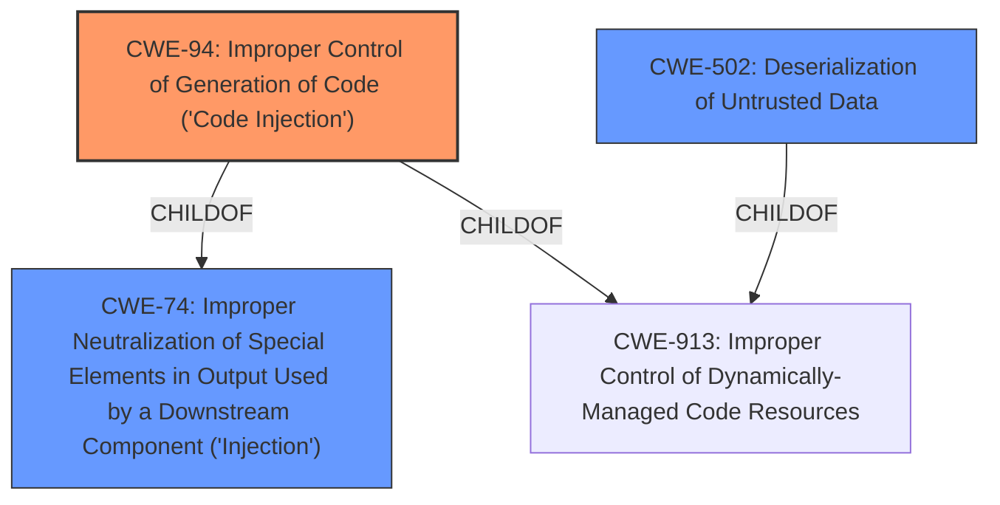

# Analysis Report for CVE-2021-42139

# Vulnerability Analysis Report: CVE-2021-42139

## Description


## Analysis (with Relationship Data)

# Summary
| CWE ID | CWE Name | Confidence | CWE Abstraction Level | CWE Vulnerability Mapping Label | CWE-Vulnerability Mapping Notes |
|---|---|---|---|---|---|
| CWE-94 | Improper Control of Generation of Code ('Code Injection') | 1 | Base | Primary | Allowed-with-Review |
| CWE-502 | Deserialization of Untrusted Data | 0.7 | Base | Secondary | Allowed |

## Evidence and Confidence

*   **Confidence Score:** 0.85
*   **Evidence Strength:** HIGH

## Relationship Analysis
The primary CWE selected is CWE-94, which is a base-level CWE and a child of CWE-74. The secondary CWE considered is CWE-502. The relationship analysis shows that CWE-94 is a good fit because the vulnerability involves the **improper control of code generation**, leading to code injection. CWE-502 is considered because the vulnerability involves parsing a YAML file, which is a form of deserialization. However, the root cause is more directly related to code injection, making CWE-94 the primary classification.



## Vulnerability Chain
The chain of weaknesses is as follows:
1.  **Improper handling of YAML files with `EXTENDED_SCHEMA` enabled.**
2.  **Code Injection** due to the ability to execute arbitrary JavaScript code via the `!!js/function` tag.

The root cause is the **improper handling** of the `!!js/function` tag within YAML files when `EXTENDED_SCHEMA` is enabled. This leads directly to code injection.

## Summary of Analysis
The initial assessment, based on the vulnerability description and the CVE reference, indicates a clear case of **code injection**. The vulnerability allows an attacker to inject and execute arbitrary JavaScript code by crafting malicious YAML files using the `!!js/function` tag.

The primary CWE selected is CWE-94, which accurately reflects the **improper control of code generation** leading to **code injection**. This decision is supported by the vulnerability description, which explicitly mentions "Code Injection", and the CVE reference, which details how the `!!js/function` tag enables arbitrary JavaScript execution.

The relationship graph highlights that CWE-94 is a child of CWE-74 (a more general injection category) and CWE-913. While CWE-74 is a parent, CWE-94 provides a more specific classification for this vulnerability.

The selection of CWE-94 is at the optimal level of specificity, as it directly addresses the root cause of the vulnerability. While CWE-502 (Deserialization of Untrusted Data) is relevant due to the use of YAML files, it is not the primary issue. The core problem is the ability to inject and execute code, making CWE-94 the most accurate classification.

Relevant CWE Information:

# Enhanced Context (25 CWEs)
The following CWEs were identified as potentially relevant to this vulnerability:

## CWE-74: Improper Neutralization of Special Elements in Output Used by a Downstream Component ('Injection')
**Abstraction Level**: Class
**Similarity Score**: 0.78

## CWE-917: Improper Neutralization of Special Elements used in an Expression Language Statement ('Expression Language Injection')
**Abstraction Level**: Base
**Similarity Score**: 0.76

## CWE-88: Improper Neutralization of Argument Delimiters in a Command ('Argument Injection')
**Abstraction Level**: Base
**Similarity Score**: 0.76

## CWE-184: Incomplete List of Disallowed Inputs
**Abstraction Level**: Base
**Similarity Score**: 0.76

## CWE-80: Improper Neutralization of Script-Related HTML Tags in a Web Page (Basic XSS)
**Abstraction Level**: Variant
**Similarity Score**: 0.75

## CWE-138: Improper Neutralization of Special Elements
**Abstraction Level**: Class
**Similarity Score**: 0.75

## CWE-73: External Control of File Name or Path
**Abstraction Level**: Base
**Similarity Score**: 0.74

## CWE-96: Improper Neutralization of Directives in Statically Saved Code ('Static Code Injection')
**Abstraction Level**: Base
**Similarity Score**: 0.74

## CWE-41: Improper Resolution of Path Equivalence
**Abstraction Level**: Base
**Similarity Score**: 0.74

## CWE-1336: Improper Neutralization of Special Elements Used in a Template Engine
**Abstraction Level**: Base
**Similarity Score**: 0.73

## CWE-116: Improper Encoding or Escaping of Output
**Abstraction Level**: Class
**Similarity Score**: 6859.79

## CWE-1336: Improper Neutralization of Special Elements Used in a Template Engine
**Abstraction Level**: Base
**Similarity Score**: 6831.49

## CWE-94: Improper Control of Generation of Code ('Code Injection')
**Abstraction Level**: Base
**Similarity Score**: 6626.41

## CWE-88: Improper Neutralization of Argument Delimiters in a Command ('Argument Injection')
**Abstraction Level**: Base
**Similarity Score**: 6601.89

## CWE-95: Improper Neutralization of Directives in Dynamically Evaluated Code ('Eval Injection')
**Abstraction Level**: Variant
**Similarity Score**: 6559.30

## CWE-98: Improper Control of Filename for Include/Require Statement in PHP Program ('PHP Remote File Inclusion')
**Abstraction Level**: variant
**Similarity Score**: 4.53

## CWE-183: Permissive List of Allowed Inputs
**Abstraction Level**: base
**Similarity Score**: 4.39

## CWE-94: Improper Control of Generation of Code ('Code Injection')
**Abstraction Level**: base
**Similarity Score**: 4.33

## CWE-79: Improper Neutralization of Input During Web Page Generation ('Cross-site Scripting')
**Abstraction Level**: base
**Similarity Score**: 4.33

## CWE-1339: Insufficient Precision or Accuracy of a Real Number
**Abstraction Level**: base
**Similarity Score**: 4.33

## CWE-193: Off-by-one Error
**Abstraction Level**: base
**Similarity Score**: 3.80

## CWE-426: Untrusted Search Path
**Abstraction Level**: base
**Similarity Score**: 3.64

## CWE-502: Deserialization of Untrusted Data
**Abstraction Level**: base
**Similarity Score**: 3.64

## CWE-625: Permissive Regular Expression
**Abstraction Level**: base
**Similarity Score**: 3.64

## CWE-78: Improper Neutralization of Special Elements used in an OS Command ('OS Command Injection')
**Abstraction Level**: base
**Similarity Score**: 3.57

CWE-74, CWE-95, CWE-96, CWE-1336, and CWE-88 were considered but not ultimately chosen as the primary CWE. CWE-74 is too broad, while CWE-95 and CWE-96 are related to specific types of code injection (dynamic and static, respectively), which are not explicitly detailed in the description. CWE-1336 and CWE-88 are not directly applicable to the described vulnerability.
CWE-116 was considered, but it relates more to encoding issues, which is not the primary problem here.
CWE-834 was not selected because there is no evidence of excessive iteration or looping.
CWE-502 was considered as a secondary issue because deserialization of untrusted data enables the code injection.


## CWE Relationship Analysis

Current CWEs represent these abstraction levels: .


### Vulnerability Chain Analysis

**Chain starting from CWE-502:**
- 502 (Deserialization of Untrusted Data) - ROOT


**Chain starting from CWE-96:**
- 96 (Improper Neutralization of Directives in Statically Saved Code ('Static Code Injection')) - ROOT


### CWE Relationship Diagram

```mermaid
graph TD
    classDef primary fill:#f96,stroke:#333,stroke-width:2px
    classDef secondary fill:#69f,stroke:#333
    classDef tertiary fill:#9e9,stroke:#333
```


*Report generated on 2025-04-02 10:53:17*
