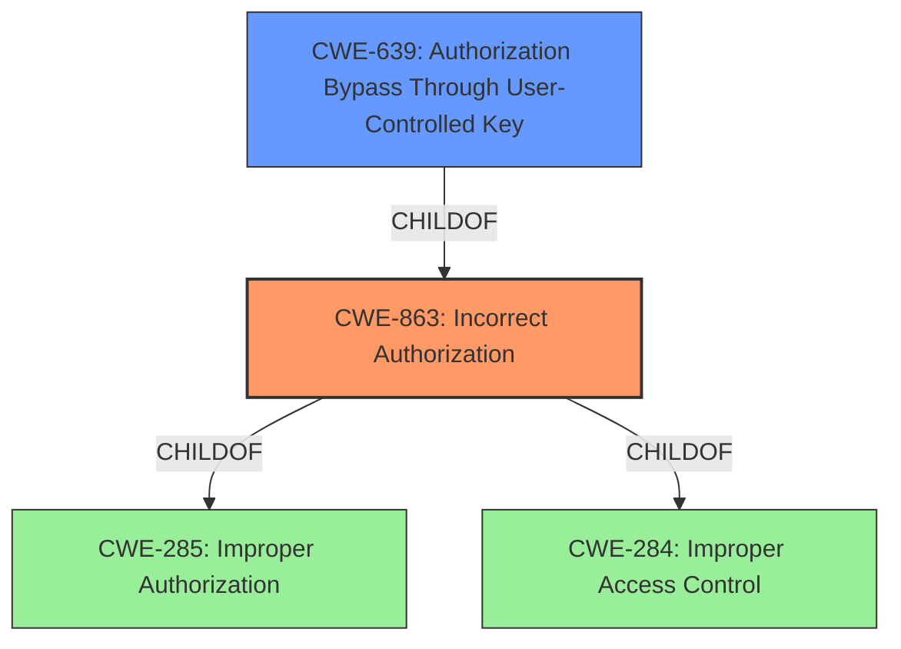

# Raw Analyzer Response for CVE-2021-42192

# Summary
| CWE ID | CWE Name | Confidence | CWE Abstraction Level | CWE Vulnerability Mapping Label | CWE-Vulnerability Mapping Notes |
|---|---|---|---|---|---|
| CWE-863 | Incorrect Authorization | 1.0 | Class | Primary | Allowed-with-Review |
| CWE-639 | Authorization Bypass Through User-Controlled Key | 0.7 | Base | Secondary | Allowed |

## Evidence and Confidence

*   **Confidence Score:** 0.9
*   **Evidence Strength:** HIGH

## Relationship Analysis
The primary CWE selected is CWE-863 (Incorrect Authorization), which is a Class-level CWE. CWE-863 is a child of both CWE-285 (Improper Authorization) and CWE-284 (Improper Access Control). CWE-639 (Authorization Bypass Through User-Controlled Key) is a Base-level CWE and a child of CWE-863. While CWE-639 is more specific, there isn't enough information to definitively state that the vulnerability occurs specifically due to user-controlled keys. Therefore, CWE-863 is selected as the primary CWE, and CWE-639 is a secondary consideration.

## Vulnerability Chain
The vulnerability chain starts with the **incorrect access control**, leading to privilege escalation. The root cause is the lack of proper authorization checks when updating user information, specifically the 'admin' attribute. An attacker crafts a request to modify their own user information, escalating their privileges to become an administrator.

## Summary of Analysis
The analysis is based on the provided vulnerability description and CVE reference content. The key phrase "**incorrect access control**" points towards an authorization issue. The CVE reference summary provides more details, stating that the "**vulnerability is caused by the lack of proper authorization checks** when updating user information, specifically the 'admin' attribute." This confirms that the core issue is related to authorization.

CWE-863 (Incorrect Authorization) is selected as the primary CWE because it accurately describes the vulnerability where the product performs an authorization check, but it does not correctly perform the check. The reference summary notes, "The vulnerability exists because there is no validation on the server-side that prevents this action from a non-admin user."

CWE-639 (Authorization Bypass Through User-Controlled Key) is considered as a secondary CWE because the attack vector involves modifying a user's 'admin' attribute, which can be seen as a key value that identifies the user's privileges. However, since the primary issue is the lack of validation on the server-side and not necessarily the modification of a specific key, CWE-863 is a more appropriate primary CWE.

The selection is at the optimal level of specificity because CWE-863 is a Class-level CWE that encompasses the general **incorrect authorization** issue. While more specific CWEs exist, such as CWE-639, the provided information does not definitively point to a user-controlled key as the root cause, thus, CWE-863 is the most fitting.