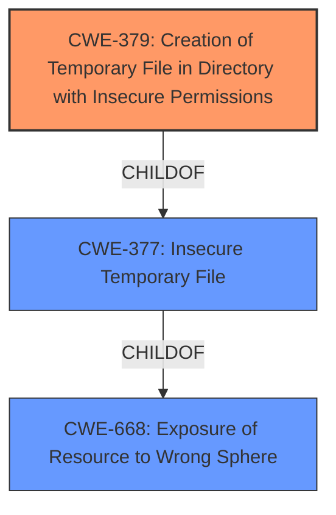

# Analysis Report for CVE-2021-42254

# Vulnerability Analysis Report: CVE-2021-42254

## Description


## Analysis (with Relationship Data)

# Summary
| CWE ID | CWE Name | Confidence | CWE Abstraction Level | CWE Vulnerability Mapping Label | CWE-Vulnerability Mapping Notes |
|---|---|---|---|---|---|
| CWE-379 | Creation of Temporary File in Directory with Insecure Permissions | 1.0 | Base | Allowed | Primary CWE |

## Evidence and Confidence

*   **Confidence Score:** 1.0
*   **Evidence Strength:** HIGH

## Relationship Analysis
The primary relationship influencing the decision is that CWE-379 is a child of CWE-377 (Insecure Temporary File), providing a more specific classification. No chain relationships are relevant. The abstraction level of CWE-379 is Base, which is the preferred level.



## Vulnerability Chain
The chain of events is straightforward: the application creates a temporary file, but **incorrect permissions** on the directory allow unauthorized access. The root cause is the **insecure directory permissions**, leading to potential information disclosure or modification.

## Summary of Analysis
The analysis is based on the provided vulnerability description: "BeyondTrust Privilege Management prior to version 21.6 creates a Temporary File in a Directory with Insecure Permissions." The retriever results strongly suggest CWE-379 "Creation of Temporary File in Directory with Insecure Permissions" as the most relevant CWE.

The selection of CWE-379 is based on the explicit statement that the temporary file is created in a directory with **insecure permissions**, aligning perfectly with the CWE's description. This CWE is at the Base level of abstraction, which is the preferred level for mapping.

Other CWEs considered but not used:

*   CWE-378 "Creation of Temporary File With Insecure Permissions": Similar to CWE-379, but less specific as it doesn't mention the directory's permissions being the source of the issue.
*   CWE-377 "Insecure Temporary File": This is a class-level CWE, and CWE-379 is a more specific child.
*   CWE-732 "Incorrect Permission Assignment for Critical Resource": This is a broader category and less specific than CWE-379. It also tends to be misused when permissions are not checked, representing authorization issues.
*   CWE-59 "Improper Link Resolution Before File Access ('Link Following')": This is not relevant as the vulnerability doesn't involve symbolic links.
*   CWE-362 "Concurrent Execution using Shared Resource with Improper Synchronization ('Race Condition')": This is not relevant as the vulnerability doesn't involve concurrency issues or race conditions.
*   CWE-277 "Insecure Inherited Permissions": Not directly applicable as the vulnerability description focuses on the directory permissions, not inherited permissions.
*   CWE-250 "Execution with Unnecessary Privileges": Not relevant as the vulnerability doesn't involve unnecessary privileges.

Based on the evidence and the specificity of CWE-379, it is the most appropriate classification for this vulnerability.


## CWE Relationship Analysis

Current CWEs represent these abstraction levels: .


### Vulnerability Chain Analysis

**Chain starting from CWE-732:**
- 732 (Incorrect Permission Assignment for Critical Resource) - ROOT


**Chain starting from CWE-377:**
- 377 (Insecure Temporary File) - ROOT


### CWE Relationship Diagram

```mermaid
graph TD
    classDef primary fill:#f96,stroke:#333,stroke-width:2px
    classDef secondary fill:#69f,stroke:#333
    classDef tertiary fill:#9e9,stroke:#333
```


*Report generated on 2025-04-02 12:33:27*
