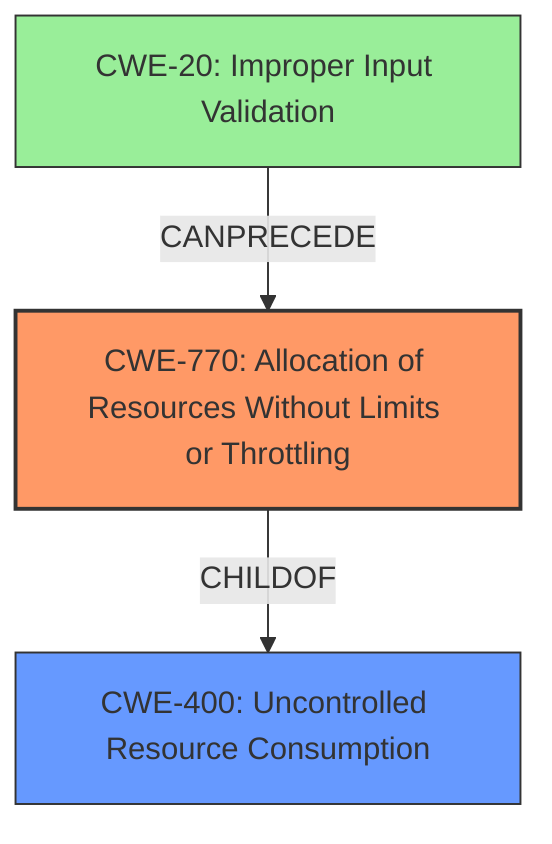

# Analysis for CVE-2021-42262

# Summary
| CWE ID  | CWE Name | Confidence | CWE Abstraction Level | CWE Vulnerability Mapping Label | CWE-Vulnerability Mapping Notes |
|-----------------|----------------------------------------------------|----------------|-------------------------|------------------------------------|------------------------------------|
| CWE-770 | Allocation of Resources Without Limits or Throttling | 0.9 | Base | Allowed | Primary CWE |
| CWE-400 | Uncontrolled Resource Consumption | 0.7 | Class | Allowed-with-Review | Secondary CWE Candidate |

## Evidence and Confidence

*   **Confidence Score:** 0.8
*   **Evidence Strength:** HIGH

## Relationship Analysis
The primary relationship considered was the parent-child relationship between CWE-770 and CWE-400, where CWE-770 is a child of CWE-400. The graph also indicates that CWE-770 can follow CWE-20 (Improper Input Validation), aligning with the vulnerability's root cause being an invalid XML element. The decision favored CWE-770 due to its more specific nature.

## Vulnerability Chain
The vulnerability chain starts with **CWE-20 (Improper Input Validation)**, due to the "invalid XML element in the type dictionary". This leads to **CWE-770 (Allocation of Resources Without Limits or Throttling)** because the invalid XML element triggers excessive memory allocation. The final impact is a crash due to an **out-of-memory condition**.

## Summary of Analysis
The initial assessment identified CWE-770 as the primary weakness, supported by the description of an **out-of-memory condition** caused by an invalid XML element. The CVE Reference Links Content Summary section also points to "Improper Input Validation (CWE-20)" as contributing to the issue.

The relationship analysis reinforces the selection of CWE-770 due to its specificity compared to its parent, CWE-400. While CWE-400 (Uncontrolled Resource Consumption) is a valid general classification, CWE-770 provides more context regarding the specific resource being consumed (memory) and the lack of limits on its allocation. The evidence from "CVE Reference Links Content Summary" states, "The OPC/UA client crashes due to an out-of-memory condition". The "Vulnerability Description Key Phrases" lists **out-of-memory condition** as the **weakness**.

The final decision is based on the evidence of an **out-of-memory condition** stemming from an invalid XML element, coupled with the hierarchical relationship analysis favoring the more specific CWE-770.

Relevant CWE Information:

# Enhanced Context (25 CWEs)

## CWE-703: Improper Check or Handling of Exceptional Conditions
**Abstraction Level**: Pillar
**Similarity Score**: 0.77
**Source**: dense
**Reason for not selecting**: Too high-level and doesn't capture the specifics of resource allocation.

## CWE-754: Improper Check for Unusual or Exceptional Conditions
**Abstraction Level**: Class
**Similarity Score**: 0.77
**Source**: dense
**Reason for not selecting**: While related, the core issue is not merely a check for exceptional conditions but the lack of control over resource allocation.

## CWE-404: Improper Resource Shutdown or Release
**Abstraction Level**: Class
**Similarity Score**: 0.77
**Source**: dense
**Reason for not selecting**: The problem isn't the release of a resource, but the uncontrolled allocation leading to exhaustion.

## CWE-226: Sensitive Information in Resource Not Removed Before Reuse
**Abstraction Level**: Base
**Similarity Score**: 0.76
**Source**: dense
**Reason for not selecting**: Not relevant as the vulnerability does not involve sensitive information.

## CWE-824: Access of Uninitialized Pointer
**Abstraction Level**: Base
**Similarity Score**: 0.76
**Source**: dense
**Reason for not selecting**: Not relevant as the vulnerability does not involve pointers.

## CWE-125: Out-of-bounds Read
**Abstraction Level**: Base
**Similarity Score**: 0.76
**Source**: dense
**Reason for not selecting**: Not relevant as the vulnerability is about memory allocation, not out-of-bounds reads.

## CWE-191: Integer Underflow (Wrap or Wraparound)
**Abstraction Level**: Base
**Similarity Score**: 0.76
**Source**: dense
**Reason for not selecting**: Not relevant as the vulnerability does not involve integer underflow.

## CWE-667: Improper Locking
**Abstraction Level**: Class
**Similarity Score**: 0.76
**Source**: dense
**Reason for not selecting**: Not relevant as the vulnerability does not involve locking mechanisms.

## CWE-476: NULL Pointer Dereference
**Abstraction Level**: Base
**Similarity Score**: 0.75
**Source**: dense
**Reason for not selecting**: Not relevant as the vulnerability does not involve pointers.

## CWE-131: Incorrect Calculation of Buffer Size
**Abstraction Level**: Base
**Similarity Score**: 0.75
**Source**: dense
**Reason for not selecting**: While buffer allocation is involved, the root cause isn't incorrect calculation of size, but lack of limits on resource allocation.

## CWE-823: Use of Out-of-range Pointer Offset
**Abstraction Level**: Base
**Similarity Score**: 4975.35
**Source**: sparse
**Reason for not selecting**: Not relevant as the vulnerability does not involve pointers.

## CWE-125: Out-of-bounds Read
**Abstraction Level**: Base
**Similarity Score**: 4917.53
**Source**: sparse
**Reason for not selecting**: Not relevant as the vulnerability is about memory allocation, not out-of-bounds reads.

## CWE-119: Improper Restriction of Operations within the Bounds of a Memory Buffer
**Abstraction Level**: Class
**Similarity Score**: 4858.71
**Source**: sparse
**Reason for not selecting**: Too general, CWE-770 is more specific to the allocation issue.

## CWE-476: NULL Pointer Dereference
**Abstraction Level**: Base
**Similarity Score**: 4768.31
**Source**: sparse
**Reason for not selecting**: Not relevant as the vulnerability does not involve pointers.

## CWE-770: Allocation of Resources Without Limits or Throttling
**Abstraction Level**: Base
**Similarity Score**: 4714.11
**Source**: sparse
**Reason for selecting**: Primary weakness, as analyzed above.

## CWE-770: Allocation of Resources Without Limits or Throttling
**Abstraction Level**: base
**Similarity Score**: 4.33
**Source**: graph
**Reason for selecting**: Primary weakness, as analyzed above.

## CWE-190: Integer Overflow or Wraparound
**Abstraction Level**: base
**Similarity Score**: 4.33
**Source**: graph
**Reason for not selecting**: Not relevant as the vulnerability does not involve integer overflow.

## CWE-1284: Improper Validation of Specified Quantity in Input
**Abstraction Level**: base
**Similarity Score**: 4.33
**Source**: graph
**Reason for not selecting**: While input validation is a factor (CWE-20), the direct weakness is uncontrolled resource allocation (CWE-770).

## CWE-787: Out-of-bounds Write
**Abstraction Level**: base
**Similarity Score**: 4.33
**Source**: graph
**Reason for not selecting**: Not relevant as the vulnerability does not involve out-of-bounds write.

## CWE-431: Missing Handler
**Abstraction Level**: base
**Similarity Score**: 4.33
**Source**: graph
**Reason for not selecting**: Not relevant as the vulnerability does not involve missing handlers.

## CWE-1325: Improperly Controlled Sequential Memory Allocation
**Abstraction Level**: base
**Similarity Score**: 3.57
**Source**: graph
**Reason for not selecting**: CWE-770 is a more direct fit for the uncontrolled resource allocation.

## CWE-126: Buffer Over-read
**Abstraction Level**: variant
**Similarity Score**: 3.32
**Source**: graph
**Reason for not selecting**: Not relevant as the vulnerability does not involve buffer over-reads.

## CWE-433: Unparsed Raw Web Content Delivery
**Abstraction Level**: variant
**Similarity Score**: 3.24
**Source